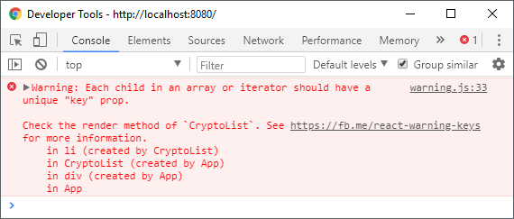

# Listen, Refs, Fragments und Conditional Rendering

Bis hier her habt ihr schon eine ganze Menge über React erfahren. Ihr wisst wofür die **Props** sind, was der **State** ist und wie er sich von den **Props** unterscheidet, ihr wisst wie eine React-Komponente implementiert wird, was der Unterschied einer React-**Komponente** und einem React-**Element** ist und wie ihr mit **JSX** einen Elementenbaum beschreibt, der später in eurer Anwendung gerendert wird. **Lifecycle-Methoden** helfen euch auf Änderungen eurer Daten zu reagieren. Damit habt ihr auch schon alles beisammen um eine simple React-Anwendung zu entwickeln. 

Allerdings gibt es noch einige Details, die in den vorherigen Kapiteln bisher gar keine Erwähnung fanden oder ohne weitere Erklärung in Beispielen benutzt wurden, die aber, gerade wenn eure Anwendung anfängt komplexer zu werden zunehmend relevanter werden.

Im Speziellen betrifft das die Arbeit mit **Listen**, also Arrays mit Daten, sogenannte **Refs**, damit sind Referenzen zu DOM-Repräsentationen von React-Elementen gemeint, **Fragments**, eine spezielle Art Komponente, die keine Spuren im gerenderten Output hinterlässt und **Conditional Rendering**, also Unterscheidungsmöglichkeiten, wann ihr was rendert, basierend auf **Props** und **State**.

Die Themen haben eins gemeinsam: sie sind zu wichtig um sie nicht im Grundlagenteil dieses Buchs zu erwähnen aber gleichzeitig zu kurz um ihnen jeweils ein komplettes eigenes Kapitel zu widmen.

## Listen

Mit Listen sind hier tatsächlich stumpfe JavaScript-Arrays gemeint, also einfache **Daten**, durch die iteriert werden kann. Sie sind bei der Arbeit mit \(nicht nur\) React alltäglich und keine Anwendung kommt ohne sie aus. **ES2015+** bietet uns mit `Array.map()`, `Array.filter()` oder `Array.find()` schöne Methoden, die wir als Ausdrücke in JSX innerhalb von geschweiften Klammern `{}` weiterverarbeiten können.

Welche Rolle Ausdrücke in JSX spielen und wie wir Ausdrücke in JSX nutzen können, habe ich bereits im Kapitel über JSX angesprochen. Kurz aufgefrischt: Arrays können als Ausdruck in JavaScript genutzt werden und somit auch in JSX. Das heißt sie können in geschweiften Klammern stehen und werden dann von beim Transpiling von JSX als Child-Node behandelt.

Das ist aber noch nicht alles, denn `Array.map()` kann bspw. modifizierte Items zurückgeben, die selbst wiederum JSX beinhalten. Das ist insofern praktisch, als dass es uns weitere Flexibilität verschafft und es uns ermöglicht Datensammlungen in React-Elemente zu verwandeln.

Nehmen wir als Beispiel an, wir wollen eine Liste aus Cryptocurrencies anzeigen. Unser Array mit den entsprechenden Daten hat die folgende Form:

```jsx
const cryptos = [
    {
        id: 1,
        name: 'Bitcoin',
        symbol: 'BTC',
        quotes: { EUR: { price: 7179.92084586 } }
    },
    {
        id: 2,
        name: 'Ethereum',
        symbol: 'ETH',
        quotes: { EUR: { price: 595.218568203 } }
    },
    {
        id: 3,
        name: 'Litecoin',
        symbol: 'LTC',
        quotes: { EUR: { price: 117.690716234 } }
    }
];
```

Dargestellt werden sollen die Daten erst einmal als einfache ungeordnete Liste in simplen HTML. Die entsprechende Komponente könnte dann zum Beispiel so aussehen:

```jsx
const CryptoList = ({ currencies }) => (
    <ul>
        {currencies.map((currency) => (
            <li>
                <h1>{currency.name} ({currency.symbol})</h1>
                <p>{currency.quotes.EUR.price.toFixed(2)} €</p>
            </li>
        ))}
    </ul>
);
```

Und würde dann etwa so benutzt werden:

```jsx
<CryptoList currencies={cryptos} />
```

Heraus kommt eine Liste mit den entsprechenden Kryptowährungen und ihrem jeweiligen Preis. Allerdings bekommen wir auch direkt eine Warnung von React an den Kopf geworfen:



React erwartet bei allen Arrays und von einem Iterator zurückgegebenen Werten eine `key`-Prop. Diese dient dazu dem Reconciler \(also dem React-Vergleichsalgorithmus\) eine Möglichkeit zu geben, um Listen-Elemente zu identifizieren und letztendlich vergleichen zu können. Der Reconciler erkennt dadurch welche Array-Elemente hinzugefügt, entfernt oder modifiziert wurden. Die `key`-Prop nimmt dabei die Funktion einer eindeutigen ID ein und muss **innerhalb dieses Arrays einmalig** sein. In der Praxis wird hier typischerweise die ID eines Datensatzes verwendet. 

In unserem Fall haben wir eine solche ID vorliegen, das oberste Element das aus der `map()`-Methode zurückgegeben wird würde also korrekt so aussehen:

```jsx
const CryptoList = ({ currencies }) => (
    <ul>
        {currencies.map((currency) => (
            <li key={currency.id}>
                <h1>{currency.name} ({currency.symbol})</h1>
                <p>{currency.quotes.EUR.price.toFixed(2)} €</p>
            </li>
        ))}
    </ul>
);
```

Der Key muss dabei nur **innerhalb eines Arrays/Iterators inmitten seiner Geschwister-Elemente einmalig sein, nicht innerhalb der Komponente!** Dies bedeutet, dass wir die gleiche `CryptoList`-Komponente mit den gleichen Keys an anderer Stelle, auch in der gleichen Komponente, problemlos noch ein zweites Mal verwenden könnten. Nur eben nicht innerhalb dieses einen Loops. 

Sind zu einer Liste aus Datensätzen keine eindeutigen Schlüssel vorhanden, kann als letzter Ausweg der **Index** des Array-Elements verwendet werden. Davon wird jedoch **ausdrücklich abgeraten**, da dies zu Problemen bei der Performance sowie zu unvorhersehbarem Verhalten beim Rendering des User Interfaces führen kann.

Wichtig ist außerdem, dass die `key`-Prop immer **direkt in der von der Iterator-Funktion** zurückgegebenen **Toplevel-Komponente** oder dem **Array-Element** vorhanden sein muss, nicht in der von dieser Komponente zurückgegebenen JSX. 

Um besser zu veranschaulichen was das genau bedeutet, machen wir aus unserem obigen Listen-Element eine eigene kleine `CryptoListItem`-Komponente:

```jsx
const CryptoListItem = ({ name, symbol, quotes }) => (
    <li>
        <h1>{name} ({symbol})</h1>
        <p>{quotes.EUR.price.toFixed(2)} €</p>
    </li>
);
```

Was fällt auf? Richtig: die `key`-Prop die wir zuvor hinzugefügt haben ist nun nicht mehr da. Unser `map()`-Aufruf würde sich dafür wie folgt verändern:

```jsx
const CryptoList = ({ currencies }) => (
  <ul>
    {currencies.map((currency) => (
      <CryptoListItem
        key={currency.id}
        name={currency.name}
        symbol={currency.symbol}
        quotes={currency.quotes}
      />
    ))}
  </ul>
);
```

Obwohl es das `<li></li>`-Element ist welches letztendlich gerendert wird, muss dennoch die `<CryptoListItem />`-Komponente die `key`-Prop bekommen, da sie es ist, die von `Array.map()` an der entsprechenden Stelle im JSX zurückgegeben wird. 

Offtopic: die `CryptoList`-Komponente könnte durch Verwendung der **Object-Spread Syntax** weiter vereinfacht werden:

```jsx
const CryptoList = ({ currencies }) => (
  <ul>
    {currencies.map((currency) => <CryptoListItem key={currency.id} {...currency} />)}
  </ul>
);
```

Auf diese Art werden alle Eigenschaften des `currency`-Objekts entsprechend als gleichnamige Props an die `CryptoListItem`-Komponente übertragen.

Bei der direkten Arbeit mit Arrays, ohne einen Iterator wie `Array.map()` sähe das analog dazu so aus:

```jsx
const MyList = () => (
  <ul>
  {[
    <li key="1">One</li>,
    <li key="2">Two</li>,
    <li key="3">Three</li>
  ]}
  </ul>
);
```

## Refs

**Refs** \(also **References**\) erlauben es in React direkt auf DOM-Elemente zuzugreifen, die während des Render-Prozesses erzeugt wurden. Auch wenn das in React eher ein Anti-Pattern ist, gibt es einige legitime Situationen in denen man nicht drumherum kommt, direkt auf die DOM-Elemente zuzugreifen. Etwa wenn die Position oder die Größe eines Elements benötigt wird, um basierend darauf bspw. ein Tooltip einzublenden oder um ein Eingabefeld mittels `.focus()` nach dem Laden einer Komponente zu fokussieren.

Hier hat sich React im Laufe der Zeit weiterentwickelt und hat uns so historisch bedingt verschiedene Möglichkeiten geschaffen um solche **Refs** zu erstellen. Die **Refs**, egal in welcher Form, werden dabei stets über die `ref`-Prop eines DOM-Elements im **JSX** bzw. `createElement()`-Aufruf definiert.


Eine Warnung jedoch gleich noch vorweg: auch wenn React es erlaubt, durch die Verwendung von **Refs** direkt auf DOM-Elemente zuzugreifen, sollte dies **immer der letzte Ausweg sein!** Sämtliche Manipulation von Attributen oder Attribut-Werten, das Hinzufügen oder Entfernen bspw. von Klassen oder Event-Listenern oder das Ändern von anderen Eigenschaften wie `aria-hidden` sollte **immer** deklarativ über den **State**, **JSX** und entsprechende **Re-Renderings** realisiert werden!


### String Refs

Die simpelste und älteste Variante sind die sogenannten **String Refs**. Mittlerweile wird von der Nutzung eher abgeraten, da sie die Performance beeinträchtigen können und in Zukunft ggf. entfernt werden. Der Vollständigkeit halber möchte ich sie dennoch erwähnen, da sie noch Teil der offiziellen API sind und euch gelegentlich auch noch bei der Arbeit mit React begegnen werden, insbesondere wenn ihr mit Legacy-Code zu tun habt.

Um eine **String Ref** zu definieren, gebt ihr einem DOM-Element eine Prop mit dem Namen `ref` und weist dieser Prop einen **String** als Wert zu. Das enstprechende DOM-Element ist dann **innerhalb der Komponente** in der Instanz-Eigenschaft `this.ref` zugänglich.

```jsx
import React from 'react';
import ReactDOM from 'react-dom';

class ComponentWithStringRef extends React.Component {
  componentDidMount() {
    this.refs.username.focus();
  }
  
  render() {
    return (
      <input type="text" ref="username" name="username" />
    );
  }
}

ReactDOM.render(
  <ComponentWithStringRef />, 
  document.getElementById('app')
);
```

Im obigen Beispiel können wir im `componentDidMount()` Lifecycle-Hook über `this.refs.wrapper` auf das umgebende div und über `this.refs.username` auf das Eingabefeld zugreifen. Über `this.refs.username.focus()` lässt sich letzteres dann bspw. fokussieren.

### Callback Refs

Eine Alternative zu **String Refs** sind die sogenannten **Callback Refs**. Diese erlauben mehr Flexibilität, sind aber dafür natürlich auch etwas umständlicher zu implementieren, da ihr euch um deren Handling selbst kümmern müsst. Dafür ist es mit **Callback Refs** möglich diese an **Kind-Komponenten** weiterzugeben um auch auf DOM-Elemente innerhalb von diesen zugreifen zu können.

**Callback Refs** werden, wie der Name es vermuten lässt, in **Callback-Form** definiert und bekommen beim **Mounting** als einzigen Parameter das DOM-Element oder bei Anwendung auf eine React-Komponente deren Instanz übergeben, beim **Unmounting** wird der Callback erneut aufgerufen, dann allerdings mit `null` als Parameter. 

Was ihr dann damit macht, ist euch selbst überlassen. Ein gängiger Ansatz ist es jedoch, die Referenz zu diesem DOM-Element als Instanz-Eigenschaft zu speichern, um von innerhalb der Komponente überall darauf zugreifen zu können.

Angewendet auf das obige Beispiel sähe das dann so aus:

```jsx
import React from 'react';
import ReactDOM from 'react-dom';

class ComponentWithCallbackRef extends React.Component {
  componentDidMount() {
    this.usernameEl.focus();
  }

  usernameEl = null;
  
  setUsernameEl = (el) => {
    this.usernameEl = el;
  };
      
  render() {
    return (
      <input type="text" ref={this.setUsernameEl} name="username" />
    );
  }
}

ReactDOM.render(
  <ComponentWithCallbackRef />, 
  document.getElementById('app')
);
```

**Callback Refs** können auch in Kind-Komponenten benutzt und auf diese **Refs** dann von innerhalb der Eltern-Komponente zugegriffen werden. Dazu übergebt ihr die Callback-Funktion der Kind-Komponente in einer eigenen Prop, die nicht `ref` heißen darf:

```jsx
import React from 'react';
import ReactDOM from 'react-dom';

class UsernameInput extends React.Component {
  render() {
    return (
      <input type="text" name="username" ref={this.props.inputRef} />
    );
  }
}

class ComponentWithRefChild extends React.Component {  
  componentDidMount() {
    this.usernameEl.focus();
  }

  usernameEl = null;

  setUsernameRef = (el) => {
    this.usernameEl = el;
  }

  render() {
    return (
      <div>
        Username:
        <UsernameInput inputRef={this.setUsernameRef} />
      </div>
    );
  }
}

ReactDOM.render(
  <ComponentWithRefChild />, 
  document.getElementById('app')
);
```

Würdet ihr die Prop hier `ref` nennen, also `<UsernameInput ref={this.setUsernameRef} />` würdet ihr stattdessen eine Referenz zur `UsernameInput`-**Instanz** erhalten, statt zu deren Input-Element. Bei **Stateless Functional Components** wäre `UsernameInput` sogar `null`, da SFCs nicht instanziiert werden!

### Refs über createRef\(\)

Neu in React 16.3. eingeführt wurde die Top Level Methode `React.createRef()`. Sie ähnelt von der Art der Verwendung her ein wenig den **Callback Refs**, jedoch mit kleinen Unterschieden. So müsst ihr euch auch hier um das Handling selbst kümmern. Durch ihre Ähnlichkeit zu **Callback Refs**, ist es auch hier gängige Praxis die **Refs** einer **Instanz-Eigenschaft** zuzuweisen.

Statt jedoch jedesmal eine nahezu identische Methode in der Form `(el) => { this.property = el }` zu übergeben, erstellt ihr bei der Instanziierung der Komponente bereits die Referenz und übergebt diese dann an die `ref`-Prop des jeweiligen Elements.

```jsx
import React from 'react';
import ReactDOM from 'react-dom';

class ComponentWithCreatedRef extends React.Component {
  componentDidMount() {
    this.usernameEl.current.focus();
  }

  usernameEl = React.createRef();

  render() {
    return (
      <input type="text" name="username" ref={this.usernameEl} />
    );
  }
}

ReactDOM.render(
  <ComponentWithCreatedRef />, 
  document.getElementById('app')
);
```

Vom Prinzip her also sehr ähnlich zu den **Callback Refs**, allerdings mit einem entscheidenden Unterschied: auf die entsprechende Referenz greift ihr hier via `this.usernameEl.current` zu. 

Die Referenz zum Element wird hier also nicht in der Instanz-Eigenschaft gespeichert, der ihr die Ref zuordnet, sondern in deren `.current` Eigenschaft. Ansonsten ist ihr Verhalten soweit vergleichbar mit den Callback Refs. Ihr könnt diese ebenfalls an Kind-Komponenten über deren Props weitergeben und dann aus der Eltern-Komponente auf das jeweilige DOM-Element zugreifen.

Im direkten Vergleich hier noch einmal die **Callback Ref**:

```jsx
class MyComponent extends React.Component {
  usernameEl = null;
  render () {
    return (
      <input ref={(el) => { this.usernameEl = el; } />
    )
  }
}
```

Zugriff auf das Element via:  `this.usernameEl` 

Und alternativ dazu die mittels **`React.createRef()`** erstellte Referenz:

```jsx
class MyComponent extends React.Component {
  usernameEl = React.createRef();
  render () {
    return (
      <input ref={this.usernameEl} />
    )
  }
}
```

Zugriff auf das Element via: `this.usernameEl.current`.

## Conditional Rendering

**Conditional Rendering**, also das Rendering von Komponenten auf Basis verschiedener Bedingungen ist ein zentrales Konzept in React. Da React-Komponenten unter der Haube lediglich eine Komposition aus JavaScript-Funktionen, -Objekten und -Klassen sind, funktionieren und verhalten sich Bedingungen hier exakt wie auch in herkömmlichem JavaScript.

Eine React-Komponente rendert **Zustände** eines **User Interfaces** basierend auf ihren **Props** und ihrem **aktuellen State**, optimalerweise **frei von Seiten-Effekten.** Um also korrekt auf diese verschiedenen Parameter reagieren zu können machen wir uns Rendering-Funktionen zu nutze, die an verschiedene Bedingungen geknüpft sind. Ist mein Parameter A, rendere dies, ist mein Parameter B, rendere das. Habe ich eine Liste mit Daten, zeige mir die Daten in einer HTML-Liste an. Habe ich keinerlei Daten, zeige mir stattdessen einen Platzhalter an.

Was einfach klingt, ist es im Grunde genommen auch. Aber man sollte die richtigen Wege kennen, insbesondere in JSX. Die `render()`-Funktion von Komponenten und Stateless Functional Components kann grundsätzlich ein **React-Element** \(natürlich auch in Form von JSX\), einen **String**, eine **Nummer**, `null`, für den Fall, dass nichts gerendert werden soll oder ein **Array** aus den zuvor genannten Typen zurückgeben.

### if/else

Die wohl einfachste Form des **Conditional Renderings** ist ein klassisches `if`/`else`-Konstrukt. 

```jsx
const NotificationList = ({ items }) => {
  if (items.length) {
    return (
      <ul>
        {items.map((notification) => (
          <li>{notification.title}</li>
        ))}
      </ul>
    );
  }
  return <p>Keine neuen Benachrichtigungen</p>
};
```

Einfacher Anwendungsfall. Wir haben eine Komponente `NotificationList`, die eine Liste an Items in Form einer Prop entgegen nimmt. Enthält diese Liste Einträge, werden diese als simple ungeordnete Liste ausgegeben. Ist die Liste hingegen leer, lassen wir unsere Komponente stattdessen eben einen Hinweis ausgeben, dass keine neuen Benachrichtigungen vorhanden sind.

Ein weiteres Beispiel mit einem komplexeren Fall. Wir haben einen Wert und möchten diesen editierbar machen. Unsere Komponente kennt zwei verschiedene Modi: `edit` und `view`. Je nachdem ob wir uns **View-Mode** oder im **Edit-Mode** befinden, möchten wir nur den Text anzeigen oder ein vorausgefülltes Textfeld mit dem jeweiligen letzten aktuellen Wert.

```jsx
import React from 'react';
import { render } from 'react-dom';

class EditableText extends React.Component {
  state = {
    value: null,
  };

  static getDerivedStateFromProps(nextProps, prevState) {
    if (prevState.value === null) {
      return {
        value: nextProps.initialValue || '',
      };
    }
    return {};
  }

  handleChange = (e) => {
    const { value } = e.target;
    this.setState(() => ({
      value,
    }));
  }

  setMode = (mode) => () => {
    this.setState(() => ({
      mode,
    }));
  }

  render() {
    if (this.state.mode === 'edit') {
      return (
        <div>
          <input 
            type="text" 
            value={this.state.value} 
            onChange={this.handleChange} />
          <br />
          <button onClick={this.setMode('view')}>Done</button>
        </div>
      );
    }

    return (
      <div>
        {this.state.value}
        <br />
        <button onClick={this.setMode('edit')}>Edit</button>
      </div>
    )
  }
}

render(
  <EditableText initialValue='Example' />, 
  document.getElementById('root')
);

```

Der für dieses Kapitel relevante Teil spielt sich innerhalb der `render()`-Methode der Komponente ab. Wir prüfen hier auf den Wert der State-Eigenschaft `mode`, ist dieser `edit`,  geben wir direkt das Eingabefeld zurück. Ist dieses nicht `edit`, gehen wir davon aus, dass der Standardfall eintritt, der in diesem Falle der Ansichtsmodus \(`view`\) wäre. Gerendert wird jeweils der Text, einmal editierbar als `value` eines `input`-Felds, einmal lediglich als Textknoten und dazu jeweils ein Button, um die State-Eigenschaft `mode` der Komponente zwischen `view` und `edit` hin und her zu wechseln.

### null

Nein, die Überschrift ist kein Fehler. `null` zurückzugeben ist wohl der einfachste Fall für **Conditional Rendering.** Gibt die `render()`-Methode einer Komponente `null` zurück, wird diese nicht gerendert und erscheint daher auch nicht im DOM. Dies kann manchmal sinnvoll sein, bspw. wenn eine Fehler-Komponente nur dann angezeigt werden soll wenn auch ein Fehler aufgetreten ist.

```jsx
render() {
  if (!this.state.error) {
    return null;
  }

  return (
    <div className="error-message">{this.state.error.message}</div>
  );
}
```


