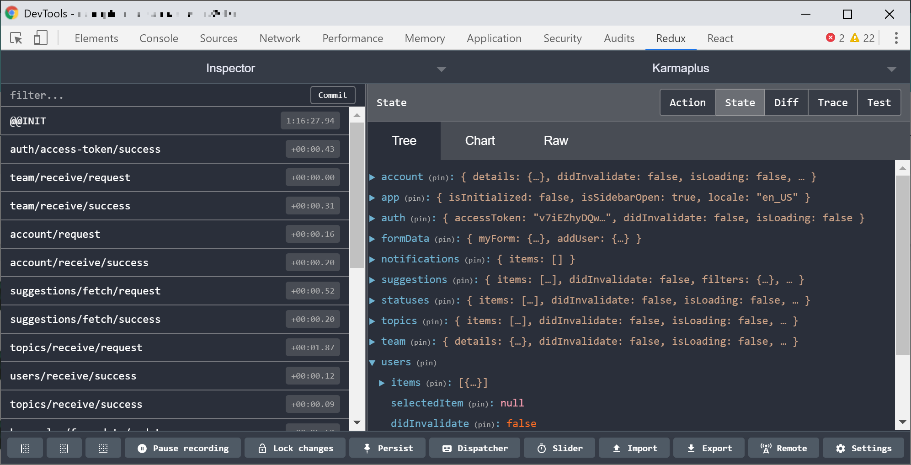

# State Management

Mit zunehmender Größe einer Anwendung wachsen meist auch deren Komplexität und die Daten, die mit der Anwendung verwaltet werden sollen. Also anders gesagt: Der **Application State** wird schwieriger und unübersichtlicher zu verwalten. Wann gebe ich wie welcher Komponente welche Props hinein? Wie wirken sich diese Props auf den State meiner Komponente aus und was passiert wenn ich den State in einer Komponente modifiziere?

Auch wenn React hier in den letzten Jahren zunehmend deutlich besser geworden ist und gerade mit der neuen **Context API** und dem **useReducer-Hook** einiges zur besseren Übersichtlichkeit von komplexen Datenstrukturen getan hat, ist es noch immer nicht ganz einfach, stets alle Daten und Datentransformationen im Blick zu haben. Um dieses Problem zu lösen, gibt es einige externe Tools für **globales State Management**, die sich im Ecosystem um React herum gebildet haben.

Zu den bekannteren Tools dieser Art zählt hier einerseits **MobX**, das sich selbst als _„Simple, scalable state management“_ beschreibt, also als Werkzeug für _simples und skalierbares State Management_. Auf der anderen Seite haben wir **Redux**, zweifellos der „Platzhirsch“ in der React-Welt, mitentwickelt unter anderem von Dan Abramov und Andrew Clark, die inzwischen auch dem offiziellen React-Team angehören. Redux bezeichnet sich als _„A predictable state container for JavaScript apps“_ also als _„vorhersehbarer State Container für JavaScript-Anwendungen“_.

In diesem Kapitel soll es insbesondere um **Redux** gehen. Einerseits, weil ich selbst mit **Redux** in vielen Projekten gearbeitet habe und sehr gute Erfahrungen damit machen durfte, andererseits aber auch, weil es mit \(laut npmjs.com\) wöchentlich rund **4 Millionen Installationen** ganz klar deutlich mehr im Mainstream angekommen ist als **MobX**, mit immer noch respektablen, verglichen jedoch mit **Redux** doch überschaubaren **200.000 Installationen**.

**Redux** erfreut sich dabei noch immer an steigender Beliebtheit und hat wachsende Downloadzahlen zu verzeichnen, obwohl es bereits mehrmals von irgendwelchen Propheten totgesagt wurde. Als die finale **Context API** in **React 16.3.0** veröffentlicht wurde, hieß es, dass **Redux** damit obsolet würde \(wurde es nicht\), als mit **React 16.8.0** die **Hooks** und hier insbesondere der stark an **Redux** angelehnte **useReducer-Hook** eingeführt wurde, gab es diese Stimmen erneut.

In der Realität sieht das so aus, dass die Zahl der Installationen auch nach Einführung von **Context** und **Hooks** weiter steigen und **Redux** selbst intern **Gebrauch** dieser neuen Möglichkeiten macht, um einerseits die Performance zu verbessern und andererseits die Verwendung der eigenen API zu vereinfachen. Darüber hinaus hat **Redux** inzwischen ein unheimlich großes Ecosystem an eigenen Addons und Tools um sich versammelt, das auch durch die in React neu hinzugekommenen Funktionen nicht ersetzt wird.

### Einführung in Redux

Bei **Redux** handelt es sich also wie beschrieben um einen _vorhersehbaren State Container_. Doch was bedeutet das genau? An dieser Stelle möchte ich gern etwas weiter ausholen, da ich es für wichtig erachte, das Grundprinzip zu verstehen um hinterher Fehler zu vermeiden, die schnell gemacht werden, hat man das Prinzip hinter **Redux** nicht zumindest in sehr groben Ansätzen verinnerlicht.

Erst einmal haben wir mit **Redux** ein Tool, das in Teilen angelehnt ist an die Prinzipien der **Flux-Architektur**. Diese wurde - wie auch **React** selbst - von **Facebook** entwickelt, um die Entwicklung clientseitiger Web Anwendungen zu vereinfachen. Das Grundprinzip sieht dabei einen **unidirektionalen Datenfluss** vor, bei dem Daten immer nur **in eine Richtung** fließen. Also das Prinzip, wie wir es bereits aus **React** selbst kennen: eine **Aktion** \(bspw. ausgelöst durch einen Button-Klick\) ändert den **State**, die **State-Änderung** löst ein **Rerendering** aus und erlaubt es dann weitere Aktionen auszuführen.

Nach diesem Prinzip funktioniert auch **Redux**, mit dem entscheidenden Unterschied jedoch, dass der State statt nur innerhalb einer Komponente eben **global** verwaltet wird und somit alle Komponenten, egal wo im Seitenbaum sich diese befinden, auf **sämtliche Daten** zugreifen können.

Um Redux in einem Projekt zu nutzen, müssen wir es natürlich zuerst wieder einmal über die Kommandozeile installieren:

```bash
npm install redux react-redux
```

bzw. mit Yarn:

```bash
yarn add redux react-redux
```

Installiert werden hier **zwei** Pakete. Die Library `redux` selbst und `react-redux`. Während mit dem `redux` Paket die eigentliche State Management Library installiert wird, werden mit `react-redux` die sog. **Bindings** installiert. Auf gut Deutsch gesagt ist dies einfach nur ein Paket mit einigen **React-Komponenten** die konkret für die Verwendung von **Redux** mit **React** entwickelt und daraufhin optimiert wurden. Keine große Magie.

Theoretisch wäre auch die Verwendung von **Redux** alleine möglich, allerdings müssten wir uns dann selbst darum kümmern zu schauen, wann Komponenten neu gerendert werden und darum, wie Daten aus einer Komponente in den State Container rein und wieder raus kommen. Da wir das nicht wollen, weil sich jemand anderes \(der sich viel besser damit auskennt als wir alle\) das bereits gemacht hat, nutzen wir eben zusätzlich `react-redux`.

### Store, Actions und Reducer

Nicht von den möglicherweise noch unbekannten Begriffen verunsichern lassen. Wir gehen sie der Reihe nach durch und irgendwann macht es Klick.

Alle Daten in **Redux** befinden sich in einem sogenannten **Store**, der sich um die Verwaltung des globalen **States** kümmert. Theoretisch kann eine Anwendung auch mehrere Stores haben, im Konzept von Flux ist das sogar explizit so vorgesehen, in **Redux** ist das jedoch um Komplexität zu reduzieren eher unüblich und so beschränken sich React-Anwendungen, die **Redux** einsetzen, meist auch auf lediglich einen _einzigen_ **Store** als **Single Source of Truth**, also als _die_ einzige wahre Quelle für alle Daten. Der Store stellt Methoden bereit, um die sich in ihm befindlichen Daten zu verändern \(`dispatch`\), zu lesen \(`getState`\), und auf Änderungen zu reagieren \(`subscribe`\).

Die einzige Möglichkeit um Daten in einem **Store** zu verändern, ist dabei das Auslösen \(_„dispatchen“_\) von **Actions**. Auch hier lässt sich **Redux** wieder von Ideen aus der Flux-Architektur inspirieren und macht es erforderlich diese **Actions** im Format der **Flux Standard Actions** \(FSA\) zu halten. Eine solche **FSA** bestehen aus einem simplen JavaScript-Objekt, das immer **zwingend** eine `type`-Eigenschaft besitzen _muss_ und darüber hinaus die drei weiteren Eigenschaften `payload`, `meta` und `error` besitzen _kann_, wobei uns in erster Linie einmal die `payload` interessieren soll, mit der wir es in 9 von 10 Fällen, in denen wir eine **Action** _dispatchen_, zu tun haben werden.

Die **Payload** stellt sozusagen den _Inhalt_ einer **Action** dar und kann vom simplen Boolean oder String, über numerische Werte, bis hin zu komplexen Arrays oder Objekten beliebige Daten beinhalten, die serialisierbar sind, also in Form einer JSON-Repräsentation gespeichert werden können.

Beispiel für eine typische **Action** in **Redux**:

```javascript
{
  type: "SET_USER",
  payload: {
    id: "d929e553-7079-4309-8c7d-2d2db39922c6",
    name: "Manuel"
  }
}
```

Wird eine **Action** durch die vom **Store** bereitgestellte `dispatch`Methode ausgelöst, wird der zum Zeitpunkt des Aufrufs aktuelle **State** zusammen mit der ausgelösten **Action** an die **Reducer** übergeben. Ein **Reducer** ist eine **pure Function**, die wir ebenfalls bereits aus React kennen, und dient dazu, aus dem **aktuellen State** und der jeweiligen Action mit ihren `type`- und `payload`-Eigenschaften einen **neuen State** zu erzeugen. Zur Erinnerung: Eine **pure Function** erzeugt stets die **selbe Ausgabe** bei **gleichen Eingabeparametern**, egal wie oft diese aufgerufen wird. Dieses Verhalten ist es, das sie vorhersehbar und dadurch auch gleichzeitig einfach testbar macht.

Beispiel für einen **Reducer**:

```javascript
const reducer = (state, action) => {
  switch (action.type) {
    case 'PLUS': {
      return state + action.payload;
    }
    case 'MINUS': {
      return state - action.payload;
    }
    default: {
      return 0;
    }
  }
};
```

Ein **Store** erwartet bei seiner Erstellung grundsätzlich einen einzigen **Reducer**, jedoch bietet **Redux** hier mit der `combineReducers()`-Funktion eine Möglichkeit, diese **Reducer**-Funktion zur besseren Verständlichkeit und Lesbarkeit in beliebig viele kleine Teilstücke zu splitten und anschließend zu einem großen, gemeinsamen **Reducer** zusammen zu setzen, auch **Root-Reducer** genannt. Wird dann eine Action _dispatched_, wird jeder **Reducer** mit jeweils den gleichen Parametern, nämlich dem **State** und der **Action**, aufgerufen. Diese Methode schauen wir uns später in diesem Kapitel noch etwas genauer an.

Da jeder **Reducer** auf die `type`-Eigenschaft einer **Action** reagiert, ist es ein Stück weit zur Konvention geworden, alle verwendeten Types in gleichnamige Variablen auszulagern, da ein Tippfehler im ersten Moment nicht immer gleich auffällt \(bspw. `USER_ADDDED`\), der JavaScript-Interpreter jedoch beim Zugriff auf eine nicht definierte Variable einen Fehler wirft. So findet man in Apps, in denen **Redux** eingesetzt wird, zu Beginn einer Datei oft einen Code-Block von folgendem Format:

```javascript
const PLUS = 'PLUS';
const MINUS = 'MINUS';
```

Dies dient eben dazu, um Kohärenz bei den verwendeten **Action Types** sicherzustellen.

### Einen Store erstellen

Um einen Store zu erstellen, der unseren globalen State verwalten wird, importieren wir die `createStore` Funktion aus dem `redux` Paket, rufen diese auf und übergeben ihr eine **Reducer**-Funktion. Die Funktion gibt uns daraufhin das Store-Objekt zurück mit Methoden, um mit dem Store zu arbeiten: `dispatch`, `getState` sowie `subscribe`, wobei letztere eine eher untergeordnete Rolle bei der Arbeit mit React spielt, da die Komponenten aus dem `react-redux` Paket sich um das Rerendering von Komponenten kümmern, die von einer Änderung am **State** betroffen sind.

```javascript
import { createStore } from 'redux';

const initialState = 0;

const counterReducer = (state = initialState, action) => {
  switch (action.type) {
    case 'PLUS': {
      return state + (action.payload || 0);
    }
    case 'MINUS': {
      return state - (action.payload || 0);
    }
    default: {
      return state;
    }
  }
};

const store = createStore(counterReducer);
```

Hier haben wir einen ersten und noch sehr simplen Store mit einem Counter-Reducer erstellt. Da wir der `createStore`-Funktion hier nur den ersten Parameter übergeben, wird die `counterReducer`-Funktion beim Initialisieren mit `undefined` als vorherigen `state` aufgerufen, weshalb der `initialState` als Standardparameter eingesetzt wird. Dieser entspricht hier dem numerischen Wert `0`.

Übergeben wir der `createStore`-Funktion einen zweiten Parameter, so würde dieser als erster State beim Initialisieren an die Reducer-Funktion übergeben werden:

```javascript
const store = createStore(counterReducer, 3);
```

Hier wäre der Startwert für unseren `state`-Parameter der an die `counterReducer`-Funktion übergeben wird `3` statt `undefined`, der `initialState` Standardparameter würde nicht einspringen und unser Counter würde bei `3` beginnen zu zählen statt bei `0`.

Als initiale **Action** wird eine Redux-interne Action _dispatched_, die die Form `{type: '@@redux/INIT5.3.p.j.l.8'}` besitzt. Daher greift in unserem `switch`-Block der `default`-Fall und gibt einfach nur den übergebenen `state` \(der in diesem Fall dem `initialState` entspricht\) zurück.

Ein solcher `default`-Fall ist wichtig. Greift kein anderer `case` im `switch`, muss stets der letzte Stand des States aus der Funktion zurückgegeben werden, um unerwünschte Seiteneffekte zu vermeiden. Die `Reducer`-Funktion wird bei **jedem** `dispatch`-Aufruf ausgeführt und ihr Rückgabewert bestimmt immer den **nächsten State!**

Rufen wir nun gleich nach der Initialisierung `store.getState()` auf, erhalten wir unseren `initialState` zurück: `0`:

```javascript
console.log(store.getState()); // 0
```

Wir können nun etwas rumspielen, verschiedene **Actions dispatchen** und schauen, wie unser **State** auf die **Actions** jeweils reagiert:

```javascript
store.dispatch({ type: 'PLUS', payload: 2 });
console.log(store.getState()); // 2

store.dispatch({ type: 'PLUS', payload: 1 });
console.log(store.getState()); // 3

store.dispatch({ type: 'MINUS', payload: 2 });
console.log(store.getState()); // 1
```

Hier _dispatchen_ wir zweimal eine **Action** mit dem `type` `PLUS` und einmal eine Action vom `type` `MINUS`. Wir übergeben jeweils eine `payload`, mit der wir angeben, um wie viele Ziffern wir den letzten State hoch- oder runterzählen wollen. Unsere **State-Mutation** findet also wie folgt statt:

```javascript
0 (initialer State) + 2 (payload) = 2 (neuer State)
2 (alter State)     + 1 (payload) = 3 (neuer State)
3 (alter State)     - 2 (payload) = 1 (neuer State)
```

Dieser State ist dabei noch denkbar simpel und besteht lediglich aus einem einzigen Wert. Später werden wir uns noch anschauen, wie wir komplexeren **State** aus verschiedenen Objekten und mit mehreren **Reducern** erstellen.

### Action Creators vs. Actions

Wer Artikel über **Redux** liest oder auch in die offizielle Doku schaut, wird immer wieder mit den Begriffen **Action** und **Action Creator** konfrontiert. Mir selbst fiel es anfangs etwas schwer, die Unterschiede zu verstehen und ich weiß auch von anderen, dass es nicht nur mir so erging. Erschwerend kommt hinzu, dass die Begriffe auch gelegentlich synonym verwendet werden obwohl sie es nicht sind. Daher möchte ich an dieser Stelle kurz einen keinen Exkurs einwerfen um die beiden Begriffe **Action Creator** und **Action** voneinander abzugrenzen.

Die **Action** haben wir oben bereits kennengelernt. Sie ist ein einfaches und möglichst _serialisierbares_ **Objekt**, mit dem wir beschreiben, wie wir den State verändern wollen. Dieses enthält immer zwingend eine `type`-Eigenschaft und meist auch eine `payload`.

Ein **Action** _**Creator**_ hingegen ist eine **Funktion**, die schlussendlich eine **Action** **zurückgibt**, also sozusagen eine **Factory**, die eine **Action** _erstellt_ \(daher: _Creator_\). Meist werden **Action Creators** dazu verwendet um in ihnen **Logik zu kapseln**, die zur Erstellung einer **Action** notwendig ist. Manchmal werden sie aber auch einfach verwendet, um die doch recht umständliche Natur der **Actions** hinter einer einprägsamen Funktion weg zu abstrahieren. **Action Creators** werden dann an Stelle der ursprünglichen **Action** als Parameter der `dispatch`-Methode aufgerufen.

Typische **Action Creators** aus unserem obigen Beispiel würden dann bspw. so aussehen:

```javascript
const add = (number) => {
  return { type: 'PLUS', payload: number };
};

const subtract = (number) => {
  return { type: 'MINUS', payload: number };
};
```

Oder wer mit den **Shorthand Notationen** aus **ES2015+** vertraut ist, kann das Ganze auch noch weiter abkürzen:

```javascript
const add = (payload) => ({ type: 'PLUS', payload });
const subtract = (payload) => ({ type: 'MINUS', payload });
```

Anschließend werden die entsprechenden **Action Creators** als Parameter der `dispatch`-Methode aufgerufen, statt die **Actions** direkt zu übergeben:

```javascript
store.dispatch(add(2));
store.dispatch(add(1));
store.dispatch(subtract(2));
```

Dies geht bei entsprechender Benennung der **Action Creator** Funktionen deutlich zu Gunsten besserer Verständlichkeit des Codes. **Action Creator** sind dabei ein wichtiges Puzzlestück im Redux-Konzept und aus der täglichen Arbeit nicht wegzudenken, da sie uns viel Schreibarbeit und Wiederholungen ersparen und somit auch potentielle Fehlerquellen wie bspw. Tippfehler beim `type` einer **Action** verringern \(etwa `PLSU` statt `PLUS`\).

### Komplexe Reducer

Die bisherigen Beispiele dienten dazu, mit dem Konzept von **Actions** und **Reducern** vertraut zu werden und um zu verstehen, wie **Actions** verwendet werden, um mit dem **Reducer** den **Store** zu mutieren. Typischerweise besteht der **State** in einer React-Anwendung aber aus deutlich komplexeren Daten und Objekten. Werfen wir also einen Blick auf einen Store, wie er realistisch in einer kleinen Anwendung aussehen könnte.

Als Beispiel soll uns das State-Management für eine fiktive kleine **Todo-App** dienen, die sowohl eine Liste mit Todos verwaltet, als auch einen eingeloggten Benutzer beinhaltet. Unser State halt also die beiden Toplevel-Eigenschaften `todos` \(vom Typ Array\) und `user` \(vom Typ Objekt\). Dies bilden wir in unserem initialen State auch so ab:

```javascript
const initialState = Object.freeze({
  user: {},
  todos: [],
});
```

Zusätzlich, da wir sicherstellen wollen, dass bei jedem Aufruf ein neues State-Objekt erzeugt wird und nicht das alte mutiert wird, umschließen wir unseren initialen State mit einem `Object.freeze()`. Dies sorgt dafür, dass wir einen `TypeError` bekommen, sollte das **State-Objekt** direkt mutiert werden.

Schauen wir uns an, wie eine **Reducer**-Funktion aussehen könnte, mit der wir den eingeloggten Benutzer setzen, neue Todos hinzufügen und entfernen sowie deren Status ändern können:

```javascript
const rootReducer = (state = initialState, action) => {
  switch (action.type) {
    case 'SET_USER': {
      return {
        user: {
          name: action.payload.name,
          accessToken: action.payload.accessToken,
        },
        todos: state.todos,
      };
    }
    case 'ADD_TODO': {
      return {
        user: state.user,
        todos: state.todos.concat({
          id: action.payload.id,
          text: action.payload.text,
          done: Boolean(action.payload.done),
        }),
      };
    }
    case 'REMOVE_TODO': {
      return {
        user: state.user,
        todos: state.todos.filter((todo) => todo.id !== action.payload),
      };
    }
    case 'CHANGE_TODO_STATUS': {
      return {
        user: state.user,
        todos: state.todos.map((todo) => {
          if (todo.id !== action.payload.id) {
            return todo;
          }
          return {
            ...todo,
            done: action.payload.done,
          };
        }),
      };
    }
    default: {
      return state;
    }
  }
};

const store = createStore(rootReducer);
```

Ich möchte gar nicht auf alles was hier passiert im Detail eingehen, da es hier darum gehen soll, wie ein großer, unübersichtlicher **Reducer** in mehrere kleinere und idealerweise übersichtlichere aufgeteilt werden kann. Doch einige Stellen sind für das generelle Verständnis nicht unwichtig. Gehen wir also der Reihe nach den `switch`-Block durch, bei dem uns jeder `case`-Block ein neues State-Objekt zurückgibt.

Angefangen bei `SET_USER`: das hier erzeugte **State-Objekt** ändert das `user`-Objekt und setzt dessen `name`-Eigenschaft auf `action.payload.name`, sowie die `accessToken`-Eigenschaft auf `action.payload.accessToken`. Wer mag, kann hier stattdessen auch `user` auf `action.payload` setzen, dann würden alle in der entsprechenden **Payload** der **Action** übergebenen Eigenschaften im `user`-Objekt landen. Dabei sollte dann aber sichergestellt sein, dass die `action.payload` immer ein Objekt ist, da wir ansonsten die Ausgangsform des `user`-Objekts verändern würden, was zu Problemen führen kann, wenn bspw. auch andere Teile des **Reducers** auf das Objekt zugreifen und das Objekt plötzlich keines mehr ist. In unserem Beispiel ignorieren wir aber alle anderen Eigenschaften, indem wir explizit nur `name` und `accessToken` aus der **Payload** der ausgelösten Action holen.

Neben dem modifizierten `user` geben wir auch eine `todos`-Eigenschaft zurück, die wir auf `state.todos` setzen, also beim bisherigen Wert belassen. **Dies ist wichtig**, da in unserem State-Objekt die `todos` ansonsten komplett aus dem State entfernt werden würden und wir nun zwar den Benutzer gesetzt, unsere Todos jedoch aus dem State verloren hätten!

Weiter geht es mit `ADD_TODO`: Hier ist es andersherum und wir geben zuerst einmal den `user`-Ast unseres State-Trees unverändert zurück. Anschließend fügen wir das neue Todo-Item mittels `.concat()`-Methode dem `todo`-Array hinzu. Hier ist es wichtig, `concat()` und nicht `push()` zu benutzen, da `push()` eine sog. _mutative_ Methode ist, also den bestehenden State verändert statt einen neuen State zu erzeugen. Mittels `state.todos.concat` nehmen wir das aktuelle `todos`-Array als Basis und erzeugen daraus ein neues Array mit dem neuen Todo-Item und geben dieses zurück.

Sehr ähnliches passiert im nächsten Fall: `REMOVE_TODO`. Hier geben wir wieder zuerst den `user`-Ast zurück, ehe wir im `todos`-Array nach dem zu entfernenden Eintrag suchen, um diesen anschließend herauszufiltern. Welcher Eintrag zu entfernen ist, das übergeben wir der Action als `action.payload` in Form einer Todo-ID. Das gefilterte Array ist dann unser neuer `todos`-State. Wir nutzen hier die `Array.filter()`-Methode, da diese anders als bspw. `Array.splice()` nicht _mutativ_ ist und ein neues Array erzeugt.

Zuletzt haben wir den `CHANGE_TODO_STATUS` Fall. Mit diesem ändern wir den Status des Todo-Elements, also von _Zu erledigen_ \(`false`\) auf _Erledigt_ \(`true`\) - oder eben andersherum. Dazu geben wir erneut das unveränderte `user`-Objekt aus dem vorherigen State zurück und iterieren anschließend mittels `state.todos.map()` durch alle Todos. In der Map-Funktion schauen wir, ob die ID des aktuellen Todo-Objekts der ID aus der `action.payload` entspricht. Ist dies nicht der Fall, geben wir einfach jeweilige Todo-Element unverändert zurück.

Entspricht die ID aus der Payload der ID des aktuellen Todo-Elements, erzeugen wir ein neues Objekt, schreiben alle Eigenschaften mit ihren jeweiligen Werten mittels ES2015+ Spread-Syntax \(`{ ...todo }`\) in das neu erzeugte Objekt und überschreiben die `done`-Eigenschaft mit dem neuen Wert aus der Action-Payload. Wir generieren hier ein neues Objekt statt einfach das bestehende zu überschreiben, da wir ja einen neuen State erzeugen müssen, damit unser **Reducer** eine **Pure Function** bleibt. Die Verwendung der `Array.map()`-Methode sorgt bereits dafür, dass wir außerdem ein neues Array erzeugen.

Hier haben wir es lediglich mit zwei Ästen in unserem State-Tree zu tun: `user` und `todos` - und dennoch wird unsere **Reducer**-Funktion bereits sehr lang. Bei steigender Komplexität des States wird die Funktion entsprechend noch länger und vor allem: **fehleranfälliger**. Da wir neben dem veränderten Teil des States auch immer alle anderen Teile zurückgeben müssen - also etwa den unveränderten `user`, wenn wir die `todos` modifizieren oder eben die `todos`, wenn wir den `user` modifizieren – wird die Funktion sehr schnell unübersichtlich und schwierig zu verwalten. Zur Erleichterung könnten wir hier auch die **Object Spread Syntax** aus ES2015+ nutzen, aus dem bisherigen State einen neuen State erzeugen und anschließend den veränderten Ast des State-Trees überschreiben. Das könnte dann am Beispiel des `ADD_TODO` Falls so aussehen:

```javascript
case "ADD_TODO": {
  return {
    ...state,
    todos: state.todos.concat(action.payload),
  };
}
```

Aber auch das macht die Sache nur unwesentlich einfacher für uns, da es uns noch immer recht schnell passieren kann, dass wir vergessen den alten, unveränderten Teil des States mit zurückzugeben.

Aus diesem Grund stellt **Redux** die `combineReducer()`-Methode bereit. Mit ihr wird es möglich, unsere **Reducer** \(bzw. den **State**, den diese erzeugen\) in einzelne benannte Teilbereiche aufzuteilen, die sich dann jeweils um eine bestimmte Aufgabe kümmern und in eigene Dateien ausgelagert werden können.

Ausgehend von unserem Beispiel hätten wir hier also die beiden **Reducer-**Funktionen `user` und `todos`. Beide befinden sich in einer eigenen Datei, die die **Reducer-**Funktion als `default` exportiert:

```javascript
// user/reducer.js
const initialState = Object.freeze({});

export default (state = initialState, action) => {
  switch (action.type) {
    case 'SET_USER': {
      return {
        name: action.payload.name,
        accessToken: action.payload.accessToken,
      };
    }
    default: {
      return state;
    }
  }
};
```

```javascript
// todos/reducer.js
const initialState = Object.freeze([]);

export default (state = initialState, action) => {
  switch (action.type) {
    case 'ADD_TODO': {
      return state.concat(action.payload);
    }
    case 'REMOVE_TODO': {
      return state.filter((todo) => todo.id !== action.payload);
    }
    case 'CHANGE_TODO_STATUS': {
      return state.map((todo) => {
        if (todo.id !== action.payload.id) {
          return todo;
        }
        return {
          ...todo,
          done: action.payload.done,
        };
      });
    }
    default: {
      return state;
    }
  }
};
```

Wer genau hinschaut, stellt fest, dass unsere große, unübersichtliche **Reducer**-Funktion nicht nur in zwei kleinere und deutlich übersichtlichere Funktionen aufgeteilt wurde. Die Funktionen selbst wurden darüber hinaus auch vereinfacht. Statt jeweils auch den _unveränderten_ Teil des **State-Trees** aus dem **Reducer** zurück zu geben, geben wir nur noch den Teil des States zurück, der _relevant für den jeweiligen_ **Reducer** ist. Im **User-Reducer** ist das eben der **Benutzer**, im **Todos-Reducer** entsprechend die **Todos**.

Um unsere beiden _kleineren_ **Reducer** nun wieder zu einer _großen_ **Reducer**-Funktion zusammenzufügen, die wir dann als einzige an die `createStore()`-Funktion übergeben können, nutzen wir `combineReducers()`. Diese Funktion erwartet ein Objekt, dessen Eigenschaftennamen denen des erzeugten State-Trees entsprechen. Die Werte müssen jeweils selbst gültige **Reducer** sein:

```javascript
import { combineReducers, createStore } from 'redux';
import userReducer from './store/user/reducer';
import todosReducer from './store/todos/reducer';

const rootReducer = combineReducers({
  todos: todosReducer,
  user: userReducer,
});

const store = createStore(rootReducer);
```

Die `combineReducers()`-Funktion fügt dabei alle Reducer aus dem übergebenen Objekt zu einer neuen Funktion zusammen, die nun als unser **Root Reducer** an die `createStore()`-Funktion übergeben werden kann. Die erzeugte Funktion ruft dabei beim Auslösen einer Action _jeden_ übergebenen Reducer auf und erstellt aus deren Rückgabewerten dann ein neues State-Objekt, das von seiner Form der, des initial übergebenen Objekts entspricht. In unserem Beispiel von oben ist der initiale State also:

```javascript
{
  "todos": [],
  "user": {}
}
```

Tipp: durch die geschickte Nutzung der ES2015+ Object Shorthand Notation können wir noch ein klein wenig Code sparen, indem wir die Imports so nennen wie die Eigenschaften, die sie im State später einmal repräsentieren. Also:

```javascript
import user from './store/user/reducer';
import todos from './store/todos/reducer';
```

Das Objekt, das an `combineReducers()` übergeben wird, schrumpft dann auf ein übersichtlicheres:

```javascript
const rootReducer = combineReducers({ todos, user });
```

Die Nutzung von `combineReducers()` ist allerdings an einige formelle Regeln gebunden, die, einmal verinnerlicht, aber nicht wirklich hinderlich oder gar schwer zu merken sind. So muss jede Reducer-Funktion, die an `combineReducers()` übergeben wird, die folgenden Kriterien erfüllen:

- Für jede unbekannte **Action** \(also jede **Action**, auf deren `type`-Eigenschaft wir nicht reagieren\) die ein **Reducer** \(in seinem _zweiten_ Argument\) übergeben bekommt, muss der `state` zurückgegeben werden, den der **Reducer** stets als _erstes_ Argument bekommt.
- Anders als „von Hand“ erzeugte, einfache **Root Reducer** darf eine innerhalb von `combineReducer()` verwendete **Reducer**-Funktion niemals `undefined` zurückgeben. Die `combineReducers()`-Funktion wirft dann einen **Error**, um auf diesen Umstand hinzuweisen und dabei die Suche der Fehler-Ursache nicht durch Verlagerung des Fehlers an andere Stelle unnötig zu erschweren. In unserem Beispiel tun wir das, indem wir im `default`-Fall innerhalb des `switch`-Blocks den `state` zurückgeben.
- Wenn der im ersten Argument übergebene `state` vom Typ `undefined` ist, muss der **initiale State** zurückgegeben werden. Dazu ist es am einfachsten, den initialen State als Standardwert zu setzen, wie wir es im obigen Beispiel auch getan haben via `state = initialState`.

**Übrigens:** `combineReducer()` lässt sich auch beliebig „verschachteln“. Und so können auch die **Reducer**-Funktionen, die an `combineReducer()` übergeben werden, selbst bereits durch `combineReducer()` erzeugt worden sein. Dabei sollte allerdings beachtet werden, dass zu fein granulare Aufteilung in immer kleinere State-Äste den Code irgendwann nicht mehr unbedingt übersichtlicher macht. In der Praxis habe ich persönlich bisher mit einer Verschachtelungstiefe von maximal _einer_ Ebene \(also insgesamt zwei `combineReducer()`-Aufrufen, einer innen, einer außen\) gearbeitet.

### Asynchrone Actions

Alle **Actions** in vorherigen Beispielen wurden bisher immer **synchron** ausgeführt. D.h. ihre **Action Creators** wurden ausgeführt, wann immer wir den State modifizieren wollten, ohne dass wir auf das Ergebnis asynchroner Prozesse warten mussten. In dynamischen Web-Anwendungen, in denen die Stärken von **React** am meisten zum Vorschein kommen, haben wir jedoch regelmäßig mit **asynchronen Datenflüssen** zu tun, insbesondere mit Netzwerk-Requests. Hier helfen uns unsere _synchronen_ **Action Creator**-Funktionen nicht wirklich weiter, da die `dispatch`-Methode eines **Stores** ja zwingend eine **Action** erwartet, die, wie wir bereits gelernt haben ein simples und einfaches Objekt mit einer `type`-Eigenschaft ist.

Hier kommt jetzt das **Middleware**-Konzept von **Redux** ins Spiel, und mit ihr insbesondere die **Redux Thunk Middleware**. Doch der Reihe nach.

Die `createStore`-Funktion aus dem `redux`-Paket, die wir etwas weiter oben bereits benutzt haben um verschiedene Stores zu erzeugen, verarbeitet bis zu drei Parameter:

- Die **Reducer**-Funktion, die als einziger Parameter zwingend angegeben werden **muss** und sich in Verbindung mit den ausgelösten **Actions** um die Mutation unseres **States** kümmert indem sie mit jeder ausgelösten **Action** einen **State** zurückgibt.
- Einen **initialen State**, der bspw. beim Initialisieren des Stores bereits mit Daten befüllt sein kann. Dieser initiale State wird bei der Initialisierung des Stores auch an die **Reducer**-Funktion übergeben.
- Eine sog. **Enhancer**-Funktion \(zu dt. etwa: _Erweiterungs-Funktion_\), mit der wir unseren erzeugten Store um eigene Funktionalität erweitern können. Wie etwa die eben angesprochene **Middleware**.

Bekommt die `createStore`-Funktion zwei Parameter übergeben, behandelt sie den zweiten Parameter als **Enhancer,** wenn der Parameter eine **Funktion** ist. Andernfalls wird der zweite Parameter als **initialer State** an die **Reducer**-Funktion übergeben.

Eine **Middleware** in **Redux** legt sich dabei um die `dispatch`-Methode, fängt Aufrufe an diese ab, erlaubt es, die aufgerufene **Action** zu modifizieren _bevor_ diese an den **Reducer** übergeben wird und gibt am Ende ihrer Ausführung eine neue `dispatch`-Funktion zurück. Möchten wir nun bspw. asynchrone Funktionen bzw. Promises als Parameter an die `dispatch()`-Methode übergeben, können wir den **Store-Enhancer** nutzen, um **Middleware** zu registrieren, die es uns erlaubt, genau dies zu tun. Die bekannteste dieser Art ist besagte **Thunk Middleware**.

Zur Installation:

```bash
npm install redux-thunk
```

oder in Yarn:

```bash
yarn add redux-thunk
```

Ist die **Thunk Middleware** installiert, müssen wir sie über die **Redux**-eigene `applyMiddleware()`-Funktion beim **Enhancer** _registrieren_. Dazu importieren wir die **Middleware** und die `applyMiddleware()`-Funktion direkt aus **Redux** und übergeben ihr jede **Middleware,** die wir nutzen wollen als eigenen Parameter. In unserem Fall ist das erst einmal nur `thunk`:

```javascript
import { applyMiddleware, createStore } from 'redux';
import thunk from 'redux-thunk';

// ...

const store = createStore(reducer, applyMiddleware(thunk));
```

Durch die Einbindung der **Thunk-Middleware** können wir nun **Action Creator** schreiben, die _asynchronen_ Code ausführen und ihre **Actions** dann _dispatchen,_ wenn ein Ergebnis vorliegt. Eine **Thunk**-Funktion ist dabei ein **Action Creator**, der selbst wiederum eine Funktion zurückgibt, deren beiden Parameter eine `dispatch()` und `getState()` Funktion sind. In der **Thunk Action Creator**-Funktion können wir dann selbst entscheiden, wann der Zeitpunkt gekommen ist um unsere Action zu _dispatchen_.

```javascript
const delayedAdd = (newTodo) => {
  return (dispatch, getState) => {
    setTimeout(() => {
      return dispatch({
        type: 'ADD_TODO',
        payload: newTodo,
      });
    }, 500);
  };
};

store.dispatch(
  delayedAdd({
    id: 1,
    text: 'Thunk Actions erklären',
    done: false,
  })
);
```

In diesem Beispiel erzeugen wir einen `delayedAdd` **Action Creator**. Dieser erhält das neue Todo-Element und gibt dann eine neue Funktion in der Form `(dispatch, getState) => {}` zurück. Die **Thunk-Middleware** sorgt dann dafür, dass dieser Funktion die `dispatch()`- und `getState()`-Funktionen entsprechend hereingereicht werden. Nach einer Verzögerung von \(in diesem Beispiel\) 500 ms rufen wir die `dispatch()`-Funktion mit der `ADD_TODO`-**Action** auf und fügen das neue Objekt hinzu.

Um die Action zu _dispatchen,_ können wir den _asynchronen_ **Action Creator** nun genauso verwenden wie wir auch bisher unsere _synchronen_ **Action Creators** _dispatched_ haben, nämlich durch das Übergeben der aufgerufenen Funktion an die `dispatch()`-Funktion des **Store**: `store.dispatch(ActionCreator)`. Die Thunk-Middleware erkennt dann, dass es sich um eine **Thunk**-Funktion handelt, führt sie aus und reicht ihr die beiden Argumente `dispatch` und `getState` hinein.

Wer bereits mit der **Arrow Function Syntax** aus ES2015 vertraut ist, kann das Ganze übrigens auch noch weiter abkürzen:

```javascript
const delayedAdd = (newTodo) => (dispatch, getState) => {
  setTimeout(() => {
    return dispatch({
      type: 'ADD_TODO',
      payload: newTodo,
    });
  }, 500);
};
```

Hier geben wir über die verkürzte **Arrow Function** mit **impliziten Rückgabewert** direkt die dann von der **Thunk-Middleware** aufgerufene Funktion zurück, ohne das `return`-Schlüsselwort dafür verwenden zu müssen. Das spart noch einmal zwei Zeilen Code, macht den Code aber gerade zu Beginn etwas schwieriger zu verstehen.

### Ein typisches Beispiel für asynchrone Actions aus der Praxis

In vielen Anwendungen, in denen mit Schnittstellen \(APIs\) gearbeitet wird, ist es ein gängiges Muster den Benutzer auf den Lade-Status hinzuweisen, sobald Daten von der API bezogen werden. Bspw. über einen grafischen Spinner oder auch nur durch einen Text-Hinweis wie etwa _„Daten werden geladen“_. Hier eignet sich eine entsprechende **Thunk Action** hervorragend, um diesen Anwendungsfall mit einem entsprechenden **Reducer** abzudecken.

Dazu erstellen wir im **Reducer** drei Fälle, in denen wir auf die folgenden **Actions** reagieren:

- `FETCH_REPOS_REQUEST`, um zu Beginn des Netzwerk-Requests etwa Fehler aus voran gegangenen Requests zurückzusetzen und um unseren Lade-Status zu initiieren,
- `FETCH_REPOS_SUCCESS`, die wir bei erfolgreich erfolgtem Request aufrufen und die das Ergebnis des Requests bekommt sowie das Datum der letzten Aktualisierung dieser Daten, und
- `FETCH_REPOS_FAILURE`, mit der wir auf aufgetretene Fehler reagieren und bspw. einen `error`-Flag setzen, um den Benutzer davon in Kenntnis zu setzen, dass sein Request fehlgeschlagen ist.

In Form von Code könnte dies dann bspw. so aussehen:

```javascript
import { applyMiddleware, createStore } from 'redux';
import thunk from 'redux-thunk';
import axios from 'axios';

const initialState = Object.freeze({
  error: null,
  items: [],
  isFetching: false,
  lastUpdated: null,
  selectedAccount: 'manuelbieh',
});

const rootReducer = (state = initialState, action) => {
  switch (action.type) {
    case 'FETCH_REPOS_REQUEST': {
      return {
        ...state,
        isFetching: true,
        error: null,
      };
    }
    case 'FETCH_REPOS_SUCCESS': {
      return {
        ...state,
        isFetching: false,
        items: action.payload.items,
        lastUpdated: action.payload.lastUpdated,
      };
    }
    case 'FETCH_REPOS_FAILED': {
      return {
        ...state,
        isFetching: false,
        error: action.payload,
      };
    }
    default: {
      return state;
    }
  }
};

const fetchGithubRepos = () => (dispatch, getState) => {
  dispatch({ type: 'FETCH_REPOS_REQUESTED' });
  const state = getState();
  axios
    .get(`https://api.github.com/users/${state.selectedAccount}/repos`)
    .then((response) => {
      dispatch({
        type: 'FETCH_REPOS_SUCCESS',
        payload: {
          lastUpdated: new Date(),
          items: response.data,
        },
      });
    })
    .catch((error) => {
      dispatch({
        type: 'FETCH_REPOS_FAILURE',
        error: true,
        payload: error.response.data,
      });
    });
};

const store = createStore(rootReducer, applyMiddleware(thunk));

store.dispatch(fetchGithubRepos());
```

_Dispatchen_ wir hier den `fetchGithubRepos()` **Action Creator,** passiert folgendes:

Zunächst erkennt die **Thunk-Middleware**, dass es sich nicht um eine einfache **Action** \(also ein Objekt\), sondern um eine Funktion handelt, führt diese aus in der Form `Action()(dispatch, getState)`. Der **Action Creator** erhält die `dispatch`-Funktion übergeben, um selbst wiederum **Actions** aus der **Action Creator** Funktion heraus _dispatchen_ zu können.

Im **Action Creator** _dispatchen_ wir nun zunächst einmal die `FETCH_REPOS_REQUESTED` Action. Der **Reducer** reagiert auf die Action, erzeugt ein neues **State-Objekt** indem der _bestehende_ **State** per **ES2015+ Spread Operator** in ein neues Objekt kopiert wird und außerdem einen ggf. existierenden `error` zurücksetzt auf `null`. Gleichzeitig wird der State mittels `isFetching` davon in Kenntnis gesetzt, dass nun ein Request folgen wird. Das ist hier etwas Geschmackssache und so bevorzugen es einige, die `error`-Eigenschaft erst dann wieder auf `null` zu setzen, wenn der anstehende Request auch tatsächlich erfolgreich war.

Für den Request holen wir uns nun mittels `getState()` zunächst den _aktuellen_ **State**, aus diesem holen wir uns aus `selectedAccount` dann den ausgewählten Account, zu dem wir uns anschließend über den API-Request die GitHub-Repos besorgen. Wir starten den Request \(und nutzen hier wie schon in früheren Beispielen Axios zur Vereinfachung\) und reagieren auf zwei mögliche Fälle:

- Der Request ist erfolgreich und wir beziehen Daten von der GitHub API. Wir _dispatchen_ dann die nächste **Action**, `FETCH_REPOS_SUCCESS`, übergeben die aktuelle Uhrzeit \(die wir später bspw. für Caching oder automatische Reloads benutzen können\) sowie das Array mit den Repos, die sich in `response.data` verbergen. Da der Request außerdem nicht mehr aktiv ist, setzen wir `isFetching` wieder zurück auf `false`.
- Der Request schlägt fehlt. In diesem Fall _dispatchen_ wir die `FETCH_REPOS_FAILURE` Action und übergeben die Fehlermeldung die Axios hier in `error.response.data` als Payload bereithält. Auch hier setzen wir `isFetching` wieder zurück auf `false`, da der Request auch hier beendet ist, wenn auch mit einem für uns unschönen Ergebnis, nämlich einem Fehler.

Unser State enthält nun die GitHub-Repos des laut `state.selectedAccount` ausgewählten Benutzers, wenn der Request erfolgreich war oder eine Fehlermeldung, wenn er es nicht war. Auf beide Fälle könnten wir nun in unserem User Interface entsprechend reagieren!

### Debugging mit den Redux Devtools

Zum Inspizieren des Stores haben wir diverse Möglichkeiten, so gibt es bspw. eine praktische **Logger-Middleware**, die uns für jede dispatchte **Action** den vorherigen State, die Action selbst und den neuen State in die Browser-Console logged: [https://github.com/LogRocket/redux-logger](https://github.com/LogRocket/redux-logger)

Wir können selbstverständlich jederzeit auch manuell mittels `console.log(store.getState())` den aktuellen State ausgeben, wobei das mühsam ist und insbesondere bei asynchronen Actions manchmal etwas verwirrend sein kann.

Und dann gibt es die **Redux Devtools**. Diese kommen als Browser-Extension daher und integrieren sich nahtlos in die Developer Tools in Chrome und Firefox, auch mit künftigen Edge-Versionen ist die Verwendung der **Redux Devtools** möglich, sobald die Browser-Engine erst einmal final auf Chromium umgestellt wurde. Gefunden werden können die Extensions in den jeweiligen Add-On Stores:

- Chrome: [https://chrome.google.com/webstore/detail/redux-devtools/lmhkpmbekcpmknklioeibfkpmmfibljd](https://chrome.google.com/webstore/detail/redux-devtools/lmhkpmbekcpmknklioeibfkpmmfibljd)
- Firefox: [https://addons.mozilla.org/en-US/firefox/addon/reduxdevtools/](https://addons.mozilla.org/en-US/firefox/addon/reduxdevtools/)

Sind die **Redux Devtools** erst einmal installiert, bekommen die Developer Tools im Browser einen neuen Tab **„Redux“**, unter dem wir sie finden können. Doch zur Verwendung müssen wir einige Vorkehrungen in unserem Code treffen. Wir müssen sie als weiteren **Enhancer** zu unserem **Store** hinzufügen.



Die **Redux Devtools** registrieren sich mit zwei eigenen globalen Variablen auf dem `window`-Objekt im Browser: `window.REDUX_DEVTOOLS_EXTENSION` und `window.REDUX_DEVTOOLS_EXTENSION_COMPOSE`. Nutzen wir keine eigenen Store Enhancer, wie z.B. `applyMiddleware()` um bspw. Middlewares wie Thunk zu registrieren, ist die Sache recht simpel: Wir schauen mittels Logical AND Operator \(`&&`\), ob die **Redux Devtools** installiert sind und übergeben, wenn das der Fall ist, einen Aufruf der `window.REDUX_DEVTOOLS_EXTENSION` an die `createStore()`-Funktion:

```javascript
createStore(
  rootReducer,
  window.__REDUX_DEVTOOLS_EXTENSION__ && window.__REDUX_DEVTOOLS_EXTENSION__()
);
```

Damit sehen wir nun automatisch jede ausgelöste **Action** in den **Devtools**, können uns in Detail anschauen, welche **Action** mit welcher **Payload** _dispatched_ wurde und können sogar manuell **Actions** _dispatchen_. Außerdem gibt es die Möglichkeit des **Time Travelings**, also dem „Zurückblättern“ zu vorherigen Zuständen des Stores. Dies ist mitunter sehr hilfreich beim Debugging.

Hier ist es besonders wichtig, dass unsere **Reducer** _Pure Functions_ sind, damit sie beim Durchblättern durch die Historie des **Stores** auch jedesmal wieder erneut den gleichen **State** erzeugen wie beim ursprünglichen Aufruf. Ansonsten läuft man möglicherweise einem Bug hinterher, der einfach nicht reproduzierbar ist, da er mit jedem Aufruf einen unterschiedlichen **State** erzeugt.

Wird wie bei unserem letzten Beispiel bereits eine Enhancer-Funktion verwendet, nutzen wir stattdessen die `window.REDUX_DEVTOOLS_EXTENSION_COMPOSE`-Funktion. Diese Funktion ist eine `compose`-Funktion die es ermöglicht _mehrere_ **Enhancer**-Funktionen zu einer _einzelnen_ zu kombinieren die dann der Reihe nach aufgerufen werden. Also das gleiche Prinzip, wie wir es schon bei der `combineReducers()`-Methode für **Reducer** kennengelernt haben.

Auch Redux selbst bietet mit `compose` eine solche Funktion, um mehrere Enhancer-Funktionen zu einer einzelnen zu kombinieren. Diese importieren wir der Einfachheit halber um eine neue, eigene `composeEnhancer()`-Funktion zu erstellen, die nun von einer Bedingung abhängt: Sind die Redux Devtools installiert, nutzt sie die `REDUX_DEVTOOLS_EXTENSION_COMPOSE`-Funktion, um die **Devtools** dem **Store-Enhancer** hinzuzufügen. Sind sie nicht installiert, nutzen wir stattdessen die Redux-eigene `compose()`-Funktion, um eine Funktion von gleicher Signatur zu erzeugen:

```javascript
import { applyMiddleware, compose, createStore } from 'redux';
import thunk from 'thunk-middleware';

const composeEnhancers =
  typeof window === 'object' && window.__REDUX_DEVTOOLS_EXTENSION_COMPOSE__
    ? window.__REDUX_DEVTOOLS_EXTENSION_COMPOSE__({})
    : compose;

// ...

const store = createStore(
  rootReducer,
  composeEnhancers(applyMiddleware(thunk))
);
```

Wer sich jetzt hier von den ganzen Funktionen und Begrifflichkeiten überwältigt fühlt, den kann ich etwas trösten: Es ist in der Praxis normal gar nicht so sehr von Relevanz das alles zu verstehen und zu beherrschen. Ich selbst nutze die **Redux Devtools** in jedem Projekt, in dem ich **Redux** verwende und noch immer muss ich jedesmal erneut nachschlagen, wie genau das doch gleich funktionierte mit der Einbindung der Devtools. Speziell dieser Text dient daher also primär dazu, das Bewusstsein dafür zu schaffen, wie das Debugging von **Redux-Stores** möglich ist und denjenigen, die gern Genaueres darüber wissen möchten, einen kleinen Leitfaden mit an die Hand zu geben.

### Verwendung von Redux mit React

Nun haben wir bereits ziemlich genau kennengelernt, wie wir einen neuen **Store** erzeugen, wie wir **Actions** _dispatchen_, welche Rolle der **Reducer** spielt und wie wir **Middleware** einsetzen. Doch wie bringen wir das jetzt unter einen Hut mit **React?**

Hier kommt nun das `react-redux`-Paket ins Spiel, das gleich zu Beginn des Kapitels bereits einmal angerissen wurde. Dies sind die _„offiziellen React Bindings für Redux“_, also die offizielle Anbindung von **Redux** an **React**, die von den Redux-Entwicklern gepflegt wird und ursprünglich von Dan Abramov entwickelt wurde, der inzwischen auch Teil des offiziellen React Core Teams ist.

Das Paket besteht im Wesentlichen aus lediglich zwei React-Komponenten, bzw. einer Komponente und einer Funktion, die eine **Higher Order Component** erzeugt \(plus einer weiteren Funktion, die von React Redux selbst intern verwendet wird, in der täglichen Arbeit aber praktisch nicht von Relevanz ist\). Da wäre zum einen die `Provider`-Komponente, die wir um den Teil unseres Komponenten-Baums legen, innerhalb dessen wir später auf den gemeinsam genutzten **Store** zugreifen wollen, sowie die `connect()`-Funktion, die eine **Higher Order Component** zurückgibt, mit Hilfe derer wir einzelne Komponenten dann mit dem Store _verbinden_ können.

#### Die Provider-Komponente

Da eine Anwendung in den meisten Fällen nur einen **Store** besitzt und alle Komponenten dieser Anwendung auf genau diesen Zugriff bekommen sollen, wird die `Provider`-Komponente üblicherweise sehr weit oben in der Komponenten-Hierarchie eingesetzt; nicht selten als die erste und damit oberste Komponente überhaupt. Die `Provider`-Komponente bekommt dabei einen **Redux Store** als `store`-Prop übergeben und enthält darüber hinaus Kind-Elemente. Alle ihre Kind-Elemente haben dann entsprechend die Möglichkeit, auf den in der `store`-Prop angegebenen **Store** zuzugreifen, diesen also zu lesen und durch das Auslösen von **Actions** zu verändern:

```jsx
import React from 'react';
import ReactDOM from 'react-dom';
import { createStore } from 'redux';
import { Provider } from 'react-redux';

const dummyReducer = (state = {}, action) => {
  return state;
};

const store = createStore(dummyReducer);

const App = () => (
  <p>Hier haben wir nun Zugriff auf den erzeugten Redux-Store</p>
);

ReactDOM.render(
  <Provider store={store}>
    <App />
  </Provider>,
  document.getElementById('root')
);
```

Statt wie in den meisten anderen Beispielen in diesem Buch übergeben wir hier der `ReactDOM.render()`-Methode diesmal nicht nur das `<App />`-Element, sondern umschließen dieses außerdem mit der `Provider`-Komponente, die den zuvor erzeugten \(Dummy-\)Store übergeben bekommt.

Die `Provider`-Komponente kann auch ineinander geschachtelt werden. Komponenten die mit dem Store verbunden werden, nutzen dann immer den **Store** der _nächsthöheren_ `Provider`-Komponente. Ein solches Vorgehen ist aber eher unüblich und man würde in einer solchen Situation, in der zwei Stores parallel existieren sollen, wohl eher die Reducer beider Stores über die `combineReducer()`-Funktion zu einem gemeinsamen Store verbinden, um schließlich wieder nur noch ein gemeinsames `Provider`-Element für alle Komponenten zu nutzen.

#### Komponenten via connect-Funktion mit dem Store verbinden

Dies war noch die eher leichtere Übung. Etwas umständlicher wird es beim zweiten Teil, nämlich dem **Verbinden** einer React-Komponente mit dem **Redux Store** über besagte `connect()`-Funktion. Diese kann bis zu 4 Parameter erhalten, wovon die ersten 3 Funktionen sind, die selbst wiederum zum Teil bis zu 3 Parameter übergeben bekommen können. Au weia. Die gute Nachricht: in den deutlich überwiegenden Fällen benötigen wir in der Praxis maximal 2 der 4 Parameter und bei diesen beiden auch jeweils nur jeweils den ersten Parameter. Arbeiten wir uns der Reihe nach daran ab, von simpel zu komplex.

Die grundsätzliche Funktionssignatur ist die folgende:

```javascript
connect(
  mapStateToProps,
  mapDispatchToProps,
  mergeProps,
  options
);
```

Zuerst einmal erzeugt der Aufruf der `connect()`-Funktion eine **Higher Order Component**. Diese können wir nutzen, um bestimmte Teile des States aus dem Store an die von dieser umschlossenen Komponente zu übergeben. Um zu entscheiden, welcher Teil des States an die Komponente übergeben wird, nutzen wir den ersten Parameter, der meist als `mapStateToProps`-Funktion bezeichnet wird, so, wie sie auch in der Doku genannt wird.

#### Zugriff auf Teile des globalen States über mapStateToProps

Die `mapStateToProps`-Funktion bekommt als ersten Parameter den kompletten **State** von Redux übergeben, als zweiten, optionalen Parameter die in der Doku als `ownProps` bezeichneten „eigenen“ Props der Komponente. Also diejenigen, die ggf. an die erzeugte HOC übergeben werden. Je nachdem, ob nur einer oder zwei Parameter übergeben werden, wird die Funktion dann entweder immer nur dann aufgerufen, wenn sich etwas im **Redux State** ändert _oder_ auch dann, wenn sich die **Props** ändern, die der Komponente ggf. übergeben werden.

```javascript
const mapStateToProps = (state, ownProps) => {
  // ...
};
```

In beiden Fällen wird von der Funktion ein **Objekt** als Rückgabewert erwartet. Die Eigenschaften dieses Objekts werden dann als die sog. `stateProps` an die Komponente übergeben. Erinnern wir uns nochmal zurück an unseren Todo-Store von etwas weiter oben. Als Beispiel möchten wir nun einer Komponente die Todos vorgefiltert nach ihrem Status \(erledigt oder nicht erledigt\) übergeben, sowie die Anzahl der Todos insgesamt.

Unsere `mapStateToProps`-Funktion sieht dann etwa so aus:

```jsx
const mapStateToProps = (state) => {
  return {
    openTodos: state.todos.filter((todo) => todo.completed !== true),
    completedTodos: state.todos.filter((todo) => todo.completed === true),
    totalCount: state.todos.length,
  };
};
```

Die Eigenschaften dieses Objekts, also `openTodos`, `completedTodos` und `totalCount` werden dann als **Props** an die umschlossene Komponente übergeben. Dies passiert, indem wir der `connect()`-Funktion die `mapStateToProps`-Funktion übergeben. Diese gibt uns dann eine HOC zurück, der wir wiederum die Komponente übergeben, in der wir auf unsere drei Props aus dem State zugreifen wollen:

```jsx
const ConnectedTodoList = connect(mapStateToProps)(TodoList);
```

Nutzen wir nun im **JSX** ein `<ConnectedTodoList />`-Element und befindet sich dieses auch innerhalb eines von der `Provider`-Komponente umschlossenen Teils der Anwendung, wird die `TodoList` gerendert mit den obigen Props aus dem globalen **Redux Store:**

```jsx
import React from 'react';
import ReactDOM from 'react-dom';
import { combineReducers, createStore } from 'redux';
import { Provider, connect } from 'react-redux';
import user from './store/user/reducer';
import todos from './store/todos/reducer';

const rootReducer = combineReducers({ todos, user });

const store = createStore(rootReducer);

const TodoList = (props) => (
  <div>
    <p>
      {props.totalCount} Todos. Davon {props.completedTodos.length}{' '}
      abgeschlossen und {props.openTodos.length} noch offen.
    </p>
  </div>
);

const mapStateToProps = (state) => {
  return {
    openTodos: state.todos.filter((todo) => todo.completed !== true),
    completedTodos: state.todos.filter((todo) => todo.completed === true),
    totalCount: state.todos.length,
  };
};

const ConnectedTodoList = connect(mapStateToProps)(TodoList);

ReactDOM.render(
  <Provider store={store}>
    <ConnectedTodoList />
  </Provider>,
  document.getElementById('root')
);
```

Hier rendern wir eine ziemlich spartanische `TodoList`-Komponente, die uns zu Demonstrationszwecken lediglich die Anzahl aller Todos, sowie die Anzahl der offenen und bereits erledigten Todos anzeigt.

Über den zweiten möglichen Parameter der `mapStateToProps`-Funktion, üblicherweise als `ownProps` bezeichnet, ist es möglich, innerhalb der Funktion auf die **Props** der Komponente zuzugreifen um bspw. darüber entscheiden zu können, welchen Teil des States wir in die verbundene Komponente hereinreichen wollen. Möchten wir also bspw. entweder immer nur die offenen Todos _oder_ die geschlossenen Todos zurückgeben, und soll die Entscheidung darüber auf einer Prop basieren, könnte der entsprechende Teil so aussehen:

```jsx
const mapStateToProps = (state, ownProps) => {
  const filteredTodos =
    ownProps.type === 'completed'
      ? state.todos.filter((todo) => todo.completed === true)
      : state.todos.filter((todo) => todo.completed !== true);

  return {
    totalCount: state.todos.length,
    todos: filteredTodos,
  };
};

const ConnectedTodoList = connect(mapStateToProps)(TodoList);

ReactDOM.render(
  <Provider store={store}>
    <ConnectedTodoList type="completed" />
  </Provider>,
  document.getElementById('root')
);
```

Über `ownProps.type` schauen wir zunächst, ob wir die erledigten Todos anzeigen wollen oder die offenen. Anschließend filtern wir `state.todos` entsprechend und geben jeweils nur die gewünschten Todos aus dem State zurück. Da wir nun die übergebenen Todos nicht mehr nach Typ unterteilen, sondern in der `mapStateToProps`-Funktion bereits eine Vorauswahl treffen, geben wir die Todos unter einer allgemeinen `todos`-Eigenschaft zurück, wodurch wir nun via `props.todos` innerhalb der Komponente auf diese zugreifen können.

Über die `mapStateToProps()`-Funktion erhalten wir also Lese-Zugriff auf den kompletten **State** aus unserem **Redux Store**. Sämtliche Daten, die wir in einer Komponente nutzen wollen, geben wir hier als Objekt zurück. Die entsprechende React-Komponente wird dann immer nur neu gerendert, wenn sich auch tatsächlich die relevanten Daten im Store geändert haben. Dann wird entsprechend ein Rerendering der verbundenen Komponente ausgelöst.

#### Actions dispatchen über mapDispatchToProps

Weiter geht es mit dem zweiten Parameter für die `connect()`-Funktion: `mapDispatchToProps`:

```javascript
const mapDispatchToProps = (dispatch, ownProps) => {
  // ...
};
```

oder alternativ:

```javascript
const mapDispatchToProps = {
  // ...
};
```

Während wir mittels `mapStateToProps` **lesend** auf den Store zugreifen, erlaubt es uns `mapDispatchToProps` durch das Dispatchen von Actions, **schreibend** auf den Store einzuwirken. Die Funktionssignatur ist dabei sogar erst einmal recht ähnlich zu `mapStateToProps`, nur bekommen wir als ersten Parameter eben nicht den State übergeben, sondern die `dispatch`-Methode des Stores, mit dem wir uns verbinden. Der zweite Parameter entspricht auch hier den `ownProps`, also den **Props**, die der Komponente selbst übergeben werden. Als kleine Besonderheit ist es möglich, ein `mapDispatchToProps`-**Objekt** statt einer Funktion an den `connect()`-Aufruf zu übergeben. Doch dazu später mehr. Schauen wir uns zuerst einmal, an wie die `mapDispatchToProps`-**Funktion** verwendet wird.

Dazu wollen wir unsere `TodoList`-Komponente um die Möglichkeit erweitern, neue Todos hinzuzufügen, als erledigt zu markieren oder ganz aus der Liste zu löschen. Die entsprechenden **Actions** sind im Beispiel über **Reducer** weiter oben in diesem Kapitel bereits vorgesehen: `ADD_TODO`, `REMOVE_TODO` und `CHANGE_TODO_STATUS`. Nun wollen wir es ermöglichen, dass ein Benutzer, der mit unserer Anwendung interagiert, diese **Actions** auslösen kann:

```javascript
// Helper-Funktion zur Erzeugung einer (hoffentlich ;)) eindeutigen ID
const getPseudoRandomId = () =>
  Math.random()
    .toString(36)
    .slice(-6);

const mapDispatchToProps = (dispatch) => {
  return {
    addTodo: (text) =>
      dispatch({
        type: 'ADD_TODO',
        payload: {
          id: getPseudoRandomId(),
          text,
        },
      }),
    removeTodo: (id) =>
      dispatch({
        type: 'REMOVE_TODO',
        payload: id,
      }),
    changeStatus: (id, done) =>
      dispatch({
        type: 'CHANGE_TODO_STATUS',
        payload: {
          id,
          done,
        },
      }),
  };
};
```

Hier geben wir ein Objekt mit den drei Eigenschaften `addTodo`, `removeTodo` und `changeStatus` zurück, die unter jeweils genau diesem Namen an eine verbundene Komponente, also in unserem Fall an die `TodoList`, in ihren **Props** übergeben wird. Dazu übergeben wir die `mapStateToProps()`-Funktion als zweiten Parameter an `connect()`:

```javascript
const ConnectedTodoList = connect(
  mapStateToProps,
  mapDispatchToProps
)(TodoList);
```

Die **Actions**, die wir hier in `mapDispatchToProps` inline übergeben, werden für gewöhnlich in entsprechende **Action Creator** Funktionen extrahiert. Diese sorgen für bessere Lesbarkeit, sind leichter testbar und normalerweise auch verständlicher:

```javascript
const addTodo = (text) => ({
  type: 'ADD_TODO',
  payload: {
    id: getPseudoRandomId(),
    text,
  },
});

const removeTodo = (id) => ({
  type: 'REMOVE_TODO',
  payload: id,
});

const changeStatus = (id, done) => ({
  type: 'CHANGE_TODO_STATUS',
  payload: {
    id,
    done,
  },
});
```

Unsere `mapStateToProps`-Funktion verkürzt sich dann und wird deutlich übersichtlicher:

```javascript
const mapDispatchToProps = (dispatch) => {
  return {
    addTodo: (text) => dispatch(addTodo(text)),
    removeTodo: (id) => dispatch(removeTodo(id)),
    changeStatus: (id, done) => dispatch(changeStatus(id, done)),
  };
};
```

Doch diese Variante hat noch einen weiteren entscheidenden Vorteil: Da wir hier einiges an Wiederholung im Code haben und Entwickler Wiederholungen natürlich möglichst vermeiden, bietet uns Redux eine Abkürzung. Stimmen die Funktionssignaturen der **Action Creators** mit denen der Funktionen überein, wie wir sie aus `mapDispatchToProps` zurückgeben, können wir unsere **Action Creators** als **ES2015+ Shorthand Objekt** zurückgeben! **Redux** setzt den notwendigen `dispatch()`-Aufruf dann von allein um alle Funktionen herum.

Mit dem folgenden Code erreichen wir also die identische Funktionalität wie mit dem Code aus dem vorherigen Beispiel:

```javascript
const mapDispatchToProps = {
  addTodo,
  removeTodo,
  changeStatus,
};
```

Doch Vorsicht: Dies funktioniert tatsächlich nur wenn auch alle **Action Creator**-Funktionen mit den gleichen Funktionen aus der verbundenen React-Komponente aufgerufen werden und `mapDispatchToProps` genau in dieser Form als Objekt übergeben wird!

Durch die Verwendung der beiden Funktionen `mapStateToProps` und `mapDispatchToProps` ergibt sich ein Aufruf, der in etwa dem Folgenden entspricht:

```jsx
<TodoList todos={...} addTodo={...} removeTodo={...} changeStatus={...} />
```

Alle Eigenschaften, die die wir aus `mapStateToProps` wie auch die, die wir aus `mapDispatchToProps` zurückgeben, werden an die Komponente übergeben, die mittels `connect()`-Funktion mit dem **Store** verbunden wird. In der Komponente \(in obigen Beispiel in der `TodoList`-Komponente\) können wir dann über die **Props** darauf zugreifen und durch den Aufruf der Funktionen aus `mapDispatchToProps` **Actions** _dispatchen_ oder durch den Zugriff auf die Eigenschaften aus `mapStateToProps` den State aus dem **Store** auslesen.

Möchten wir nur `mapDispatchToProps()` an den `connect()`-Aufruf übergeben, um aus einer Komponente heraus **Actions** dispatchen zu können, müssen jedoch den State selbst in der Komponente nicht lesen, kann als erster Parameter `null` übergeben werden:

```javascript
const ConnectedTodoList = connect(
  null,
  mapDispatchToProps
)(TodoList);
```

#### Die StateProps und die DispatchProps zusammenführen mit mergeProps

Der dritte Parameter deckt einen Fall ab, der in der Praxis eher äußerst selten vorkommt. Ich möchte ihn daher an dieser Stelle der Vollständigkeit halber nicht unerwähnt lassen, aber auch nicht zu sehr im Detail drauf eingehen. Hier handelt es sich um die `mergeProps()`-Funktion:

```javascript
const mergeProps = (stateProps, dispatchProps, ownProps) => {
  // ...
};
```

Die Funktion bekommt als ersten Parameter das Ergebnis von `mapStateToProps` und`mapDispatchToProps`, sowie abermals `ownProps` übergeben. Als Rückgabewert wird ein neues Objekt erwartet, dessen Eigenschaften dann ebenfalls über die Props an die mit dem Store verbundene Komponente übergeben werden.

Diese Funktion kann hilfreich sein, wenn man bspw. ohne die Verwendung der **Thunk Middleware** gewisse **Actions** dispatchen möchte, die auf Daten aus dem State angewiesen sind. Auch denkbar wäre es, die **Actions** zu filtern, basierend auf dem State, so dass eine Komponente bspw. eine mögliche `updateProfile()` **Action** nicht hereingereicht bekommt, wenn `state.profile` nicht existiert, der Benutzer also etwa nicht eingeloggt ist. Solche Bedingungen lassen sich aber innerhalb der Komponenten selbst in der Regel deutlich eleganter lösen.

#### Zuletzt: die Optionen als vierter Parameter für connect\(\)

Wer soweit ist, den 4. Parameter zu benötigen, der sollte ziemlich genau wissen, was er dort tut. Redux ist standardmäßig so optimiert, dass die Optionen nur in sehr seltenen Ausnahmefällen überhaupt benutzt werden müssen. So kann etwa ein eigener Context angegeben werden, den Redux nutzen soll oder es können eigene Vergleichsfunktionen übergeben werden, mittels denen festgestellt wird, ob eine Komponente neu gerendert werden soll oder nicht. Die komplette Liste der verfügbaren Optionen ist die folgende:

```javascript
{
  context: Object,
  pure: boolean,
  areStatesEqual: Function,
  areOwnPropsEqual: Function,
  areStatePropsEqual: Function,
  areMergedPropsEqual: Function,
  forwardRef: boolean,
}
```

Wer das Gefühl hat, die Optionen zu benötigen \(meist ist die Antwort darauf „nein“\), schaut am besten einmal in die offizielle Doku: [https://react-redux.js.org/api/connect\#options-object](https://react-redux.js.org/api/connect#options-object)

#### Wie wir alle Teile des Puzzles miteinander verbinden

Nun wissen wir, welchen Zweck der `Provider` erfüllt und wie wir die `connect()`-Funktion einsetzen. Werfen wir nun doch einmal einen Blick auf ein sehr umfangreiches, aber dafür auch vollständiges Beispiel einer voll funktionsfähigen TodoList-App, mit der wir neue Todos hinzufügen, diese als erledigt oder nicht erledigt markieren und auch wieder entfernen können:

```javascript
// store/todos/reducer.js
const initialState = Object.freeze([]);

export default (state = initialState, action) => {
  switch (action.type) {
    case 'ADD_TODO': {
      return state.concat(action.payload);
    }
    case 'REMOVE_TODO': {
      return state.filter((todo) => todo.id !== action.payload);
    }
    case 'CHANGE_TODO_STATUS': {
      return state.map((todo) => {
        if (todo.id !== action.payload.id) {
          return todo;
        }
        return {
          ...todo,
          done: action.payload.done,
        };
      });
    }
    default: {
      return state;
    }
  }
};
```

```javascript
// store/todos/actions.js
const getPseudoRandomId = () =>
  Math.random()
    .toString(36)
    .slice(-6);

export const addTodo = (text) => ({
  type: 'ADD_TODO',
  payload: {
    id: getPseudoRandomId(),
    text,
  },
});

export const removeTodo = (id) => ({
  type: 'REMOVE_TODO',
  payload: id,
});

export const changeStatus = (id, done) => ({
  type: 'CHANGE_TODO_STATUS',
  payload: {
    id,
    done,
  },
});
```

```jsx
// TodoList.js
import React, { useState } from 'react';
import { connect } from 'react-redux';
import { addTodo, removeTodo, changeStatus } from './store/todos/actions';

const TodoList = (props) => {
  const [todoText, setTodoText] = useState('');

  return (
    <div>
      <p>{props.todos.length} Todos.</p>
      <ul>
        {props.todos.map((todo) => (
          <li key={todo.id}>
            <button
              type="button"
              onClick={() => {
                props.removeTodo(todo.id);
              }}
            >
              löschen
            </button>
            <label
              style={{ textDecoration: todo.done ? 'line-through' : 'none' }}
            >
              <input
                type="checkbox"
                name={todo.id}
                checked={Boolean(todo.done)}
                onChange={(e) => {
                  const { name, checked } = e.target;
                  props.changeStatus(name, checked);
                }}
              />
              {todo.text}
            </label>
          </li>
        ))}
      </ul>
      <input onChange={(e) => setTodoText(e.target.value)} value={todoText} />
      <button
        type="button"
        onClick={() => {
          props.addTodo(todoText);
          setTodoText('');
        }}
      >
        hinzufügen
      </button>
    </div>
  );
};

const mapStateToProps = (state) => ({
  todos: state.todos,
});

const mapDispatchToProps = {
  addTodo,
  removeTodo,
  changeStatus,
};

export default connect(
  mapStateToProps,
  mapDispatchToProps
)(TodoList);
```

```jsx
// index.js
import React from 'react';
import ReactDOM from 'react-dom';
import { combineReducers, createStore } from 'redux';
import { Provider } from 'react-redux';
import todosReducer from './store/todos/reducer';
import TodoList from './TodoList';

const rootReducer = combineReducers({
  todos: todosReducer,
});

const store = createStore(rootReducer);

const App = () => (
  <Provider store={store}>
    <TodoList />
  </Provider>
);

ReactDOM.render(<App />, document.getElementById('root'));
```

Hier definieren wir zunächst mal unseren `todosReducer`, sowie die drei **Actions** `addTodo`, `removeTodo` und `changeStatus`, die uns jeweils aus vorherigen Beispielen bekannt vorkommen dürften. Zur besseren Übersicht lagern wir sowohl **Reducer** als auch **Actions** in eigene Dateien aus, die wir in ein eigenes Unterverzeichnis `./store/todos` legen.


Achtung, kontrovers: Über die „korrekte“ Ordnerstruktur beim Aufteilen einer Anwendung in mehrere Dateien werden immer wieder hitzige Debatten geführt. Ich selbst habe mit vielen unterschiedlichen Strukturen gearbeitet und fand die Aufteilung nach Domäne \(also etwa `todos`, `user`, `repositories`, …\) und nach Typ \(`actions`, `reducer`, ...\) am übersichtlichsten. Andere wiederum bevorzugen es, alle Actions in einem Ordner `actions` zu sammeln, alle Reducer in einem Ordner `reducer`. Wieder andere vermeiden die Aufteilung von Actions und Reducern in separate Dateien.

Hier gibt es kein eindeutiges _Richtig_ oder _Falsch_. Dies hängt einerseits von den persönlichen Vorlieben ab, andererseits aber auch ein Stück weit vom sonstigen Aufbau der Anwendung, ihrer Größe, ihrer Komplexität und letztendlich auch davon, wie und von wem die Anwendung auf Entwicklerseite verwendet wird.


Weiter erstellen wir eine neue Datei, die unsere `TodoList`-Komponente beinhalten wird: `./TodoList.js`. Mit ihr werden wir gleich unsere Todos anzeigen, neue anlegen oder wieder entfernen, sowie einzelne Todos als erledigt markieren können. Dazu verbinden wir die Komponente über `connect()` mit dem Store. Dementsprechend müssen wir in der Komponente auch unsere **Actions** importieren, die wir in `mapDispatchToProps` an `connect()` übergeben werden. Der besseren Übersichtlichkeit halber nutzen wir die **Object Shorthand Syntax**:

```javascript
const mapDispatchToProps = {
  addTodo,
  removeTodo,
  changeStatus,
};
```

Die Funktionen werden dann von React Redux automatisch von einem `dispatch`-Aufruf umschlossen.

In `mapStateToProps` legen wir fest, dass wir den `todos`-Ast unseres Stores an die Komponente übergeben wollen. Sowohl `mapStateToProps` als auch `mapDispatchToProps` übergeben wir dann an die `connect()`-Funktion:

```javascript
connect(
  mapStateToProps,
  mapDispatchToProps
);
```

Doch das ist noch nicht alles: die `connect()`-Funktion erzeugt uns eine neue **HOC**, an die wir unsere `TodoList`-Komponente übergeben:

```javascript
connect(...)(TodoList);
```

Unsere `TodoList`-Komponente ist nun mit dem **Redux-Store** verbunden und wir müssen nur darauf achten, dass wir sie entsprechend auch nur innerhalb eines `<Provider>`-Elements verwenden. Wir nutzen außerdem `export default` vor dem Aufruf der `connect()`-Funktion, um unsere mit dem Store verbundene Komponente zu exportieren.

Zuletzt werfen wir einen Blick auf die `index.js`, die letztendlich den „Einstiegspunkt“ unserer App darstellt. Hier findet der `ReactDOM.render()`-Aufruf statt, mit dem wir unsere App in das jeweilige DOM-Element rendern. Doch bevor es soweit ist, passiert hier noch einiges:

Wir importieren `combineReducers` und `createStore` aus `redux`. Damit erstellen wir gleich unser `store`-Objekt. Dazu importieren wir unseren ausgelagerten `todosReducer`, den wir an `combineReducers()` übergeben, um einen neuen **Root Reducer** zu erstellen. Das wäre an dieser Stelle noch unnötig, da wir ohnehin nur einen einzigen **Reducer** haben und diesen daher direkt an `createStore()` übergeben könnten. Allerdings gehen wir in diesem Fall bereits vorsorglich davon aus, dass unsere Anwendung noch weiter wachsen wird und wir mit der Zeit sicherlich noch weitere **Reducer** hinzufügen werden.

Wir importieren außerdem die `Provider`-Komponente aus `react-redux`. An diese übergeben wir später den eben erstellten **Store**. Aus der `TodoList.js` importieren wir unsere verbundene Komponente, die wir letztlich in unserer `App`-Komponente _innerhalb_ der `Provider`-Komponente mit unserem `store`-Objekt verwenden.

Interagieren wir nun mit der `TodoList`, können wir entsprechend neue Todos anlegen, diese über eine Checkbox als erledigt markieren oder über den Löschen-Button vollständig wieder entfernen.

An dieser Stelle macht es sicherlich am meisten Sinn etwas mit der Komponente rumzuspielen und zu schauen wie sich die Interaktion auf den Store auswirkt. Dazu sollten die Redux-Devtools für unseren Store aktiviert werden. Dazu ändern wir in der `index.js` die Zeile:

```javascript
const store = createStore(rootReducer);
```

In die folgende:

```javascript
const store = createStore(rootReducer, __REDUX_DEVTOOLS_EXTENSIONS__());
```

Dabei muss sichergestellt sein, dass im verwendeten Browser die Redux Devtools installiert sind.

### Redux mit React Hooks

In React-Redux v7.1.0 haben endlich auch Hooks ihren Weg in die offiziellen React Bindings für Redux gefunden. Hooks vereinfachen die Verwendung von Redux in React enorm. Während bei der Erstellung des Stores alles beim Alten bleibt, kann durch die Verwendung von Hooks gänzlich auf die `connect()` HOC verzichtet werden. Jeglicher Zugriff, egal ob lesend, oder schreibend durch das Auslösen von Actions, kann von innerhalb einer Komponente und durch die Verwendung der entsprechenden Hooks realisiert werden.

Im Wesentlichen geht es hier um die beiden Hooks `useSelector` und `useDispatch`, die man **grob** mit `mapStateToProps` und `mapDispatchToProps` vergleichen kann. Der `useSelector` Hook wird zum _Lesen_ von Daten aus dem Store verwendet, `useDispatch` wird verwendet, um Actions zu _dispatchen_, um somit in den Store _schreiben_ zu können. Es gibt noch einen dritten offiziellen Hook `useStore`, dessen Verwendung ist in der Praxis aber eher selten bis unüblich und dient lediglich als letzter Ausweg, sollte wirklich der Zugriff auf das Store-Objekt notwendig werden.

Importiert werden die Hooks als benannte Imports aus dem react-redux Paket:

```javascript
import { useSelector, useDispatch, useStore } from 'react-redux';
```

Zu beachten ist hier, dass die Redux Hooks, wie alle Hooks, lediglich in Function Components verwendet werden können, nicht jedoch in Class Components. Für Class Components steht auch weiterhin die `connect()` HOC bereit.

#### useSelector\(selectorFn, equalityFn\)

Der `useSelector` Hook dient zum Auslesen von Werten aus dem Store und erwartet eine sog. Selector-Funktion als ersten Parameter. Diese Funktion bekommt den kompletten Store übergeben und liefert dann einen einfachen oder berechneten Wert oder auch einen ganzen Baum von Daten als Rückgabewert:

```jsx
import React from 'react';
import { useSelector } from 'react-redux';

const TodoList = () => {
  const openTodos = useSelector((state) =>
    state.todos.filter((todo) => todo.completed !== true)
  );
  const completedTodos = useSelector((state) =>
    state.todos.filter((todo) => todo.completed === true)
  );
  const allTodos = useSelector((state) => state.todos);

  return (
    <div>
      <p>
        {allTodos.length} Todos. Davon {completedTodos.length} abgeschlossen und{' '}
        {openTodos.length} noch offen.
      </p>
    </div>
  );
};
```

Die Selector-Funktionen können dabei zur besseren Übersicht und gleichzeitig zur besseren Wiederverwendbarkeit auch ausgelagert werden und müssen nicht Teil der Komponente sein:

```jsx
import { useSelector } from 'react-redux';

const selectOpenTodos = (state) =>
  state.todos.filter((todo) => todo.completed !== true);

const selectCompletedTodos = (state) =>
  state.todos.filter((todo) => todo.completed === true);

const selectAllTodos = (state) => state.todos;

const TodoList = () => {
  const openTodos = useSelector(selectOpenTodos);
  const completedTodos = useSelector(selectCompletedTodos);
  const allTodos = useSelector(selectAllTodos);

  return (
    <div>
      <p>
        {allTodos.length} Todos. Davon {completedTodos.length} abgeschlossen und{' '}
        {openTodos.length} noch offen.
      </p>
    </div>
  );
};
```

Wann immer eine Komponente gerendert wird, wird auch die Selector-Funktion aufgerufen. Diese kann einen zwischengespeicherten Wert zurückgeben, wenn die Selector-Funktion bereits einmal aufgerufen wurde und der Wert sich seitdem nicht geändert hat. Redux nutzt hierzu einen _Strict Reference Equality_ Check, vergleicht also mittels `===`, ob der Wert des aktuellen Render-Durchlaufs die selbe Referenz hat wie die, des vorherigen Durchlaufs.

Wird eine Action _dispatched_, löst `useSelector` immer dann ein Rerendering der Komponente aus, wenn der Wert nicht strikt identisch ist. Dies kann zu vermehrten Rerenderings führen, verglichen mit der `connect()`-Methode. So wird die Selector-Funktion auch aufgerufen wenn eine Komponente neu gerendert wird, ohne dass sich jedoch ihre Props geändert haben. Wer hier auf Performance-Probleme stößt und diese in der Verwendung des `useSelector` Hooks begründet vermutet hat einige Möglichkeiten.

- Die Komponente selbst kann in ein `React.memo` eingeschlossen werden. Unnötige Rerenderings in denen sich die Props der Komponente gar nicht geändert haben, werden so verhindert.
- Der `useSelector`-Hook kann auf einen shallowEqual Vergleich umgestellt werden, bei dem nicht strikt per `===` auf referentielle Gleichheit geprüft wird sondern nur auf oberflächliche Gleichheit \(Vergleich mittels `==`\). Dazu kann `shallowEqual` aus `react-redux` importiert und an den Hook übergeben werden: `useSelector(selectorFn, shallowEqual)`.
- Auch die Verwendung von [Reselect](https://github.com/reduxjs/reselect) kann hier sinnvoll sein, da Reselect strikt gleiche Werte zurückgibt, solange sich im State nichts geändert hat.

#### useDispatch\(\)

Der `useDispatch`-Hook gibt eine Referenz zur `dispatch`-Funktion des Stores zurück. Diese ganz anschließend verwendet werden um Actions zu _dispatchen_, ähnlich wie das in der `connect()`-HOC mit `mapDispatchToProps` realisiert wird.

```javascript
import React from 'react';
import { useDispatch } from 'react-redux';

const addTodoAction = (text) => ({
  type: 'ADD_TODO',
  payload: { text },
});

const TodoApp = () => {
  const dispatch = useDispatch();
  const addTodo = () => dispatch(addTodoAction('Ein neues Todo-Element'));

  return <button onClick={addTodo}>Todo hinzufügen</button>;
};
```

Die Action wird also ausgelöst durch den Aufruf der `dispatch`-Funktion. Jedoch muss diese nicht, wie bei der `connect()`-HOC, erst umständlich über `mapDispatchToProps` in die Komponente herein gegeben werden.

### Fazit

Ich muss gestehen, dass ich die Komplexität dieses Kapitels bei weitem unterschätzt habe. **Redux** gehört für mich in vielen Projekten seit Jahren zum Alltagsgeschäft und so fühlt sich die Verwendung von **Redux** mittlerweile ein Stück weit sehr _natürlich_ an, also wie etwas, über dass ich nicht viel nachdenken muss. Grundsätzlich würde ich **Redux** als Tool beschreiben, dass es schafft, sehr komplexes State Management sehr einfach, nachvollziehbar und eben _vorhersehbar_ zu machen.

Beim Schreiben dieses Kapitels habe ich dann erst einmal wieder gemerkt, wie überwältigend **Redux** aber gerade für Einsteiger sein kann und so kann ich mir vorstellen, dass einige der in diesem Kapitel beschriebenen Dinge trotz meiner Erläuterungen nicht unbedingt gleich verständlich sein werden. Hier sollte es aber tatsächlich helfen, mit geöffneten Devtools etwas mit den **Actions** und den **Reducern** herumzuspielen um zu verstehen, wie das eine das andere beeinflusst und wie die das Zusammenspiel aller Komponenten, also dem Store, dem State, den Props einer Komponente, der `connect()`-Funktion sowie der **Actions** und **Reducer** letztendlich ablaufen.

Sollte es danach immer noch Fragen geben, könnt ihr euch jederzeit gern mit Bezug auf dieses Buch an mich wenden!
