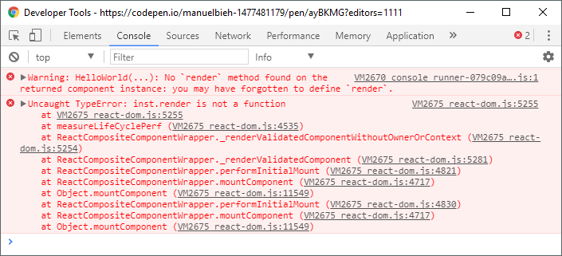
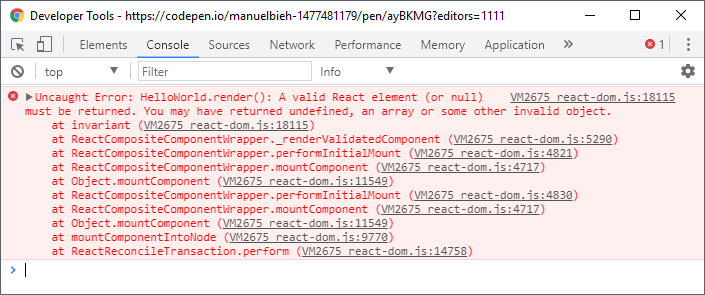

# Ab ins kalte Wasser


Nun hatten wir bereits das „Was“, das „Wann“ und das „Wo“. Kommen wir also zum „Wie“ und schreiben unsere erste kleine **React-Komponente**. Neben **React** selbst benötigen wir für die Ausgabe unserer App im Browser auch das Package **ReactDOM,** um unsere Anwendung _mounten_ zu können, also grob gesagt: im Browser nutzbar zu machen.


Ein sehr minimalistisches Setup, um schnell mit React loslegen zu können, sieht wie folgt aus:

```markup
<!DOCTYPE html>
<html>
<head>
<meta charset="UTF-8" />
<title>Hallo React!</title>
</head>
<body>
<div id="root"></div>
<script crossorigin src="https://unpkg.com/react@16.8.4/umd/react.development.js"></script>
<script crossorigin src="https://unpkg.com/react-dom@16.8.4/umd/react-dom.development.js"></script>
<script>
// Platzhalter für unsere erste Komponente
</script>
</body>
</html>
```

Wir erstellen also das Grundgerüst für ein gewöhnliches HTML-Dokument und laden **React** und **ReactDOM** in der jeweils aktuellsten Stable-Version vom unpkg-CDN, die uns dann jeweils als globale Variable im `window` Objekt unter `window.React` und `window.ReactDOM` zur Verfügung stehen. Ansonsten sehen wir hier vorerst nur eine leere Seite mit einem \(noch inhaltlosen\) `<div id="root"></div>`. Dieses div nutzen wir gleich als sogenannte **Mount-Node**, um dort unsere erste React-Komponente anzuzeigen.


Sind mehrere React-Komponenten im Spiel, redet man üblicherweise von einer **App**, **WebApp** oder **Single Page App**. Die Grenzen, ab wann eine _Komponente_ als _App_ bezeichnet wird, sind dabei aber fließend. Einige Entwickler reden auch schon bei einer einzigen Komponente von einer **App**. 
Eine feste Definition gibt es dafür nicht.


Starten wir also klassischerweise mit dem üblichen „Hello World“-Beispiel und setzen das Script an die Stelle, an der sich oben der Platzhalter befindet:

```javascript
class HelloWorld extends React.Component {
  render() {
    return React.createElement(
      'div', 
      { id: 'hello-world' }, 
      'Hello World'
    );
  }
}

ReactDOM.render(
  React.createElement(HelloWorld), 
  document.getElementById('root')
);
```

Und damit haben wir bereits die erste einfache React-Komponente implementiert! Setzen wir diesen Code nun an die Stelle unseres Platzhalters aus dem vorangegangenen Code-Snippet, sehen wir im Browser die folgende Ausgabe:


Sieht für’s Erste einmal gar nicht so kompliziert aus, oder? Gehen wir den Code einmal Schritt für Schritt durch. Die relevanten Stellen im Code habe ich fett hervorgehoben.

```jsx
class HelloWorld 
```


Hier geben wir dem Kind seinen Namen. Unsere Komponente hat in dem Fall den Namen **HelloWorld**. Bei der Namensgebung sind der Fantasie grundsätzlich keine Grenzen gesetzt, doch Achtung: React-Komponenten müssen stets mit einem Großbuchstaben beginnen! So wäre helloWorld also kein gültiger Name für eine Komponente, HELLOWORLD hingegen schon \(wenn auch sehr unüblich\). 

Die gängige Art der Benennung von Komponenten folgt der **UpperCamelCase**-Form. Auch längere, selbsterklärende Namen sind nicht unüblich. So wäre also ein Name wie **UserNotificationView** für eine Komponente keineswegs exotisch.

```jsx
extends React.Component
```

Hier erweitern wir schließlich die react-interne Klasse `React.Component`, wodurch unsere Klasse erst einmal zu einer Komponente wird, die wir in React nutzen können. Neben der `React.Component` gibt es außerdem auch die `React.PureComponent` als Komponenten-Klasse, sowie eine zweite Form, die sogenannte _Function Component_. Diese ist lediglich eine JavaScript-Funktion, die einem bestimmten Muster folgt. Beide werden im weiteren Verlauf noch ausführlich beleuchtet und sind an dieser Stelle zum Grundverständnis erst einmal weniger wichtig.

```jsx
render()
```

Unsere Komponente besteht lediglich aus dem einzigen zwingenden Bestandteil einer Komponente, nämlich der `render()`-Methode. Mittels dieser wird React mitgeteilt, wie die entsprechende Komponente dargestellt \(sprich: _„gerendert“_\) werden soll. Eine Komponente hat zwingend einen `return`-Wert. Dieser kann entweder ein explizites `null` sein, um bewusst nichts anzuzeigen \(jedoch nicht `undefined`!\), ein **React-Element** oder ab Version 16 auch ein **String** oder **Array**.

Im Falle eines Arrays darf dieser Strings, Numbers, React-Elemente oder ebenfalls `null` als Werte enthalten. Die `render()`-Methode dient also dazu, **deklarativ** den Zustand unseres Interfaces zu beschreiben. All das, was wir aus ihr per `return` zurückgeben, zeigt uns React beim Rendering als Ausgabe im Browser an.

Auch wenn man in der Gestaltung seiner JavaScript-Klassen natürlich vollkommen frei ist und dies daher nicht zwingend notwendig ist, so wird die `render()`-Methode der Übersicht halber in der Regel meist als letzte Methode einer Komponente definiert. So wird es etwa in den Code-Guidelines von AirBnB, dessen Entwickler in der React-Szene sehr aktiv sind, aber auch von vielen anderen bekannten Entwicklern vorgegeben oder zumindest empfohlen. Aus eigener Erfahrung kann ich sagen, dass es die tägliche Arbeit mit React deutlich erleichtert, sich an diese Empfehlung zu halten**.**





```jsx
React.createElement()
```

Wie erwähnt gibt die `render()`-Methode einer React-**Komponente** in den meisten Fällen ein React-**Element** zurück. React-**Elemente** sind sozusagen die kleinsten aber dennoch gleichzeitig auch die wesentlichen Bausteine in einer React-Anwendung und beschreiben, was der Benutzer letztendlich auf seinem Bildschirm sieht. Neben `React.cloneElement()` und `React.isValidElement()` war `React.createElement()` sehr lange eine eine von lediglich 3 Top-Level API-Methoden.
 Mittlerweile kamen einige weitere dazu, die aber vorrangig zur Performance-Optimierung dienen.

Die `createElement()-`Methode erwartet 1-n Parameter:

1. „Typ“, das können HTML-Elemente als String sein, also bspw. `'div'`, `'span'` oder `'p'` aber auch andere React-Komponenten
2. sog. „Props“, das sind im grundlegenden Sinn schreibgeschützte \(_readonly_\) „Eigenschafts-Objekte“ einer Komponente. Abgeleitet vom engl. _Properties_ eben.
3. sowie beliebig viele Kind-Elemente, die selbst wieder React-Elemente, Arrays, Funktionen oder auch einfacher Text sein können. Eine Komponente muss aber nicht zwingend auch Kind-Elemente besitzen.

Letztendlich ist ein **React-Element** unter der Haube nichts weiter als ein unveränderliches \(_immutable_\) JavaScript-Objekt zur Beschreibung von Eigenschaften, die React mitteilen, wie etwas \(und was\) dargestellt werden soll. React erstellt nach dieser Beschreibung ein virtuelles Abbild der Komponenten-Hierarchie. Diese stellt eine Repräsentation des HTML-Baums in Form eines JavaScript-Objekts dar und wird manchmal auch noch als Virtual DOM bezeichnet, auch wenn das React-Team von dieser Bezeichnung eher wieder Abstand genommen hat. Dieser Baum wird anschließend von React dazu verwendet, möglichst nur die Teile einer Anwendung zu aktualisieren, in denen auch tatsächlich eine Änderung vorgenommen wurde, wenn der Benutzer mit der Anwendung interagiert, Daten verändert oder Events auslöst. Dazu wird grob gesagt der vorherige Baum mit dem aktuellen Baum verglichen.

Dadurch, dass React nicht einfach bei jeder State-Änderung die komplette Anwendung neu in den DOM schreibt, was aus Performance-Sicht sehr kostspielig wäre, sondern mittels eines **Reconciliation** \(zu deutsch etwa _„Abgleich“_\) genannten Prozesses zuvor vergleicht was geändert wurde, somit die Schreibvorgänge auf ein Minimum reduziert, wird ein zum Teil enormer Geschwindigkeitsvorteil erreicht gegenüber anderen Frameworks und Libraries die viele zum Teil unnötige DOM-Mutationen vornehmen.

Bei der täglichen Arbeit wird man `React.createElement()` jedoch für gewöhnlich niemals in dieser Form aufrufen, da uns **JSX**, eine von Facebook entwickelte Syntax-Erweiterung für JavaScript, diese Arbeit abnehmen und massiv erleichtern wird. Dennoch halte ich es für wichtig, von ihrer Existenz zu wissen um zu verstehen, wie **JSX** im Hintergrund arbeitet und so mögliche Fehlerquellen ausschließen zu können.

**JSX** sieht auf den ersten Blick aus wie HTML bzw. XML/XHTML, jedoch mit deutlich erweitertem Funktionsumfang und der Möglichkeit JavaScript-Ausdrücke darin zu verwenden. JSX ist eine Abstraktion um die Art, wie man React-Elemente erstellt, für den Entwickler **deutlich** zu vereinfachen. So würde unser obiges Beispiel:

```jsx
React.createElement('div', {id: 'hello-world'}, 'Hello World');
```

in JSX ganz einfach wie folgt geschrieben werden:

```jsx
<div id="hello-world">Hello World</div>
```

Was für viele Einsteiger in React erst einmal sehr befremdlich wirkt - ich habe in diesem Zusammenhang mal den schönen Begriff **JSX-Schock** gelesen - stellt sich aber nach etwas Rumspielerei jedoch sehr schnell als unglaublich praktisch heraus und ist meines Erachtens einer der wesentlichen Gründe, warum React letztendlich so viel an Beliebtheit in so kurzer Zeit gewonnen hat.


Zurück zum Wesentlichen: unsere Komponente bekommt hier also über den `return`-Wert der `render()`-Methode mitgeteilt, dass sie ein Element vom Typ `div` mit der id `hello-world` und dem Kind-Element \(in dem Fall ein Textknoten\) mit dem Inhalt `Hallo Welt` darstellen soll.

```jsx
ReactDOM.render(Element, Container)
```

Zu guter Letzt kommt mit `ReactDOM` die zweite Library ins Spiel. **ReactDOM** ist zuständig für das Zusammenspiel von React mit dem DOM \(_Document Object Model_\), also oberflächlich ausgedrückt: dem **Web-Browser**. Wie auch schon React selbst besitzt **ReactDOM** nur sehr wenige Top-Level API-Methoden. Wir konzentrieren uns vorerst mal auf die `render()`-Methode, die sozusagen das Herzstück von **ReactDOM** im Browser ist.

Trotz der Namensgleichheit hat diese erst einmal nicht direkt etwas mit der Methode innerhalb von React-Komponenten zu tun, sondern dient lediglich dazu, ein **React-Element** in eine angegebene **„Root-Node“** zu rendern, also stumpf ausgedrückt: anzuzeigen. In unserem Fall wird hier unsere `HelloWorld`-Komponente in das `<div id="root"></div>` gerendert. Die Root-Node wird dabei **nicht ersetzt**, sondern die Komponente wird **innerhalb des Containers** eingesetzt.

**ReactDOM** sorgt also dafür, **dass** wir die angegebene Komponente überhaupt erst einmal im Browser sehen können. **Was** wir dort genau sehen haben wir zuvor in der `render()`-Methode der Komponente über das angegebene React-Element als `return`-Wert beschrieben. Beim Aufruf von `ReactDOM.render()` wird dabei das als ersten Parameter angegebene **React-Element** in den als zweiten Parameter angegebenen **Container** gerendert.


Beim ersten Aufruf der `ReactDOM.render()` Funktion wird sämtlicher möglicherweise vorhandene Inhalt des Ziel-Containers durch den von React ermittelten, darzustellenden Inhalt ersetzt. Bei jedem weiteren Aufruf verwendet React einen internen Vergleichs-Algorithmus für bestmögliche Effizienz, um nicht die komplette Anwendung vollständig neu zu rendern! 


In der Praxis ist das allerdings weniger von Relevanz, da die Funktion`ReactDOM.render()`  bei der Erstellung von Single Page Apps üblicherweise nur einmalig ausgeführt wird, für gewöhnlich beim Laden einer Seite. React verändert dabei auch niemals den Ziel-Container selbst, sondern lediglich dessen Inhalt. Besitzt das Container-Element also eigene Attribute wie  Klassen, IDs oder data-Attribute, bleiben diese auch nach dem Aufruf von `ReactDOM.render()` erhalten.


Damit ist das generelle Funktionsprinzip von React erst einmal erklärt, unsere erste Komponente ist implementiert und im Browser zu sehen!

