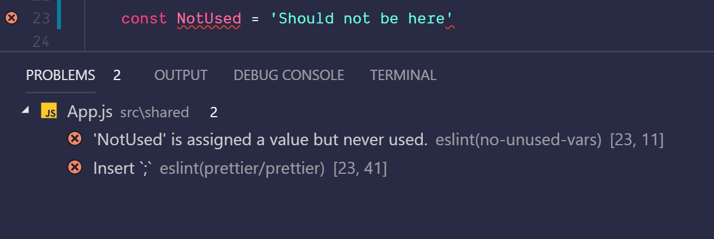
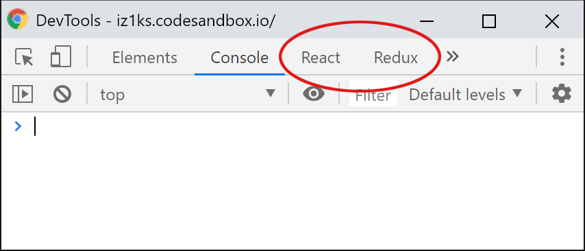

# Tools und Setup

## Tools

Um störungsfrei und komfortabel mit React arbeiten zu können, sollten einige Bedingungen erfüllt sein. Nicht alles davon ist **zwingend** notwendig, es erleichtert das Entwicklerleben jedoch ungemein, weswegen ich dennoch **dringend** dazu rate und auch bei allen folgenden Beispielen davon ausgehen werde, dass ihr diese Tools installiert habt:

### Node.js und npm

**Node.js** werden die meisten möglicherweise als **serverseitiges JavaScript** kennen, das ist allerdings nicht die ganze Wahrheit. In erster Linie ist **Node.js** einmal eine **JavaScript-Laufzeitumgebung**, die sich eben hervorragend für Netzwerkanwendungen eignet, also klassische Webserver. Darüber hinaus bringt **Node.js** auch ein Tool zur Paketverwaltung mit, nämlich **npm**, mit dem sich spielend einfach neue JavaScript-Libraries auf dem eigenen Rechner installieren lassen. Außerdem lassen sich auch eigene Kommandozeilen-Scripts damit schreiben und ausführen.

Statt **Node** direkt zu installieren, empfehle ich [**nvm**](https://github.com/creationix/nvm) \(_„Node Version Manager“_\) für Mac und Linux bzw. [**nvm-windows**](https://github.com/coreybutler/nvm-windows) für Windows. **Nvm** hat den Vorteil, dass es einerseits keine Admin-Rechte benötigt, um Packages global zu installieren und man andererseits mit einem simplen Befehl auf der Kommandozeile \(`nvm install [version]`\) die auf dem System installierte Version aktualisieren kann. Für einer Liste aller verfügbaren Version kannst du ganz einfach `nvm ls-remote` \(Mac/Linux\) bzw. `nvm list available` \(Windows\) benutzen. Ich empfehle im weiteren Verlaufe dieses Buches, die aktuelle LTS \(Long Term Support\) Version zu benutzen. LTS Versionen sind stabile Versionen, die auch längere Zeit Updates erhalten.

### Yarn

Während **Node** mit **npm** bereits einen guten und soliden Package-Manager mitbringt, geht **yarn** noch ein Stück weiter. Es bietet besseres Caching, dadurch auch bessere Performance, einfachere Kommandos und kommt darüber hinaus, wie React, ebenfalls aus dem Hause Facebook und wurde dort entwickelt, u.a. um die Arbeit mit React noch etwas angenehmer zu gestalten. Während alles, was hier im weiteren Verlauf des Buches beschrieben wird, auch mit **npm** ausgeführt werden kann, würde ich dennoch empfehlen, **Yarn** zu installieren. Dies gewinnt gerade im React-Umfeld mehr und mehr an Gewicht, insbesondere wegen seiner Einfachheit und seiner verbesserten Performance ggü. **npm**.   
Sind **Node** und **npm** erst einmal installiert, lässt sich **yarn** als globales Package über **npm** installieren:

```bash
npm install --global yarn
```

oder einfach kurz:

```bash
npm i -g yarn
```

Wir haben gerade außerdem unser erstes Package installiert. Easy! Das Commandline-Flag `--global` \(bzw. `-g`\) sorgt dabei dafür, dass die `yarn`-Executable global installiert wird und von überall auf eurem Gerät auf der Kommandozeile ausgeführt werden kann, indem ihr `yarn` auf der Kommandozeile eingebt.

### Babel

Babel ist ein Tool, das für gewöhnlich lediglich als Dependency \(Abhängigkeit\), genauer, als npm-Paket in React-basierten Projekten, zum Einsatz kommt und an dieser Stelle erst einmal nicht explizit installiert werden muss. Babel erlaubt es, nicht oder _noch_-nicht standardkonformen oder noch nicht von allen gängigen Browsern unterstützten, JavaScript-Code in interpretierbaren und ausführbaren Code zu _transpilieren_.


**Transpilieren** \(engl. _transpiling_\) nennt man einen Prozess, bei dem der Sourcecode von einer Sprache in ein entsprechendes funktional identisches Gegenstück einer anderen Sprache umgewandelt wird. In unserem Fall eben von JSX oder ES2015+ in valides, ausführbares und vom Browser unterstütztes JavaScript.


Babel besteht aus einem Core-Modul \(`@babel/core`\), das lediglich einige APIs bereitstellt, die dann von **Plugins** für das entsprechende **Transpiling** verwendet werden. Diese Plugins werden oft zu sog. **Presets** zusammengefasst, die dann wiederum mehrere **Plugins** gleichzeitig installieren. Die in React-basierten Projekten üblichsten Presets sind `@babel/preset-react` \(um **JSX** zu lesen und zu übersetzen\) und `@babel/preset-env`, welches abhängig von einer Ziel-Umgebung modernes JavaScript so umschreibt, dass es eben auch ältere Browser verstehen.

Das `@`-Zeichen vor dem Namen bedeutet dabei, dass es sich um eine Organisation innerhalb der npm Registry \(dem npm-Paketverzeichnis\) handelt und kann als eine Art Namespace betrachtet werden. Im Fall von Babel findet man dort die offiziellen Pakete, die von den Babel-Maintainern dort veröffentlicht werden. Bevor Babel in der Version 7 erschien gab es diese Organisation noch nicht und die Pakete wurden mit einem Bindestrich im Namen getrennt. So hieß `@babel/preset-react` eben `babel-preset-react`, `@babel/core` war `babel-core` usw. 

Also nicht verwirren lassen, sollte euch in einem Projekt mal `babel-core` statt `@babel/core` begegnen. In diesem Fall handelt es sich also einfach um Babel 6 \(oder eine ältere Version\). Allerdings kommt es gelegentlich vor, dass Entwickler deren Plugins oder Presets nicht offizieller Teil von Babel sind, diese ebenfalls mit `babel-` prefixen, während die Pakete dennoch mit Babel 7 arbeiten. Hier hilft in der Regel nur ein Blick in die Readme des jeweiligen Pakets.

Die **Presets**, die ich bei der Arbeit mit React verwende \(und gleichzeitig auch empfehle\) sind:

* `@babel/preset-env`
* `@babel/preset-react`
* `@babel/plugin-proposal-object-rest-spread` 
* `@babel/plugin-proposal-class-properties` 
* `@babel/plugin-syntax-dynamic-import` 

Wer mit Flow oder TypeScript als statischen Type Checkern arbeiten möchte benötigt darüber hinaus noch `@babel/preset-flow` für Flow bzw. `@babel/preset-typescript` für TypeScript. 

Installiert werden alle erwähnten Pakete via:

```bash
npm install --save-dev [paket]
```

bzw.

```bash
yarn add --dev [paket]
```

Die `--dev`-Flag gibt hier an, dass es sich um eine `devDependency` handelt, also nur für die Entwicklung relevant ist und nicht Teil des Produktionscodes sein soll.

### Webpack

**Webpack** ist ebenfalls eins der zentralen Tools im React-Ecosystem, ohne das ein effizientes Arbeiten mit React kaum möglich oder zumindest deutlich umständlicher wäre. Hier handelt es sich um einen sog. **Module-Bundler**, der modulbasierte Entwicklung, wie sie manch einer vielleicht bereits aus NodeJS kennen mag, in den Browser bringt. Dadurch wird es ermöglicht, Anwendungscode übersichtlich in einzelnen Files zu verteilen, die jeweils ihre Abhängigkeiten über `import` oder `require()` in ihren eigenen **Module-Scope** laden und damit innerhalb des Moduls verfügbar machen. Am Ende fällt dann nur noch eine einzelne JavaScript-Datei heraus \(auf Wunsch auch mehrere\), so dass nicht mehr jede einzelne unserer Komponenten, und das können schnell mal über 100 werden, einzeln über `<script src="..."></script>` im HTML eingebunden werden muss.

Wow. Klingt unfassbar kompliziert, passiert aber nach einigen wenigen Beispielen nahezu intuitiv von ganz allein und hat man sich erst einmal daran gewöhnt, wird man sich fragen, wie man jemals ohne Module-Bundler arbeiten konnte.

Neben dem Module-Bundling selbst kann **Webpack** auch beigebracht werden, Dateien mit JSX durch Babel in JavaScript zu transpilieren, Bilder, Stylesheets oder andere Assets in einen `build`-Ordner zu kopieren, der später auf einen Server deployed wird und viele andere Dinge. Wie eine solche Konfiguration aussehen kann, beleuchten wir später noch einmal genau, weshalb das Webpack-Kommandozeilen-Tool auch an dieser Stelle noch nicht installiert werden muss.

### ESLint

**ESLint** ist ein sehr praktisches Tool zur statischen Code-Analyse. Es soll in erster Linie dazu dienen, Fehler im Programmcode zu erkennen, kann aber auch dazu genutzt werden um bspw. konsistente Regeln beim Codestil durchzusetzen oder dem Entwickler Hinweise für Optimierungsmöglichkeiten während des Entwickelns zu geben. ESLint bezeichnet sich selbst als „pluggable linting utility“, verspricht also besonderen Wert auf Erweiterbarkeit zu legen. Und so gibt es in der Tat allerhand nützliche Plugins für diverse Tools, Laufzeitumgebungen und Frameworks.

Im professionellen Umfeld, aber auch in den meisten Open-Source-Projekten ist eine ESLint-Konfiguration mittlerweile üblich und nicht mehr wegzudenken. In React-Projekten haben sich insbesondere die ESLint-Plugins `eslint-plugin-react`, `eslint-plugin-babel` und `eslint-plugin-react-hooks` als solide Basis erwiesen.

Bei der Einrichtung entsprechender IDE-Plugins erscheinen dann deutlich sichtbare Warnungen an den Stellen, wo mit dem Code augenscheinlich etwas nicht gemäß den definierten Regeln abläuft:



### Prettier

Die einen lieben es, die anderen hassen es. Letztere meist nur für einen kurzen Moment, denn sobald erstmal der wahre Wert dieses Tools erkannt wurde, möchte man es nie wieder missen und fragt sich wie man jemals ohne arbeiten konnte. So ging es mir persönlich auch und vielen anderen Kollegen, mit denen ich in der Vergangenheit zusammengearbeitet habe.

**Prettier** ist ein Tool, um Code automatisch nach bestimmten Regeln sauber und vor allem konsistent zu formatieren. Es kann auf der Kommandozeile ausgeführt werden und in allen gängigen Editoren und IDEs als Plugin installiert werden. Das Tool bietet bewusst möglichst wenige Optionen um die zahlreichen nicht zielführenden Diskussionen darüber, wie Code formatiert werden sollte, nicht in die Richtung zu lenken, dass fortan darüber diskutiert wird, welche **Prettier**-Optionen genutzt werden sollten.

Es mag anfangs etwas gewöhnungsbedürftig sein und auch wer länger mit **Prettier** arbeitet wird nicht unbedingt immer 100% einverstanden sein mit der Art wie **Prettier** gewisse Stellen im Code formatiert, es setzt aber so viel kognitive Energie frei \(da keine Gedanken mehr darüber verschwendet werden müssen, wo nun ein Umbruch erfolgen und welche Zeile wie weit eingerückt werden sollte um den Code lesbarer zu machen\), dass es die Sache in meinen Augen absolut wert macht und die Verwendung rechtfertigt.

### IDE-/Editor-Plugins

Alle bekannten Editoren und IDEs wie bspw. Webstorm, Atom, Visual Studio Code oder Sublime \(aber auch so ziemlich jeder andere moderne Editor oder IDE\) bietet Plugins oder inzwischen sogar bereits nativ integrierte Funktionen für die bessere Unterstützung von **React** und **JSX**. Hier rate ich dringend zur Installation dieser Plugins, da diese in der Regel für deutlich besseres Syntax-Highlighting sorgen und teilweise Code-Vervollständigung sowie andere Nettigkeiten bieten. 

In **Atom** ist das etwa [language-babel](https://atom.io/packages/language-babel), in **VS Code** gibt es hier u.a. [Babel ES6/ES7](https://marketplace.visualstudio.com/items?itemName=dzannotti.vscode-babel-coloring) und in **Sublime** lohnt sich in Blick auf [babel-sublime](https://github.com/babel/babel-sublime). Nutzt ihr **Webstorm**, habt ihr seit Version 10 native Unterstützung für React Syntax-Highlighting. Auch Plugins für die eben erwähnten **ESLint** oder **Prettier** sind überaus sinnvoll. Dazu am Besten im Plugin-Manager eurer IDE oder eures Editors einfach nach ESLint oder Prettier suchen und das Plugin mit den meisten Installationen auswählen. Dies ist für gewöhnlich jeweils das offizielle ESLint- oder Prettier-Plugin.

### Browser-Plugins

Für den Browser empfehle ich dringend, jeweils die **React-Devtools** für [Chrome](https://chrome.google.com/webstore/detail/react-developer-tools/fmkadmapgofadopljbjfkapdkoienihi) und [Firefox](https://addons.mozilla.org/de/firefox/addon/react-devtools/) zu installieren, für den späteren Verlauf außerdem die **Redux-Devtools** für beide Browser \([Chrome](https://chrome.google.com/webstore/detail/redux-devtools/lmhkpmbekcpmknklioeibfkpmmfibljd), [Firefox](https://addons.mozilla.org/de/firefox/addon/remotedev/?)\). Die Devtools fügen sich nahtlos als neuer Tab in die bestehenden Browser-Devtools ein und bieten einen enormen Mehrwert beim Debugging von React-Komponenten.



So lässt sich bspw. der State direkt im Browser manipulieren und die Auswirkungen live beobachten. Ich würde so weit gehen zu behaupten, dass ein effizientes Debugging ohne die Devtools-Erweiterungen kaum oder sogar gar nicht möglich ist.

## Zero Config Setup

Manch einer hat in der Vergangenheit darüber gescherzt, dass man gut und gerne Tage damit verbringen kann, ein Setup aufzusetzen, bevor man die erste Zeile Code schreibt. Und in der Tat: ein ordentliches Setup ist wichtig, bestimmt es doch ein Stück weit auch die Qualität und Wartbarkeit der Anwendung, die man auf Basis seines Setups entwickelt.

Hier hat die große React-Community aber bereits sehr gute Vorarbeit geleistet. Und so listet die Seite JavaScriptStuff aktuell **198 Projekte** in der Rubrik [**React Starter Projects**](https://www.javascriptstuff.com/react-starter-projects/). Auch Facebook selbst, bzw. konkret **Dan Abramov**, Core-Entwickler bei Facebook und Autor von **Redux**, ist dort mit **Create React App** \(_„CRA“_\) vertreten. Das Projekt ist mit über 45.000 Stars auf GitHub mittlerweile so etwas wie der de-facto Standard wenn es um React Starter Projekte geht und beschreibt sich auf GitHub selbst mit:

> Create React apps with no build configuration

Und in der Tat, **Create React App** macht es gerade Einsteigern \(aber nicht nur diesen\) sehr einfach, ein sehr robustes und gutes Setup mit nur einem Befehl auf der Kommandozeile zu erzeugen:

```bash
yarn create react-app projektname
```

Wer stattdessen npm bevorzugt, muss momentan noch zwei Befehle ausführen:

```bash
npm install -g create-react-app
```

… um die **Create React App** Executable global zu installieren und anschließend

```bash
create-react-app projektname
```

Und schon wird im Ordner „_projektname_“ ein vollständiges React-Setup mit einigen kleinen Beispiel-Komponenten erzeugt. Ich würde empfehlen, dies jetzt direkt mal zu tun, denn die ersten Code-Beispiele werden zu Beginn allesamt auf einem gewöhnlichen CRA-Setup basieren und können so recht einfach ausprobiert werden.


Der Projektname muss den [Kriterien für die `name`-Eigenschaft](https://docs.npmjs.com/files/package.json#name) des `package.json`-Formats von **npm** haben. Dies bedeutet, neben einigen anderen Kriterien, er darf **nur Kleinbuchstaben** beinhalten, **keine Leerzeichen** und darf aus **maximal 214 Zeichen** bestehen. Die vollständigen Kriterien finden sich in der **npm-**Dokumentation


Dieses Setup ist bereits sehr umfangreich und deckt viele Themen ab, so dass wir uns weniger mit dem Setup beschäftigen müssen und direkt in den Code eintauchen können.

Nachdem CRA das Basis-Setup erstellt und seine Paket-Abhängigkeiten \(_Dependencies_\) installiert hat, gibt es uns noch eine kurze Anleitung, wie wir mit CRA an unserem ersten React-Projekt arbeiten können.

```bash
$ create-react-app foobar

Creating a new React app in /home/manuel/my-react-app.

Installing packages. This might take a couple of minutes.
Installing react, react-dom, and react-scripts...

Success! Created foobar at /home/manuel/my-react-app
Inside that directory, you can run several commands:

  yarn start
    Starts the development server.

  yarn build
    Bundles the app into static files for production.

  yarn test
    Starts the test runner.

  yarn eject
    Removes this tool and copies build dependencies, configuration files
    and scripts into the app directory. If you do this, you can’t go back!

We suggest that you begin by typing:

  cd my-react-app
  yarn start

Happy hacking!
```

### yarn start

Hiermit starten wir einen Entwicklungs-Server, über den wir unsere neu erstellte App im Browser aufrufen können. Dieser kümmert sich auch darum, alle Dateien im Ordner zu beobachten und unsere App mit all seinen Abhängigkeiten neu zu „kompilieren“ sobald wir eine Änderung an einem der Files vornehmen.

### yarn build

Erstellt einen Build unserer App, die wir dann bspw. auf einen öffentlichen Server deployen können. Dieser Build ist gegenüber dem Development-Build \(`yarn start`\) auf Performance optimiert, weswegen das Ausführen von `yarn build` für gewöhnlich deutlich länger dauert als `yarn start`.

### yarn test

Führt Tests aus. Als Test-Framework bringt CRA das ebenfalls von Facebook entwickelte **Jest** mit. Jest bringt hier aus meiner Sicht einen sehr entschiedenen Vorteil mit gegenüber anderen Testing-Frameworks, nämlich das sog. **Snapshot-Testing,** bei dem sozusagen eine Art _Abbild_ des aktuellen Zustands einer Komponente erstellt wird, der den Status Quo darstellt und mit dem zukünftige Test-Zustände verglichen werden. So fallen Änderungen, gewünschte wie ungewünschte, sofort ins Auge.

### yarn eject

Mit `yarn eject` können wir uns von Create React App „verabschieden“. Dabei werden alle Build-Scripts, Dependencies und Config-Files in das aktuelle Projektverzeichnis kopiert und wir sind fortan selbst dafür verantwortlich, dass alles korrekt läuft. Dadurch haben wir mehr Verantwortung, aber eben auch deutlich mehr Freiheiten, da wir von nun an eigene Änderungen an der Standard-Konfiguration von CRA vornehmen können. Wann und ob dieser Schritt überhaupt jemals nötig wird, ist völlig abhängig vom Projekt. Ich selbst habe bereits in Projekten über Monate mit dem CRA Standard-Setup gearbeitet, in anderen Projekten hat es sich bereits nach wenigen Tagen oder Wochen ergeben, dass Änderungen am Setup vorgenommen werden müssen, so dass ein Eject recht frühzeitig vorgenommen wurde.


Um die Code-Beispiele in diesem Buch nachzuvollziehen, empfehle ich an dieser Stelle, **Create React App** zu installieren. Die große Mehrzahl der Beispiele können dann per Copy and Paste in die `App.js`-Datei aus Create React App übertragen und ausgeführt werden. Um den Lern-Effekt zu erhöhen, würde ich sogar empfehlen, die Beispiele nicht zu kopieren, sondern tatsächlich abzutippen.

Wer CRA nicht installieren möchte oder es eilig hat, dem sei [CodeSandbox](https://codesandbox.io/) ans Herz gelegt. Hier kann in einer per Knopfdruck ein neues Setup mit Create React App als Basis erstellt und dann in einer Browser-Entwicklungsumgebung herumprobiert werden.


