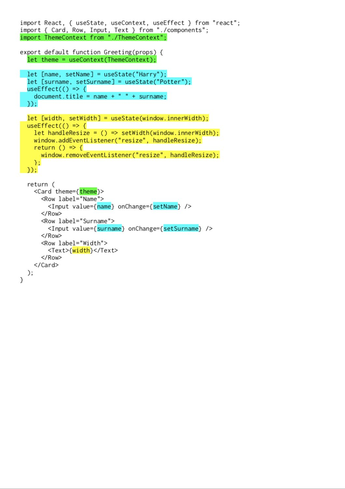

# Einführung in Hooks

**Hooks** sind ein komplett neues Konzept, das in React **16.8.0** eingeführt wurde. So komplett neu, dass ich **Hooks** in diesem Buch ein eigenes Kapitel widmen möchte. Einige der React Core-Entwickler haben es bereits als die aufregendste und grundlegendste Änderung an React in den letzten Jahren bezeichnet und in der Tat haben **Hooks** viel Aufsehen erregt, als sie auf der **React Conf 2018** angekündigt und gleich im Anschluss in der ersten Alpha-Version von React 16.7. eingeführt wurden. Inzwischen haben auch andere Frameworks eigene **Hooks** implementiert. Doch worum geht es eigentlich?

Mit **Hooks** ist es erstmals möglich, Mechanismen in **Function Components** zu benutzen die bisher nur in Klassen-Komponenten möglich waren. Features wie `setState` oder Lifecycle Methoden, ähnlich wie `componentDidMount()` oder `componentDidUpdate()`, werden dank **Hooks** auch in **Function Components** möglich. **Hooks** sind dabei im wesentlichen Sinn nichts anderes als spezielle Funktionen, die einem festen Schema folgen. So gibt es die Konvention, dass **Hooks** zwangsweise mit `use` anfangen müssen.

Dabei stellt React selbst eine Reihe interner **Hooks** wie etwa `useState`, `useEffect` oder `useContext` zur Verfügung, erlaubt aber auch die Erstellung eigener Hook-Funktionen, den sogenannten **Custom Hooks**, in denen dann eigene Logik gebündelt werden kann. Auch diese müssen per Konvention mit `use` beginnen, darüber hinaus ist die weitere Benennung dem Entwickler selbst überlassen, der Name muss lediglich ein valider JavaScript-Funktionsname sein. Also etwa `useAccountInfo` oder `useDocumentInfo`


Kleine persönliche Anekdote am Rande: die Einführung von **Hooks** hat dazu geführt dass ich große Teile dieses Buches umformulieren musste und auch noch weiterhin umformulieren muss. So war bspw. vorher auch in der offiziellen Dokumentation die Rede von **Stateless Functional Components** \(oder kurz **SFCs**\), das **Stateless** wurde mit der Einführung von **Hooks** quasi über Nacht aus der offiziellen Dokumentation gestrichen, was ich zum Anlass nahm, dies auch in diesem Buch zu tun.


**Hooks** wurden vor dem Hintergrund eingeführt, dass es mit ihnen erstmals möglich sein soll, Komponenten-Logik in einer einheitlichen und von React vorgegebenen Form zwischen verschiedenen Komponenten zu teilen. Vor **Hooks** kam es häufig vor, dass verschiedene Komponenten fast identische `componentDidMount()` oder `componentDidUpdate()`-Methoden implementiert haben; oder, dass vor allem innerhalb einer Klassen-Komponente speziell diese beiden Methoden eine nahezu identische Implementierung hatten, mit dem einzigen Unterschied, dass in `componentDidUpdate()` zusätzlich geschaut wurde, ob sich gewisse Parameter geändert haben. Bspw., ob sich eine via Props übergebene Benutzer-ID geändert hat, woraufhin ein API-Request initiiert wurde, um die Daten für den jeweiligen Benutzer abzufragen.

Aus diesem Grund wurde mit den **Hooks** ein neues Konzept eingeführt, mit dem komplexe Logik deutlich einfacher und ohne viel duplizierten Code geschrieben werden kann. Sie erfordern tatsächlich, wenn man mit der Funktionsweise von **Klassen-Komponenten** erst einmal vertraut ist, etwas Umdenken. Da sich einige Abläufe und der Aufbau der Komponenten selbst etwas ändern, hat man es schließlich nur noch mit relativ simplen Funktionen zu tun statt wie vorher mit komplexen Klassen mit Klassen-Methoden, Klassen-Eigenschaften, Vererbung und einem gemeinsamen `this`-Kontext. Doch zu den genauen Details kommen wir noch im weiteren Verlauf dieses Kapitels.

## Sind Klassen-Komponenten jetzt schlecht?

Bleibt noch die Frage zu klären: _sind Klassen-Komponenten jetzt schlecht?_

Diese Frage kam unmittelbar nach der Ankündigung und Einführung von **Hooks** in der React-Community immer wieder auf. Das React-Team beantwortete es so, dass sie nicht empfehlen würden, eine bestehende Anwendung, die mit **Klassen-Komponenten** arbeitet, nicht abrupt in **Function Components** mit **Hooks** umzuschreiben, da auch **Klassen-Komponenten** weiterhin Teil von React bleiben werden.

Die Community hat das aber zu großen Teilen nicht wirklich interessiert und so gab es nach dem Release von **React 16.7.0-alpha.0**, also der ersten Version mit **Hooks**, zahlreiche Meldungen von Entwicklern auf Twitter, die sich trotz aller Warnungen nicht davon abhalten ließen, ihre Anwendungen mit **Hooks** umzuschreiben und zum deutlich überwiegenden Teil begeistert waren von der neuen Einfachheit der Entwicklung von Komponenten ohne den Overhead, den Klassen-Komponenten ein Stück weit mit sich gebracht haben.

Grundsätzlich ist also auch nach wie vor nichts gegen die Verwendung von Klassen-Komponenten einzuwenden und wer mag, kann diese auch weiterhin verwenden, da es momentan keine Pläne gibt, diese wieder aus React zu entfernen. Wer sich allerdings erst einmal an die Verwendung von **Hooks** gewöhnt hat, dem dürfte es in den meisten Fällen schwer fallen, freiwillig auf die Einfachheit und Verständlichkeit dieser neuen Form einer Komponente zu verzichten.

## Klassen-Komponenten und Hooks – ein Vergleich

Um zu veranschaulichen, wie viel simpler Komponenten durch die Verwendung von **Hooks** werden können hat Sunil Pai, ebenfalls ein Core-Entwickler von React, einen Vergleich erstellt, bei dem zusammenhängende Logik gleich eingefärbt wurde und die Teile, die in der **Function Component** mit **Hooks** nicht mehr benötigt werden, in der Klassen-Komponente geschwärzt wurden. Das Ergebnis ist ein sehr harmonisches Bild in dem Logik jeweils an einer Stelle gebündelt ist und nicht an verschiedenen Stellen innerhalb der Komponente verwendet wird:

Quelle: [Sunil Pai auf Twitter](https://twitter.com/threepointone/status/1056594421079261185)

