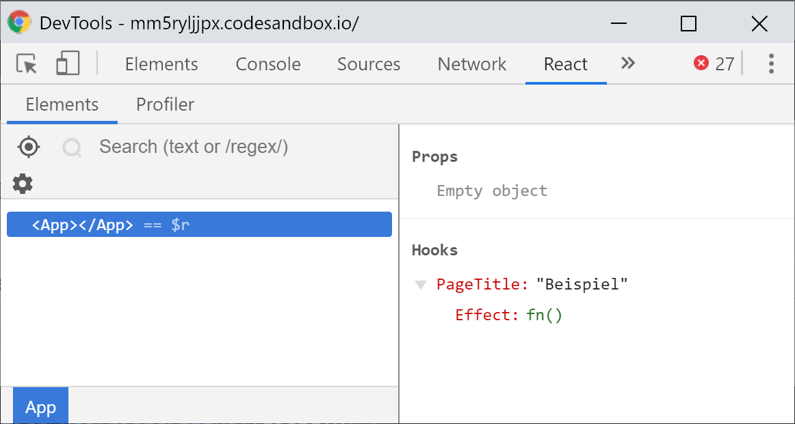

# Hooks API

In diesem Kapitel möchte ich auf alle verfügbaren internen Hooks einmal eingehen, ihre genaue Verwendung und ihre Einsatzbereiche beschreiben. In der React-Dokumentation werden diese unterteilt in drei generelle \(_basic_\) und sieben zusätzliche \(_additional_\) Hooks. Die zusätzlichen Hooks sind insbesondere für spezielle Anwendungsfälle \(bspw. Performance-Optimierung\) gedacht oder sie sind Abwandlungen der generellen Hooks.

Zu den drei **generellen Hooks** gehören die bereits in den vorherigen Kapiteln vorgestellten Hooks:

* `useState`
* `useEffect`
* `useContext`

Die sieben **weiteren Hooks** sind:

* `useReducer` 
* `useCallback` 
* `useMemo` 
* `useRef` 
* `useImperativeHandle` 
* `useLayoutEffect` 
* `useDebugValue`

## useState

```javascript
const [state, setState] = useState(initialState);
```

Dieser Hook gibt uns einen **Wert** zurück und eine **Funktion,** um selbigen zu aktualisieren. Während des ersten Renderings einer Komponente, die den `useState()`-Hook nutzt, entspricht dieser Wert dem als `initialState` übergebenen Parameter. Ist der übergebene Parameter eine Funktion nutzt React den Rückgabewert der Funktion als initialen Wert.

Bei der Update-Funktion stellt React sicher, dass diese stets die selbe **Identität** hat, erstellt die Funktion also nicht bei jedem Aufruf des Hooks neu. Dies ist wichtig, um unnötige Re-Renderings zu verhindern und führt außerdem dazu, dass sie nicht als **Dependency** an andere **Hooks** wie `useEffect()` oder `useCallback()` übergeben werden muss.

Ganz konkret gibt `useState()` ein **Array** zurück in dem das erste Element immer der **Wert** des States ist und das zweite Element immer eine **Funktion**, um diesen Wert zu aktualisieren. Für die Benennung von Wert und Funktion gibt es durch die Array Destructuring Syntax keine formellen Einschränkungen. Jedoch hat es sich schnell herauskristallisiert, dass in den deutlich überwiegenden Fällen die Form `value`/`setValue` eingehalten werden. Also etwa `user` und `setUser`. Aber auch andere Namen wie `changeUser` oder `updateUserState` wären natürlich denkbar.

Der Mechanismus zum Aktualisieren des States funktioniert hier ansatzweise ähnlich wie `this.setState()` in Klassen-Komponenten. So kann der Funktion entweder ein **neuer Wert** übergeben werden, der dann an die Stelle des alten Werts tritt oder eine **Updater-Funktion**. Diese bekommt den letzten Wert übergeben und nutzt den **Rückgabewert** aus der Funktion als neuen State.

Doch Achtung, es gibt einen entscheidenden Unterschied: anders als bei `this.setState()` werden Objekte **nicht zusammengeführt** mit dem bestehenden State, sondern der State wird **komplett** durch den neuen State **ersetzt!**

Um diesen Unterschied zu illustrieren schauen wir uns einmal den direkten Vergleich an:

```jsx
import React, { useState, useEffect } from "react";
import ReactDOM from "react-dom";

class StateClass extends React.Component {
  state = { a: 1, b: 2 };

  componentDidMount() {
    this.setState({ c: 3 });
    this.setState(() => {
      return { d: 4 };
    });
  }

  render() {
    // { a: 1, b: 2, c: 3, d: 4 }
    return <pre>{JSON.stringify(this.state, null, 2)}</pre>;
  }
}

const StateHook = () => {
  const [example, setExample] = useState({ a: 1, b: 2 });

  useEffect(() => {
    setExample({ c: 3 });
    setExample(() => {
      return { d: 4 };
    });
  }, []);

  // { d: 4 }
  return <pre>{JSON.stringify(example, null, 2)}</pre>;
};

const App = () => {
  return (
    <>
      <StateClass />
      <StateHook />
    </>
  );
};

ReactDOM.render(<App />, document.getElementById("root"));
```

Während die `StateClass` die Daten aller Aufrufe von `this.setState()` sammelt und mit dem bestehenden State zusammenführt, überschreibt die `setState()`-Funktion im `StateHook` jeweils den kompletten State und ersetzt den kompletten alten Wert mit dem neuen Wert. Die Ausgabe ist also in der **Klassen-Komponente**: `{a: 1, b: 2, c: 3, d: 4}` und in der **Function Component** mit dem Hook ein einfaches `{d: 4}`, da dieses zuletzt in den State geschrieben wurde.

Gibt die Update-Funktion als neuen State exakt den gleichen Wert zurück wie den vorherigen, kommt das dem Abbruch eines State-Updates gleich und es wird kein Rerendering ausgelöst und auch keine Seiten-Effekte ausgelöst.

## useEffect

```javascript
useEffect(effectFunction, dependenciesArray);
```

Dieser **Hook** ist für **imperative Seiteneffekte** vorgesehen, wie etwa API Requests, Timer oder globale Event-Listener. Diese sind innerhalb von **Function Components** grundsätzlich nicht erlaubt oder zumindest zu vermeiden, da sie zu nicht nachvollziehbarem Verhalten und möglicherweise zu schwer zu behebenden Bugs führen können und werden.

Der `useEffect()`-**Hook** schafft hier Abhilfe und erlaubt die _sichere_ Verwendung von Seiten-Effekten auch innerhalb einer **Function Component**.

Der **Hook** erwartet eine **Funktion** als ersten Parameter und optional ein **Dependency Array** als zweiten Parameter. Die Funktion wird aufgerufen **nachdem** eine Komponente gerendert wurde. Wird ein optionales **Dependency Array** übergeben, wird die Funktion nur dann ausgeführt wenn sich mindestens einer der Werte aus dem **Dependency Array** seit der letzten Ausführung der Funktion geändert hat. Wird ein leeres **Dependency Array** übergeben, also `[]`, wird die Funktion nur beim **ersten** Rendering der Komponente aufgerufen, vergleichbar also mit der `componentDidMount()` **Lifecycle Methode**, die wir bereits aus Klassen-Komponenten kennen.

### Seiteneffekte aufräumen

In einigen Fällen hinterlassen Seiteneffekte "Spuren", die wieder aufgeräumt werden müssen wenn eine Komponente nicht mehr verwendet wird. Werden beispielsweise Intervalle mittels `setInterval()` gestartet, sollten diese beim Entfernen der Komponente via `clearTimeout()` gestoppt werden, andernfalls kann es zu Problemen wie im schlimmsten Falle Memory Leaks führen.

Auch global registrierte Event Listener wie `resize` oder `orientationchange` die dem `window`-Objekt mittels `addEventListener()` hinzugefügt werden, sollten spätestens beim Unmounting einer Komponente wieder durch `removeEventListener()` entfernt werden, damit der Code nicht mehr ausgeführt wird, wenn die Komponente sich gar nicht mehr im Seitenbaum befindet.

Zu diesem Zweck ist es möglich eine **Cleanup-Funktion** aus der **Effekt-Funktion** zurück zu geben. Gibt eine **Effekt-Funktion** eine **Cleanup-Funktion** zurück, wird diese vor jedem Aufruf der **Effekt-Funktion** ausgeführt, außer vor dem ersten Aufruf:

```javascript
import React, { useState, useEffect } from "react";
import ReactDOM from "react-dom";

const Clock = () => {
  const [time, setTime] = useState(new Date());

  useEffect(() => {
    const intervalId = setInterval(() => {
      setTime(new Date());
    }, 1000);
    return () => {
      clearInterval(intervalId);
    };
  }, []);

  return `${time.getHours()}:${time.getMinutes()}:${time.getSeconds()}`;
);

ReactDOM.render(<Clock />, document.getElementById("root"));
```

Im obigen Beispiel installieren wir ein Intervall beim **Mounting** der Komponente. Beim **Unmounting** der Komponente halten wir den Timer an, da wir sonst den State einer Komponente ändern würden, die sich nicht mehr im Seitenbaum befindet. Dies würde uns React mit einer Fehlermeldung quittieren, vor Memory Leaks warnen und uns darauf hinweisen, dass Subscriptions und andere asynchrone Tasks in der **Cleanup**-Funktion aufgeräumt werden müssen:


Warning: Can't perform a React state update on an unmounted component. This is a no-op, but it indicates a memory leak in your application. To fix, cancel all subscriptions and asynchronous tasks in a useEffect cleanup function.


Indem wir eine Aufräum-Funktion aus der Effekt-Funktion zurückgeben, können wir das Intervall durch den Aufruf von `clearInterval()` abbrechen. Dies passiert vor jedem erneuten Aufruf der Effekt-Funktion, spätestens jedoch beim Unmounting.

### Bedingte Aufrufe der Effekt-Funktion

Standardmäßig wird der `useEffect()`-Hook bzw. dessen Effekt-Funktion nach jedem Rendering der Komponente erneut ausgeführt. Damit ist sichergestellt, dass der Effekt jedesmal ausgeführt wird, wenn sich einige der von ihm verwendeten Abhängigkeiten \(_Dependencies_\) ändern. Greifen wir also innerhalb der Effekt-Funktion bspw. auf den State oder die Props einer Komponente zu, soll auch der Seiteneffekt erneut ausgeführt werden, wenn sich eine dieser Dependencies ändert. Möchten wir etwa Profildaten zu einem Benutzer anzeigen und beziehen diese über eine API, so soll der API-Request natürlich auch initiiert werden wenn der Benutzer dessen Profil wir anschauen wollen sich ändert während die Komponente gemounted ist.

Dies führt aber mitunter zu sehr vielen unnötigen Aufrufen der Funktion und auch dazu, dass die Funktion unter gewissen Umständen auch ausgeführt wird, wenn sich gar keine Daten seit dem letzten Rendering geändert haben, die für den Seiteneffekt relevant sind. Zu diesem Zweck bietet uns React die Möglichkeit, ein **Dependency Array** als zweiten Parameter zu definieren. Dort können und sollen wir alle Werte eintragen, die eine erneute Ausführung der Effekt-Funktion herbeiführen sollen. Nur wenn sich mind. ein Wert im **Dependency Array** geändert hat, wird die Funktion erneut ausgeführt. Um am Beispiel unseres Benutzerprofils zu bleiben, wäre das hier etwa der Benutzername oder die ID, über die wir die Benutzerdaten von der API abrufen.

```javascript
useEffect(
  () => {
    const user = api.getUser(props.username);
    setUser(user);
  }, 
  [props.username]
);
```

Beim Erstellen eines solchen **Dependency Arrays** sollte man genau darauf achten, dass sämtliche Werte, die innerhalb der Funktion verwendet werden und die sich im Laufe der Lebenszeit der Komponente ändern können, auch dort aufgelistet sind. Soll die Effekt-Funktion nur einmalig ausgeführt werden, also einen ähnlichen Zweck erfüllen wie `componentDidMount()` in Klassen-Komponenten, wird ein leeres Array \(d.h. `[]`\) übergeben.


Um die Arbeit bei der Erstellung von **Dependency Arrays** zu erleichtern oder gar zu automatisieren gibt es im `eslint-plugin-react-hooks` die `exhaustive-deps`-Regel, die bei entsprechender Editor-Konfiguration \(z.B. _Format on Save_\) die in der Effekt-Funktion benutzten Abhängigkeiten automatisch in das **Dependency Array** einträgt oder zumindest warnt, sollten Unstimmigkeiten gefunden werden.

Aktiviert werden kann sie durch den Eintrag `"exhaustive-deps": "warn"` im `rules` Block der ESLint-Konfiguration.


### Zeitliche Abfolge

Die **Effekt-Funktion** wird **asynchron** mit Verzögerung nach den **Layout-** und **Paint-Phasen** vom Browser ausgeführt. Das sollte für die meisten Seiteneffekte völlig ausreichend sein. Jedoch kann es Situationen geben in denen um **synchron** ausgeführte Seiteneffekte kein Weg dran vorbei führt. Dies kann der Fall sein, wenn etwa DOM-Mutationen involviert sind und die verzögerte Ausführung dazu führen würde, dass der Benutzer ein kurzes Flackern oder ein inkonsistentes User Interface wahrnehmen könnte.

Zu diesem Zweck wurde der `useLayoutEffect()`-Hook eingeführt. Er funktioniert identisch zum `useEffect()`-Hook, erwartet ebenso eine **Effekt-Funktion**, diese kann in der gleichen Form eine **Aufräum-Funktion** zurückgeben und auch das **Dependency Array** funktioniert identisch zum `useEffect()`-Hook. Der Unterschied besteht hier darin, dass sie synchron ausgeführt wird \(statt asynchron\), und zwar nachdem alle DOM-Mutationen geschrieben wurden.

Der `useLayoutEffect()`-Hook kann also aus dem DOM lesen und diesen ebenfalls synchron modifizieren, **bevor** der Browser die Änderungen in seiner Paint-Phase darstellt.

### Asynchrone Effekt-Funktionen

Auch wenn **Effekt-Funktionen** verzögert ausgeführt werden, dürfen sie selbst nicht asynchron sein bzw. keine Promises zurückgeben. Andernfalls bekommen wir eine Fehlermeldung, in der uns React auf diesen Umstand hinweist:


Warning: An Effect function must not return anything besides a function, which is used for clean-up.

It looks like you wrote useEffect\(async \(\) =&gt; ...\) or returned a Promise. Instead, you may write an async function separately and then call it from inside the effect \[…\]

In the future, React will provide a more idiomatic solution for data fetching that doesn't involve writing effects manually.


Im obigen Beispiel hätte der **inkorrekte** `useEffect()`-Hook etwa so ausgesehen:

```javascript
useEffect(async () => {
  const response = await fetch('https://api.github.com/users/manuelbieh');
  const accountData = await response.json();
  setGitHubAccount(accountData);

  fetchGitHubAccount("manuelbieh");
}, []);
```

Dies ist **nicht erlaubt**, da die Effekt-Funktion mit dem `async` Schlüsselwort als _asynchron_ deklariert wird. Wie also lösen wir das Problem? Nun, die Lösung ist in diesem Fall relativ simpel: Wir verschieben den asynchronen Teil der Funktion in eine eigene, asynchrone Funktion **innerhalb der Effekt-Funktion** und rufen diese Funktion dann lediglich auf:

```jsx
import React, { useEffect, useState } from "react";
import ReactDOM from "react-dom";

const App = (props) => {
  const [gitHubAccount, setGitHubAccount] = useState();

  useEffect(() => {
    const fetchGitHubAccount = async () => {
      const response = await fetch(`https://api.github.com/users/${props.username}`);
      const accountData = await response.json();
      setGitHubAccount(accountData);
    };

    fetchGitHubAccount();
  }, [props.username]);

  if (!gitHubAccount) {
    return null;
  }

  return (
    <p>
      {gitHubAccount.name} has {gitHubAccount.public_repos} public repos
    </p>
  );
};

ReactDOM.render(
  <App username="manuelbieh" />, 
  document.getElementById("root")
);
```

In diesem Fall ist nicht mehr die Effekt-Funktion selbst asynchron, sondern die asynchrone Funktionalität wird in die asynchrone Funktion `fetchGitHubAccount()` ausgelagert, die wir **innerhalb** des `useEffect()`-Hooks definieren.

Die asynchrone Funktion muss dabei nicht zwingend **in** der Effekt-Funktion erzeugt werden. Die Effekt-Funktion selbst darf nur eben nicht selbst asynchron sein.

## useContext

```javascript
const myContextValue = useContext(MyContext);
```

Dieser Hook erwartet als einzigen Parameter einen Context-Typen, der mittels `React.createContext()` erstellt wurde und gibt dann den Wert des in der Komponenten-Hierarchie nächsthöheren Context-Providers des entsprechenden Typs zurück.

Der `useContext()`-Hook verhält sich dabei wie eine Context-Consumer-Komponente und verursacht ein Rerendering der **Function Component,** sobald der Wert des Contexts im jeweiligen Provider-Element geändert wurde.

Die Verwendung des Hooks ist optional und so ist es auch weiterhin möglich, Context-Consumer im **JSX** der **Function Component** zu verwenden. Allerdings ist der Hook die deutlich übersichtlichere Variante, da dieser keine neue Hierarchie-Ebene im Komponentenbaum erzeugt.

## useReducer

```javascript
const [state, dispatch] = useReducer(reducerFunc, initialState, initFunc)
```

Der `useReducer()`-Hook ist eine Alternative zu `useState()`, die es erlaubt auch komplexere States zu managen. Der Hook ist angelehnt an die Flux-Architektur, bei der, kurz gesagt, eine **Reducer-** Funktion einen **neuen State erzeugt**, indem sie den **letzten State** und eine sog. **Action** übergeben bekommt.

Die **Reducer**-Funktion wird durch den Aufruf einer **Dispatch**-Funktion aufgerufen, die wiederum eine **Action** übergeben bekommt. Die **Action** selbst ist dabei ein Objekt, das zwingend eine `type` Eigenschaft und oftmals \(optional\) eine `payload`-Eigenschaft besitzt. Aus dieser **Action** und dem **letzten State** erzeugt die **Reducer**-Funktion dann den **neuen State**. Die **Reducer**-Funktion hat also die Form `(oldState, action) => newState`.

Schauen wir uns auch hierzu einmal ein simples Beispiel an und entwickeln zu diesem Zweck eine einfache `Counter`-Komponente, mit der wir über zwei Buttons \(`+` und `-`\) einen Wert rauf- und runterzählen können:

```jsx
import React, { useReducer } from "react";
import ReactDOM from "react-dom";

const initialState = {
  count: 0,
};

const reducerFunction = (state, action) => {
  switch (action.type) {
    case "INCREMENT":
      return { count: state.count + 1 };
    case "DECREMENT":
      return { count: state.count - 1 };
    default:
      throw new Error('Unbekannte Action');
  }
};

const Counter = () => {
  const [state, dispatch] = useReducer(reducerFunction, initialState);

  return (
    <div>
      <h1>{state.count}</h1>
      <button onClick={() => dispatch({ type: "INCREMENT" })}>+</button>
      <button onClick={() => dispatch({ type: "DECREMENT" })}>-</button>
    </div>
  );
};

ReactDOM.render(<Counter />, document.getElementById("root"));
```

Wir definieren zunächst den initialen State \(`initialState`\) und die Reducer-Funktion \(`reducerFunction`\). Der **initiale State** besteht lediglich aus einem Objekt mit einer `count`-Eigenschaft, die initial `0` ist. Die **Reducer**-Funktion erwartet einen `state` und eine `action`. die von React später über den Aufruf der **Dispatch**-Funktion an den Reducer übergeben werden. Aus diesen beiden Parametern erzeugen wir dann den neuen State. **Wichtig:** Hier müssen wir stets einen neuen State erzeugen statt den bestehenden zu mutieren, da eine Mutation des bestehenden States zu ungewünschten Seiteneffekten und fehlerhafter Darstellung führen kann. Eine **Reducer**-Funktion muss also eine **Pure Function** sein!

Die **Reducer**-Funktion und den initialen State geben wir dann in den `useReducer()`-Hook hinein, der uns daraufhin ähnlich wie der `useState()`-Hook einen Tupel zurückgibt, in dem das erste Element immer der **aktuelle State** in der aktuellen Rendering-Phase ist, das zweite Element ist dann die besagte **Dispatch**-Funktion.

Möchten wir nun den State verändern, rufen wir in der Komponente die `dispatch`-Funktion auf und übergeben ihr eine **Action**. Dies passiert in unserer Beispiel-Komponente per Klick auf einen der beiden Buttons, die dann die Action `{type: "INCREMENT"}` \(zum Raufzählen\) oder `{type: "DECREMENT"}` \(zum Runterzählen\) „dispatchen“.

Wird eine Action _dispatched_ und wird dabei ein neuer State erzeugt, löst React ein Rerendering aus und der neu erzeugte State steht in der von der Reducer-Funktion zurückgegebenen `state` Variable zur Verfügung. Wird hingegen der gleiche State von der **Reducer**-Funktion zurückgegeben, wird **kein** Rerendering ausgelöst!

### Der dritte Parameter

Neben der `reducer`-Funktion und dem `initialState`, die jeweils zwingend angegeben werden müssen, kann der `useReducer()`-Hook aber noch einen dritten, optionalen Parameter erhalten, nämlich eine `init`-Funktion zum Errechnen des initialen States. Die Funktion kann verwendet werden, um bspw. den initialen Wert des **Reducers** in einer externen Funktion außerhalb des Reducers zu berechnen.

Wird eine solche `init`-Funktion übergeben, wird diese vom Hook beim **ersten** Aufruf aufgerufen und der `initialState` wird ihr als **initiales Argument** übergeben. Dies kann insbesondere dann sinnvoll sein, wenn der **initiale State** auf den **Props** einer Komponente basiert. Diese können dann im zweiten Parameter an die `init`-Funktion weitergereicht werden, die darauf basierend den initialen State des Reducers erzeugen kann:

```jsx
import React, { useReducer } from "react";
import ReactDOM from "react-dom";

const reducerFunction = (state, action) => {
  switch (action.type) {
    case "INCREMENT":
      return { count: state.count + 1 };
    case "DECREMENT":
      return { count: state.count - 1 };
    default:
      throw new Error("Unbekannte Action");
  }
};

const initFunction = (initValue) => {
  return { count: initValue };
};

const Counter = (props) => {
  const [state, dispatch] = useReducer(
    reducerFunction, props.startValue, initFunction
  );

  return (
    <div>
      <h1>{state.count}</h1>
      <button onClick={() => dispatch({ type: "INCREMENT" })}>+</button>
      <button onClick={() => dispatch({ type: "DECREMENT" })}>-</button>
    </div>
  );
};

ReactDOM.render(<Counter startValue={3} />, document.getElementById("root"));
```

In diesem Beispiel erweitern wir den `useReducer()`-Hook um den dritten, optionalen Parameter: die **Init-** Funktion. Aus dem `initialState` im ersten Beispiel wird ein Argument für die **Init-**Funktion. Der Wert für dieses Funktions-Argument wird der Komponente hier als `startValue` über die Props übergeben.

### Reducer in der Praxis

Das Prinzip von **Reducern** dürfte einem großen Teil der React-Community wohl erstmals durch den Aufstieg von **Redux** nahegebracht worden sein. **Redux** ist ein Paket um globalen State komfortabel managen zu können und wurde in der Vergangenheit häufig verwendet, wenn das Handling von lokalen States in React zu unübersichtlich wurde oder über zu viele Komponenten hinweg durch sog. „Props Drilling“ \(also dem Weiterreichen von Props über mehrere Hierarchie-Ebenen hinweg\) zu umständlich wurde.

**Redux** \(und daher der Name\) besteht in seinem Kern darin, Reducer-Funktionen zu verwalten und deren State und Dispatch-Funktion in den Komponenten verfügbar zu machen, die den globalen State lesen oder verändern sollen. Mit dem `useReducer()`-Hook bekommt React nun eine eigene Funktion um komplexes State-Management mittels Reducer-Funktionen zu bewerkstelligen.

Ein typischer Anwendungsfall für Reducer ist dabei die Status-Verwaltung bei API Requests. Als gewohntes Muster hat sich hier bspw. herauskristallisiert, drei verschiedene Actions je API Request zu definieren:

* eine Action, die die Anwendung davon in Kenntnis setzt, dass Daten geladen werden, wenn der Request gestartet wird,
* eine Action, die den Lade-Status zurücksetzt und, wenn der Request fehlgeschlagen ist, den State darüber in Kenntnis setzt, dass ein Fehler aufgetreten ist \(und ggf. auch welcher\),
* eine Action, die die von der API erhaltenen Daten in den State schreibt, wenn der Request erfolgreich war

Werfen wir hierzu einen Blick auf ein solches Beispiel und laden wieder unsere Account-Daten via GitHub-API:

```jsx
import React, { useEffect, useReducer } from "react";
import ReactDOM from "react-dom";

const initialState = {
  data: null,
  isLoading: false,
  isError: false,
  lastUpdated: null,
};

const accountReducer = (state, action) => {
  switch (action.type) {
    case "REQUEST_START":
      return {
        ...state,
        isLoading: true,
      };
    case "REQUEST_SUCCESS":
      return {
        ...state,
        data: action.payload,
        isLoading: false,
        isError: false,
        lastUpdated: action.meta.lastUpdated,
      };
    case "REQUEST_ERROR":
      return {
        ...state,
        isLoading: false,
        isError: true,
      };
  }
};

const RepoInfo = (props) => {
  const [state, dispatch] = useReducer(accountReducer, initialState);

  useEffect(() => {
    const fetchGitHubAccount = async (username) => {
      try {
        dispatch({
          type: "REQUEST_START",
        });
        const response = await fetch(
          `https://api.github.com/users/${username}`
        );

        const accountData = await response.json();
        dispatch({
          type: "REQUEST_SUCCESS",
          payload: accountData,
          meta: {
            lastUpdated: new Date(),
          },
        });
      } catch (err) {
        dispatch({
          type: "REQUEST_ERROR",
          error: true,
        });
      }
    };

    fetchGitHubAccount(props.username);
  }, [props.username]);

  if (state.isError) {
    return <p>Ein Fehler ist aufgetreten.</p>;
  }

  if (state.isLoading) {
    return <p>Daten werden geladen.</p>;
  }

  if (!state.data) {
    return <p>Es wurde kein GitHub-Account geladen</p>;
  }

  return (
    <p>
      {state.data.name} hat {state.data.public_repos} öffentliche Repos
    </p>
  );
};

ReactDOM.render(
  <RepoInfo username="manuelbieh" />,
  document.getElementById("root")
);
```

Wir benutzen wieder den `useReducer()`-Hook und übergeben ihm die `accountReducer`-Funktion. In dieser Funktion reagieren wir auf die drei **Actions** vom **Typ** `REQUEST_START`, `REQUEST_SUCCESS` und `REQUEST_ERROR`.

Der `initialState` besteht aus einem Objekt mit einer leeren `data`-Eigenschaft, den beiden Flags `isFetching` und `isError`, die unserer Komponente später mitteilen ob Daten geladen werden oder ob ein Fehler aufgetreten ist, sowie einer `lastUpdated`-Eigenschaft, in der wir den Zeitpunkt des letzten erfolgreichen Requests speichern. Diese können wir später nutzen, um etwa Requests nur einmal pro Minute auszuführen oder dem Benutzer zu signalisieren, dass er Daten sieht, die schon für längere Zeit nicht aktualisiert wurden.

Wir nutzen außerdem einen `useEffect()`-Hook um das Laden der Daten zu veranlassen, sobald sich der in den **Props** übergebene GitHub-Benutzername ändert. Ist dies der Fall, wird zuallererst die `REQUEST_START`-**Action** dispatched. Der **Reducer** erzeugt daraufhin den folgenden neuen State:

```diff
{
  data: null,
- isLoading: false,
+ isLoading: true,
  isError: false,
  lastUpdated: null,
}
```

Dadurch greift in unserer Komponente weiter unten nun folgende Bedingung:

```jsx
if (state.isLoading) {
  return <p>Daten werden geladen.</p>;
}
```

Und signalisiert dem Benutzer, dass momentan Daten geladen werden.

Als nächstes können zwei Fälle eintreten: Entweder der Request schlägt fehl oder wir beziehen erfolgreich Daten von der API.

Schlägt der Request fehl, dann würde die `REQUEST_ERROR`-**Action** dispatched. Unser State würde sich daraufhin wie folgt verändern:

```diff
{
  data: null,
- isLoading: true,
+ isLoading: false,
- isError: false,
+ isError: true,
  lastUpdated: null,
};
```

Da kein Request mehr durchgeführt wird, wird die `isLoading`-Flag von `true` wieder auf `false` zurückgesetzt um dem Benutzer nicht fälschlicherweise zu signalisieren, dass wir noch Daten laden würden. Da ein Fehler aufgetreten ist, setzen wir gleichzeitig `isError` von `false` auf `true`. Statt der Lade-Nachricht greift nun folgende Bedingung und setzt den Benutzer vom aufgetretenen Fehler in Kenntnis:

```jsx
if (state.isError) {
  return <p>Ein Fehler ist aufgetreten.</p>;
}
```

An dieser Stelle wäre es durchaus ratsam dem Benutzer mitzuteilen, was falsch gelaufen ist und wie er den Fehler ggf. beheben kann. Vielleicht existiert der übergebene Benutzername nicht und man könnte ihm die Chance geben, diesen zu korrigieren oder die API ist gerade nicht erreichbar, dann könnte man dem Benutzer die Möglichkeit geben, den Request zu einem späteren Zeitpunkt noch einmal zu wiederholen.

Für den Fall, dass alles geklappt hat und wir korrekt Daten von der API beziehen konnten, wird die `REQUEST_SUCCESS`-**Action** dispatched. Diese enthält neben der `payload`, die den geladenen Daten entspricht, auch eine `meta`-Eigenschaft, mit der wir den Zeitpunkt des Requests mitgeben.

Der **neue State**, der vom **Reducer** erzeugt wird, unterscheidet sich dann folgendermaßen vom letzten State:

```diff
{
- data: null,
+ data: {
+   "login": "manuelbieh",
+   "name": "Manuel Bieh",
+   "public_repos": 59,
+   [...]
+ },
- isLoading: true,
+ isLoading: false,
  isError: false,
- lastUpdated: null,
+ lastUpdated: "2019-03-19T02:29:10.756Z",
}
```

Unsere `data`-Eigenschaft enthält nun die Daten, die wir von der API bekommen haben. Der `isLoading`-Status wird wieder auf `false` zurückgesetzt, die `lastUpdated`-Eigenschaft setzen wir auf den Zeitpunkt, zu dem wir auch die Daten in den State geschrieben haben. In unserer Komponente sollte nun die gewünschte Ausgabe erzeugt werden:

```jsx
return (
  <p>
    {state.data.name} hat {state.data.public_repos} öffentliche Repos
  </p>
);
```

Damit haben wir neben dem ersten komplexeren Reducer auch zugleich ein erstes Zusammenspiel der beiden **Hooks** `useEffect()` und `useReducer()` in einem praxisnahen Beispiel implementiert!

Übrigens: Genau wie beim `useState()`-Hook löst auch der `useReducer()`-Hook kein erneutes Rendering aus, wenn die Reducer-Funktion den gleichen State wie vorher zurückgibt!

## useCallback

```javascript
const memoizedFunction = useCallback(callbackFunction, dependencyArray);
```

Der `useCallback()`-Hook dient zur Optimierung hinsichtlich der Performance einer Anwendung. Er erwartet eine Funktion und erzeugt eine **eindeutige Identität** dieser Funktion, die so lange Bestand hat, bis sich die **Dependencies** des Hooks ändern.

Dies ist dazu gedacht, eine immer gleiche Referenz zu einer Funktion an Komponenten zu übergeben die entweder `PureComponents`, eine eigene `shouldComponentUpdate()`-Methode implementieren oder die mittels `React.memo()` umschlossen werden.

Der `useCallback()`-Hook erwartet eine Funktion als erstes Argument und einen Dependency Array \(wie beim `useEffect()`-Hook\) und gibt im Gegenzug dafür eine „stabile“ Referenz zur hereingereichten Funktion zurück. Stabil heißt in dem Fall, dass sie sich nur dann ändert, wenn sich die **Dependencies** des Hooks verändert haben. Bis zu diesem Zeitpunkt ist eine via `useCallback()` erzeugte Referenz für `PureComponents` oder Komponenten mit `React.memo()` dieselbe.

Was erst einmal kompliziert klingen mag, lässt sich wie so häufig am Besten anhand eines Beispiels erklären:

```jsx
import React, { useState, useCallback } from "react";
import ReactDOM from "react-dom";

const FancyInput = React.memo(({ name, onChange }) => {
  console.log("Rendering FancyInput");
  return (
    <input type="text" name={name} onChange={onChange} />
  );
});

const Form = () => {
  const [values, setValues] = useState({});

  const changeHandler = (e) => {
    const { name, value } = e.target;

    setValues((state) => {
      return {
        ...state,
        [name]: value,
      };
    });
  };

  return (
    <>
      <pre>{JSON.stringify(values, null, 2)}</pre>
      <FancyInput name="example" onChange={changeHandler} />
    </>
  );
};

ReactDOM.render(<Form />, document.getElementById("root"));
```

Hier sehen wir die zwei Komponenten `Form` und `FancyInput`. Die `Form`-Komponente rendert eine `FancyInput`-Komponente und übergibt ihr neben dem `name`-Attribut auch eine `onChange`-Funktion. Diese ändert bei jeder Änderung im Eingabefeld den State der `Form`-Komponente und löst somit ein Rendering aus.

Die `changeHandler`-Funktion selbst wird **in der Form-Komponente erstellt**, und zwar mit jedem neuen Rendering erneut. D.h. **die Referenz zur Funktion ändert sich**, da wir mit jedem neuen Rendering eine neue Funktion erzeugen. Auf gut Deutsch gesagt: wir übergeben zwar die **gleiche**, nicht jedoch **dieselbe** Funktion.

Dadurch greift die Optimierung von `React.memo()`, die wir um die `FancyInput`-Komponente gelegt haben, **nicht**. Kurz zur Auffrischung: `React.memo()` prüft **vor** dem Rendering einer Komponente, ob sich deren **Props** ggü. des letzten Renderings geändert haben und löst ein Rerendering aus, falls diese Bedingung erfüllt ist. Da wir die `changeHandler`-Funktion bei jedem Rendering der `Form`-Komponente neu erstellen, ist diese Bedingung **immer** wahr und die `FancyInput`-Komponente wird entsprechend bei jedem Rendering der `Form`-Komponente ebenfalls neu gerendert.

Hier kommt nun `useCallback` ins Spiel. Wrappen wir unsere `changeHandler`-Funktion in diesem Hook, erzeugt React eine Funktion mit einer **eindeutigen** und **stabilen** Referenz und gibt uns diese zurück, damit wir sie sicher an die `FancyInput`-Komponente weitergeben können, ohne jedesmal ein Rerendering auszulösen:

```jsx
const changeHandler = useCallback((e) => {
  const { name, value } = e.target;

  setValues((state) => {
    return {
      ...state,
      [name]: value,
    };
  });
}, []);
```

Hier nutzen wir nun die Optimierungsmöglichkeiten von `React.memo()` \(oder in Klassen-Komponenten `PureComponent`\) und lösen nicht mehr ungewollt ein Rerendering der jeweiligen Kind-Komponente aus.

Beruht die Funktion auf Werten, die sich während der Lebensdauer der Komponente ändern können, können diese wie auch schon beim `useEffect()`-Hook in einem **Dependency Array** als zweiter Parameter von `useCallback()` angegeben werden. React erstellt dann eine neue Funktion mit neuer Referenz, sobald sich eine Dependency ändert.


Wie auch schon beim `useEffect()`-Hook hilft die `exhaustive-deps` Regel des `eslint-plugin-react-hooks` bei der korrekten Erstellung des **Dependency Arrays**.


## useMemo

```javascript
const memoizedValue = useMemo(valueGetterFunction, dependencyArray);
```

Der `useMemo()`-Hook ist neben `useCallback()` der zweite **Hook** zur hardcore **Performance-Optimierung**. Dabei funktioniert `useMemo()` recht ähnlich; allerdings mit dem entscheidenden Unterschied, dass hier nicht die hinein gegebene Funktion mit einer eindeutigen Identität versehen wird, sondern der Rückgabewert aus der Funktion, die in den `useMemo()`-Hook hereingegeben wird.

Zusammengefasst bedeutet das:

```javascript
useCallback(fn, deps);
```

entspricht:

```javascript
useMemo(() => fn, deps);
```

Während uns `useCallback()` also die **hereingegebene Funktion** in einer _memoized_ \(dt. etwa: _gemerkten_\) Version zurückgibt, gibt uns `useMemo()` den **Rückgabewert** der hereingegebenen Funktion als _memoized_ Version zurück. Benutzt werden kann `useMemo()` für Funktionen, die sehr rechenintensive Aufgaben erfüllen und nicht bei jedem Rerendering erneut ausgeführt werden sollen.

Werfen wir einmal einen Blick auf eine nicht optimierte Komponente:

```jsx
import React, { useState, useMemo } from "react";
import ReactDOM from "react-dom";

const fibonacci = (num) =>
  num <= 1 ? 1 : fibonacci(num - 1) + fibonacci(num - 2);

const FibonacciNumber = ({ value }) => {
  const result = fibonacci(value);
  return (
    <p>{value}: {result}</p>
  );
};

const App = () => {
  const [values, setValues] = useState([]);

  const handleKeyUp = (e) => {
    const { key, target } = e;
    const { value } = target;
    if (key === "Enter") {
      if (value > 40 || value < 1) {
        alert('Invalid value');
        return;
      }
      setValues((values) => values.concat(target.value));
    }
  };

  return (
    <>
      <input type="number" min={1} max={40} onKeyUp={handleKeyUp} />
      {values.map((value, i) => (
        <FibonacciNumber value={value} key={`${i}:${value}`} />
      ))}
    </>
  );
};

ReactDOM.render(<App />, document.getElementById("root"));
```

Unsere kleine App besteht zunächst aus einem Eingabefeld für Nummern. Wird eine Nummer eingegeben und die **Enter**-Taste betätigt, wird diese Nummer in den `values`-State geschrieben. Dieser ist in diesem Fall ein Array, das all unsere eingegebenen Nummern vorhält. Die Komponente iteriert dann durch alle eingegebenen Nummern und rendert eine `FibonacciNumber`-Komponente, die den Wert \(also die jeweilige Nummer\) übergeben bekommt.

Die `FibonacciNumber`-Komponente berechnet die entsprechende Fibonacci-Zahl zu dieser Nummer und stellt diese dar. Je nach Nummer und Rechenkraft kann das Berechnen der übergebenen Nummer schon mal eine gewisse Zeit in Anspruch nehmen \(auf meinem Rechner sind das bei der 40. Fibonacci-Zahl bspw. 2-3 Sekunden\).

Diese Berechnung wird nun bei **jeder** Eingabe einer Nummer für **jede** bereits vorhandene Fibonacci-Nummer erneut ausgeführt. Gebe ich also 40 ein, warte die ca. 3 Sekunden bis mein Computer fertig gerechnet hat und gebe erneut 40 ein, warte ich nun schon zweimal 3 Sekunden, da der Wert in beiden Komponenten erneut berechnet wird.

Nun kommt `useMemo()` ins Spiel. Durch eine vermeintlich simple Änderung der Zeile

```javascript
const result = fibonacci(value);
```

in diese:

```javascript
const result = useMemo(() => fibonacci(value), [value]);
```

… erzeugen wir einen _memoisierten_ Wert.

Dies bedeutet, dass React die Berechnung des Werts beim **ersten Rendering** ausführt, sich den Wert **merkt** und erst dann wieder neu berechnet, wenn sich der Wert der `value` Prop für genau diese Komponente geändert hat. Ändert sich der Wert bzw. genauer die **Dependencies** zwischen zwei Renderings nicht, nutzt React den Wert der letzten Berechnung, ohne jedoch die Berechnung erneut auszuführen.

**Doch Vorsicht:** All dies passiert auf Basis jeweils **eines** Aufrufs des `useMemo()`-Hooks. Rufe ich dieselbe Funktion zweimal in zwei verschiedenen `useMemo()`-Hooks auf, wird die Berechnung für jeden der beiden Hooks separat ausgeführt, selbst wenn beide die gleiche Funktion mit den gleichen Parametern nutzen. Der zweite Hook nutzt **nicht** das Ergebnis der ersten Berechnung!

## useRef

```javascript
const ref = useRef(initialValue);
```

Der `useRef()`-Hook ist, wie der Name es erahnen lässt, die Hooks-Variante um **Refs** zu erzeugen:

```jsx
import React, { useEffect, useRef } from "react";
import ReactDOM from "react-dom";

function App() {
  const inputRef = useRef();
  useEffect(() => {
    inputRef.current.focus();
  }, []);

  return <input ref={inputRef} />;
}

ReactDOM.render(<App />, document.getElementById("root"));
```

Doch dies ist nur die halbe Wahrheit, denn in **Function Components** dienen **Refs** noch einem weiteren Zweck: Mit ihnen ist es möglich eine **veränderbare Referenz** zu erzeugen, die während der gesamten Lebensdauer einer Komponente \(d.h. bis sie unmounted wird\) Bestand hat. Sie erfüllt sozusagen darüber hinaus auch die Aufgaben von Instanzvariablen bei Klassen-Komponenten.

Von der Funktionsweise her funktioniert `useRef()` so, dass es einen optionalen Initialwert bekommt, und ein Objekt mit einer `current`-Eigenschaft zurückgibt, auf die dann innerhalb der **Function Component** zugegriffen werden kann. Und mit Zugriff ist hier sowohl lesend als auch schreibend gemeint. Möchten wir bspw. Daten vorhalten, deren Änderung kein Rerendering auslöst, deren Referenz aber dennoch zwischen zwei Renderings der Komponente erhalten bleiben, nutzen wir dafür den `useRef()`-Hook.

## useLayoutEffect

```javascript
useLayoutEffect(effectFunction, dependenciesArray);
```

Den `useLayoutEffect()`-Hook hatte ich bei der Erklärung des `useEffect()`-Hooks schon einmal kurz angeteasert, er funktioniert grundsätzlich genau wie der `useEffect()`-Hook, unterscheidet sich jedoch durch den Zeitpunkt seiner Ausführung und seiner synchronen Natur vom `useEffect()`-Hook.

Während `useEffect()` verzögert **nach** der **Layout-** und **Paint-**Phase des Browsers ausgeführt wird, werden Layout-Effekte synchron **nach** der **Layout**- und **vor** der **Paint**-Phase ausgeführt. Dies wiederum bedeutet, dass sie die Chance haben, das aktuelle Layout aus dem DOM auszulesen und zu verändern, **bevor** der Browser die Änderungen darstellt.

Dieses Verhalten entspricht dem von `componentDidMount()` und `componentDidUpdate()` in **Klassen-Komponenten**, dennoch wird aus Gründen der Performance empfohlen, den `useEffect()`-Hook zu nutzen und nur dann auf `useLayoutEffect()` zurückzugreifen, wenn ihr entweder genau wisst, was ihr da tut \(und warum!\) oder wenn ihr bei der Migration einer **Klassen-Komponente** in eine **Function Component** Probleme habt, die auf den unterschiedlichen Zeitpunkt der Ausführung der Effekte zurückzuführen sind.

Wird der `useLayoutEffect()`-Hook in Zusammenhang mit **Server Side Rendering** verwendet, ist Vorsicht geboten: Weder `useEffect()` noch `useLayoutEffect()` werden serverseitig ausgeführt. Während das beim `useEffect()`-Hook durch die verzögerte Ausführung nach den Layout- und Paint-Phasen kein Problem ist, kann es beim `useLayoutEffect()`-Hook jedoch zu einer Abweichung vom serverseitig gerenderten Markup zum initialen clientseitigen Rendering kommen. React weist dann in einer Konsolen-Warnung darauf hin. In diesem Fall sollte dann der `useEffect()`-Hook verwendet werden, oder aber die Komponente mit dem `useLayoutEffect()`-Hook erst nach der ersten Paint-Phase gemounted werden:

```jsx
import React, { useState, useEffect } from 'react';
import ReactDOM from 'react-dom';

const App = () => {
  const [ mountLayoutComp, setMountLayoutComp ] = useState(false);

  useEffect(() => {
    setMountLayoutComp(true);
  }, []);

  return mountLayoutComp 
    ? <ComponentWithLayoutEffect /> 
    : null;
};

ReactDOM.render(<App />, document.getElementById('root'));
```

In diesem Fall wird die Komponente mit dem `useLayoutEffect()` erst dann registriert, wenn die Komponente erstmals gemounted wurde. Dies passiert durch die Abfrage des entsprechenden `mountLayoutComp`-States erst nach dem ersten Durchlauf der Paint-Phase.

## useDebugValue

```javascript
useDebugValue(value);
```

Der `useDebugValue()`-Hook dient allein zur Verbesserung der Debugging-Erfahrung für Entwickler und hat keinen direkten Nutzen für den **Benutzer** einer Anwendung. Mit ihm ist es in **eigenen Hooks** möglich, einen Wert innerhalb des **Hooks** mit einem Label zu versehen, wenn dieser mit den **React-Devtools** inspiziert wird:

```jsx
import React, { useDebugValue, useEffect } from "react";

const usePageTitle = (title) => {
  useDebugValue(title);
  useEffect(() => {
    document.title = title;
  }, [title]);
};

export default usePageTitle;
```

Hier implementieren wir einen eigenen kleinen **Hook,** um den Seitentitel im Browser zu ändern. In den **Devtools** erscheint dieser Wert nun wie folgt:



### Verzögerte Formatierung des Debug Values

Eben erwähnte ich, dass der `useDebugValue()`-Hook keinen direkten **Nutzen** für den Benutzer hat. Dies bedeutet allerdings nicht, dass er auch keinen direkten **Einfluss** auf die User Experience hat. Denn eine langsame Berechnung bei der Anzeige des Debug Values hat durchaus Einfluss auf die Rendering-Performance einer Anwendung.

Aus diesem Grund ist es möglich, dem Hook als zweiten Parameter eine Formatierungsfunktion zu übergeben. Die Formatierung des Werts wird in diesem Fall dann erst ausgeführt, wenn ein Wert auch tatsächlich in den Devtools inspiziert wird. Diese hat folgende Form:

```javascript
useDebugValue(value, (value) => formattedValue);
```

Der Hook bekommt also wie bisher als erstes Argument den **Debug-Wert** übergeben. Als zweites Argument bekommt er eine Funktion, die anschließend die Formatierung ausführt. Diese wiederum bekommt vom **Hook** den **Wert** übergeben und es wird von ihr erwartet, dass sie den formatierten Wert zurückgibt.

Wer einmal an einem zugegebenermaßen sehr abwegigen aber eindeutigen Beispiel selbst erleben möchte, wie sich der Unterschied bemerkbar macht, der nimmt einmal die Fibonacci-Funktion aus dem `useMemo()`-Beispiel, lässt sich diese einmal mit und einmal ohne Formatierungsfunktion als Debug-Wert anzeigen und beobachtet, wie sich die Zeit bis zum Anzeigen der App verändert:

```jsx
import React, { useDebugValue, useEffect } from "react";
import ReactDOM from "react-dom";

const fibonacci = (num) =>
  num <= 1 ? 1 : fibonacci(num - 1) + fibonacci(num - 2);

const useNumber = (number) => {
  useDebugValue(number, (number) => fibonacci(number));
  // ohne Formatierungsfunktion:
  // useDebugValue(fibonacci(number));
  useEffect(() => {});
  return number;
};

function App() {
  useNumber(41);
  return <p>Debug Value Formatter Beispiel</p>;
}

ReactDOM.render(<App />, document.getElementById("root"));
```

Hier erhöht sich die initiale Ladezeit der App deutlich, was sich natürlich auch auf den Benutzer und die User Experience auswirkt.

## useImperativeHandle

```javascript
useImperativeHandle(ref, createHandle, [deps])
```

Um es Vorweg zu nehmen: Dieser Hook hat mir einige graue Haare bereitet, denn es fiel mir wirklich schwer einen Anwendungsfall zu konstruieren, bei dem der Einsatz von `useImperativeHandle()` die Lösung darstellt. Als ich meinem Frust auf Twitter etwas Luft machen wollte, meldete sich dann auch noch Dan Abramov, Core-Entwickler im React-Team bei Facebook und bekräftigte mich darin, dass es ein Zeichen dafür ist, dass ich alles richtig machen würde, da der Hook bestenfalls gar nicht verwendet werden sollte und daher auch absichtlich einen langen Namen hat. Allerdings möchte ich in diesem Buch den Anspruch verfolgen, React eben auch zu verstehen und nicht nur zu wissen, dass es einen solchen Hook möglicherweise gibt.


Nun habe ich mich tatsächlich lange mit diesem Hook beschäftigt und muss sagen: Ja, wer den `useImperativeHandle()`-Hook nutzt, der sollte schauen, ob das wirklich alles so sinnvoll ist und ob es nicht einen anderen Weg gibt, der die Verwendung genau dieses Hooks nicht beinhaltet. Auch die offizielle Doku spricht an dieser Stelle davon, den Hook nicht zu verwenden, da er, wie der Name bereits erahnen lässt, für imperativen Code ausgelegt ist und damit dem in React vorherrschenden deklarativen Stil entgegensteht. Manchmal ist dies aber eben notwendig, insbesondere wenn mit Klassen und Objekten gearbeitet wird, was häufig auch bei externen Libraries der Fall ist.

Hier daher ein mit Vorsicht zu genießendes Beispiel, die die Verwendung des **Hooks** illustriert. Im Beispiel erstellen wir eine eigene `FancyForm` Formular-Komponente. Diese gibt ihre **Kind-Elemente** aus und stellt einige Methoden bereit, die in der konsumierenden Eltern-Komponente aufgerufen werden können. So implementieren wir hier beispielhaft eine Methode `focusFirstInput`, um das erste Eingabefeld innerhalb unseres `FancyForm`-Formulars fokussieren zu können. Außerdem erweitern wir das Formular um eine eigene Methode `getFormValues`, mit der wir die aktuell eingegebenen Daten als JSON zurückgegeben bekommen. Weiterhin ermöglichen wir, das Formular programmatisch abzusenden und zurückzusetzen, indem wir der weitergeleiteten **ForwardRef** die Methoden `reset()` und `submit()` vom HTML-`<form>`-Element als imperative Methode zuweisen:

```jsx
import React, { useImperativeHandle, useEffect, useRef } from "react";
import ReactDOM from "react-dom";

const FancyForm = React.forwardRef((props, forwardedRef) => {
  const formRef = useRef();

  useImperativeHandle(forwardedRef, () => ({
    focusFirstInput: () => {
      (formRef.current.querySelector("input") || {}).focus();
    },
    getFormValues: () => {
      return Array.from(new FormData(formRef.current)).reduce(
        (acc, [value, name]) => {
          acc[name] = value;
          return acc;
        },
        {}
      );
    },
    reset: () => formRef.current.reset(),
    submit: () => formRef.current.submit(),
  }), []);

  return <form ref={formRef}>{props.children}</form>;
});

const App = () => {
  const formRef = useRef();

  useEffect(() => {
    formRef.current.focusFirstInput();
  }, []);

  const submit = (e) => {
    e.preventDefault();
    console.log(formRef.current.getFormValues());
  };

  return (
    <FancyForm ref={formRef}>
      <p>
        <input type="text" name="name" placeholder="name" />
      </p>
      <p>
        <input type="email" name="email" placeholder="email" />
      </p>
      <input type="submit" onClick={submit} />
    </FancyForm>
  );
};

ReactDOM.render(<App />, document.getElementById("root"));
```

