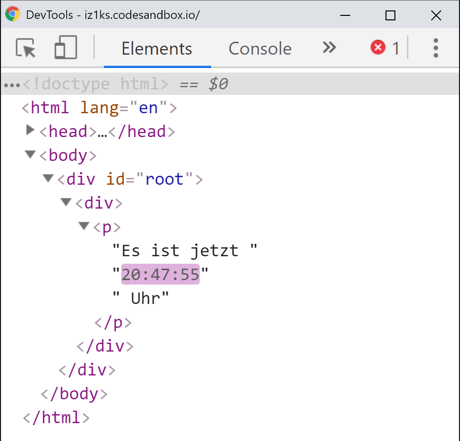

# Rendering von Elementen

In einigen der vorherigen Kapitel habe ich sie wie selbstverständlich bereits einige Male erwähnt, doch was genau sind **React Elemente** eigentlich?

**React Elemente** sind der kleinstmögliche Baustein in einer **React Anwendung**. Anhand der **Elemente** beschreibt ihr, was der Benutzer später auf dem Bildschirm zu sehen bekommt. Trotz ihres gleichen Namens unterscheiden sie sich von DOM-Elementen in einem wesentlichen Punkt: sie sind lediglich ein einfaches Objekt und damit auch günstig \(im Sinne der Performance\) zu erstellen. Die bloße Erstellung eines **React Elements** mittels `React.createElement()` löst noch keine DOM Operation aus!


React **Elemente** werden oftmals mit React **Komponenten** durcheinander geworfen oder im Sprachgebrauch analog verwendet. Das ist aber nicht korrekt! **Elemente** sind das, aus was **Komponenten** letztendlich bestehen. **Komponenten** werden im nächsten Kapitel noch ausführlich behandelt, bevor es damit weitergeht, solltest du jedoch zuerst dieses Kapitel über **Elemente** gelesen haben.


Wir wissen bereits wie wir mittels **JSX** ein **React Element** erstellen und das **JSX** nur eine Vereinfachung ist, um uns viel Schreibarbeit und ständige `React.createElement()`-Aufrufe zu ersparen. Doch wie rendern wir ein erstelltes Element nun, also mit anderen Worten, zeigen wir es im Browser an?

Hier bedienen wir uns an `ReactDOM`, genauer gesagt dessen eigener `render()`-Methode. Um ein React Element zu rendern benötigen wir grundsätzlich eine **Root-** oder **Mount-Node**. Dies ist eine DOM-Node die sozusagen als Platzhalter dient und die React mitteilt, wohin ein Element gerendert werden soll. Theoretisch kannst du problemlos mehrere Root-Nodes in deinem HTML-Dokument haben. React kontrolliert diese alle unabhängig voneinander. Statt also nur einer großen React-Anwendung kannst du also auch auch viele kleine \(oder auch große\) Anwendungen in einem einzigen HTML-Dokument unterbringen. Üblich ist es aber normalerweise nur **eine Root-Node** für deine React-Anwendung zu haben.

Kommen wir also zum Wesentlichen: um ein React **Element** zu rendern übergibst du dieses als erstes Argument der `ReactDOM.render()`-Methode, zusammen mit der **Root-Node** als zweitem Argument, also der DOM-Node, in das dein **Element** gerendert werden soll.

Stellen wir uns einmal vor du hast ein `div` mit der ID `root`in deinem HTML-Dokument, das als **Root-Node** dienen soll:

```markup
<!DOCTYPE html>
<html>
  <head>
    <title></title>
  </head>
  <body>
    <div id="root"></div>
  </body>
</html>
```

 Der entsprechende Aufruf ist dann der folgende:

```jsx
var myFirstElement = <div>Mein erstes React Element</div>;
ReactDOM.render(myFirstElement, document.getElementById('root'));
```

Führst du diesen Code nun im Browser aus, siehst du **innerhalb** des `root`-divs nun dein `<div>Mein erstes React Element</div>`.

**React Elemente** sind dabei **immutable**, also unveränderlich. Dies bedeutet, ist ein Element einmal erstellt, repräsentiert es immer einen bestimmten Zustand \(„State“\) im User Interface. Die offizielle React Dokumentation spricht hier metaphorisch von einem Einzelbild in einem Film. Möchten wir unser User Interface aktualisieren, müssen wir dazu ein neues **React Element** mit den veränderten Daten erstellen. Keine Angst, das klingt umständlicher als es ist und passiert später einmal ganz intuitiv.

React selbst ist dabei so klug, dass es durch einen Vergleichsalgorithmus nur die Teile einer Anwendung aktualisiert, die sich auch tatsächlich verändert haben. Dabei werden **React Elemente** und ihre Kind-Elemente mit ihren Vorgängerversionen vergleichen und lösen nur eine DOM-Operation aus wenn eine Änderung vorliegt. Dies führt dazu, dass React Anwendungen, richtig gemacht, sehr gute Rendering-Performance aufweisen, da DOM-Operationen in der Regel sehr kostspielig \(also Performance lastig\) sind, durch React und seinen **Reconciliation** genannten Prozess aber auf ein Minimum verringert werden. Dabei werden nicht immer grundsätzlich ganze DOM-Elemente neu erzeugt anhand der Beschreibung eines **React-Elements**, sondern es werden auch nur einzelne Attribute aktualisiert, sollte sich nur ein solches geändert haben.

Schauen wir uns das mal in der Praxis an:

```javascript
function showTime() {
  var time = new Date().toLocaleTimeString();
  var timeElement = (
    <div>
      <p>Es ist jetzt {time} Uhr</p>
    </div>
  );
  ReactDOM.render(timeElement, document.getElementById('root'));
}
setInterval(showTime, 1000);
```

Wieder erstellen wir ein **React-Element**, diesmal soll es uns beim Aufruf von `ReactDOM.render()` die aktuelle Zeit ausgeben. Da wir stets die genaue Uhrzeit wissen wollen, stecken wir das Element und den `ReactDOM.render()` Aufruf in eine Funktion, die per `setInterval` alle 1000 ms aufgerufen wird.

Ein Blick in die **Chrome Devtools** offenbart: bei jedem `ReactDOM.render()`-Aufruf wird stets nur die Uhrzeit selbst aktualisiert, die restlichen Elemente, wie die DOM-Nodes oder auch nicht betroffene Teil des angezeigten Textes bleiben unangetastet:



Und hier lernen wir zugleich auch eins der grundlegenden React Prinzipien in der Praxis kennen: das **deklarative** Vorgehen zur Erstellung von User Interfaces. Statt unserer Mini-App **imperativ** zu sagen, dass sie bitte sekündlich die Uhrzeit aktualisieren soll, definieren wir stattdessen **deklarativ** im **React-Element**, dass wir an einer gewissen Stelle jeweils stets bei jedem Re-Rendering die aktuelle Uhrzeit sehen möchten.

Eine ähnliche Funktionalität ohne React implementiert hätte stattdessen wohl in etwa so ausgesehen:

```javascript
function changeTime() {
  var time = new Date().toLocaleTimeString();
  var target = document.getElementById('root');
  target.textContent = 'Es ist jetzt ' + time  ' Uhr';
}
setInterval(changeTime, 1000);
```

Der Vorteil beim deklarativen Vorgehen ist, dass wir nur noch **Zustände beschreiben** und sagen wie etwas angezeigt werden soll und nicht selber jeden Schritt festlegen wie wir diesen Zielzustand erreichen wollen. Das macht insbesondere bei komplexeren Anwendungen viele Dinge einfacher, übersichtlicher und ist dadurch zugleich deutlich weniger fehleranfälliger.


In der Praxis ist es eher üblich, dass `ReactDOM.render()` nur ein einziges Mal, meist beim Öffnen einer Seite aufgerufen wird. Der wiederholte Aufruf der `render()`-Methode dient hier nur zur Veranschaulichung wie **ReactDOM** und React **Elemente** zusammenspielen. 

Das Re-Rendering übernehmen meist **stateful Components** \(also Komponenten, die einen eigenen Zustand speichern\). Mit Komponenten geht es im nächsten Kapitel weiter!


